# 基巴纳可视化

> 原文：<https://www.javatpoint.com/kibana-visualization>

在本节中，我们将了解基巴纳的可视化。我们将学习如何根据用户的需要，使用 Kibana 在 Kibana 中创建、编辑和自定义可视化。我们还将学习如何在基巴纳使用饼图和其他不同的图表选项来有效地使用可视化。

## 可视化的创建

要开始在[基巴纳](https://www.javatpoint.com/kibana)中创建数据的可视化，请转到基巴纳的可视化选项卡。作为参考，请看下图。

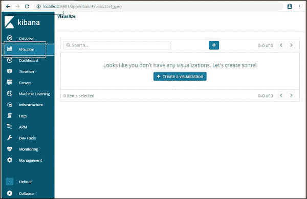

到目前为止，由于我们对基巴纳工具非常陌生，所以我们还没有创建任何可视化，所以空间是空白的。但是如果我们在过去创造了其中的任何一个，那么它们将在这里展示。

这里我们还有一个创建可视化的按钮，通过点击它，我们可以开始创建可视化。它将带您进入屏幕，如下所示。

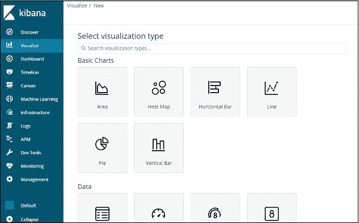

在这里，您可以选择可视化数据的选项。在接下来的章节中，我们将详细了解它们。首先，立即选择饼图。

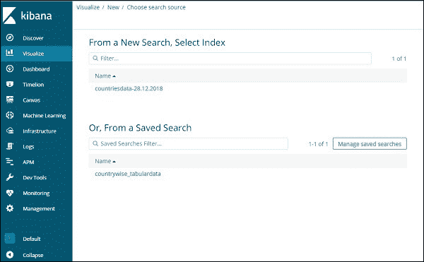

现在，一旦我们完成了可视化类型的选择，现在是时候选择我们想要创建可视化的索引了。

作为参考，我们附上了样本图像。

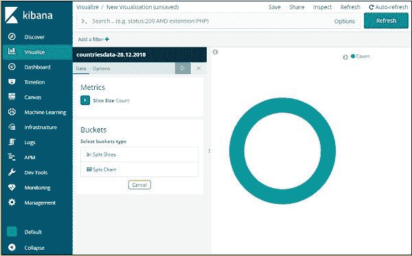

现在我们通过设计得到了一个饼图。我们将使用 2018 年 12 月 28 日的国家数据来获得国家数据中可用区域计数的饼图格式。

### 时段和度量聚合

窗口的左侧有我们将用作计数的指标。容器中提供了分割切片和分割地图选项。我们将使用分割切片选项。

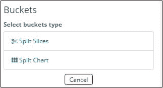

现在选择分割切片并显示以下选项:

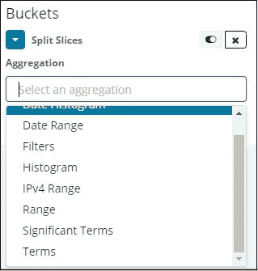

现在选择聚合作为术语，并显示更多要加入的选项，如下所示

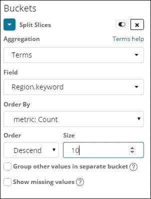

字段下拉列表将包含从索引中选择的所有字段:国家/地区数据。我们为区域选择字段和排序依据。我们将命令它下降，我们采取的规模像 10。这意味着在这里，从国家指数，我们将获得前 10 名地区名单。

如下图所示，按下查看按钮，您应该会看到右侧的饼图被修改。

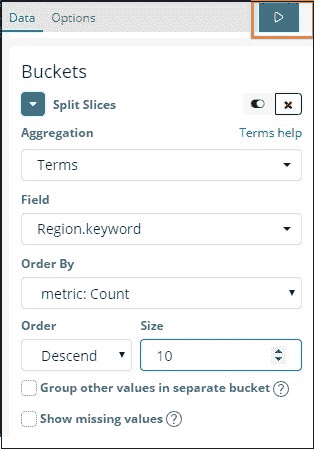

## 饼图显示

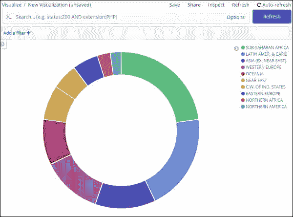

所有的块都用特定的颜色代码指定。该颜色标识位于图表的右上角。如果将鼠标悬停在饼图上，它将给出区域计数和区域名称，如下所示:

所以，它告诉我们，从我们从这些国家输入的数据来看，撒哈拉以南非洲占据了 22.77%的面积。

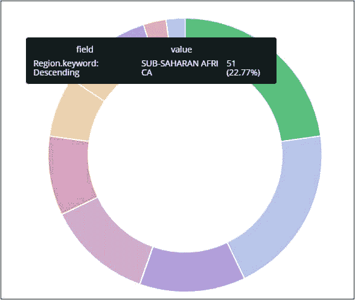
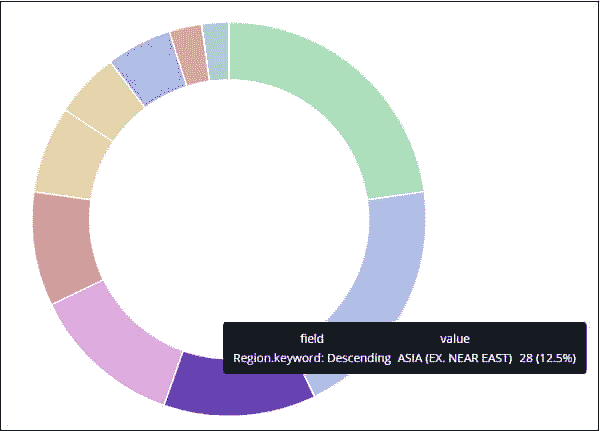

亚洲面积占 12.5%，有 28 个。

点击保存按钮保存。该按钮位于窗口的右上角。

 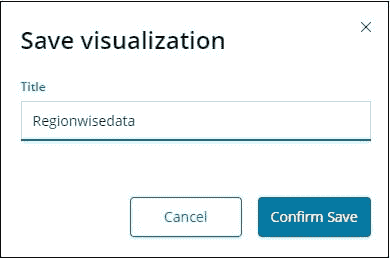

现在，如果我们愿意，我们可以保存处理后的图表供将来使用。

我们想要的数据也可以使用如下所示的搜索方法获得:

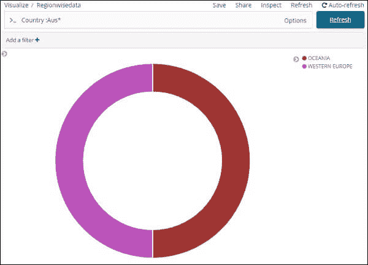

我们已经过滤了澳大利亚*国家的数据。我们可以在饼图和另一个可视化的未来章节中了解更多。

* * *