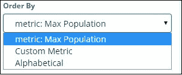

# 基巴纳-图表的形成

> 原文：<https://www.javatpoint.com/kibana-formation-of-charts>

在本节中，我们将学习图表。我们将进一步探讨**可视化**，我们如何创建图表，我们如何创建不同类型的图表，以及我们如何在图表上使用不同的**聚合**功能。

让我们探索和欣赏可视化中最广泛使用的图表。

*   水平条形图可视化
*   垂直条形图可视化
*   Pie Chart 视觉化

我们需要采取的制作或创建观想的步骤如下。我们可以先从单杠开始。

## 水平条形图可视化

首先，打开[基巴纳图形用户界面](kibana-gui)界面，然后转到窗口最左侧停靠栏上的视图选项卡。

现在右键单击+按钮以创建新视图。

现在在窗口中，在所有其他选项中单击水平栏按钮或选项。在这里，我们需要选择我们需要创建可视化的索引。

选择如上所示的索引 countrydata-28.12.2018。选择索引后，它会显示如下所示的屏幕:

默认情况下，它显示计数。现在，我们将绘制水平条形图，显示前 10 名国家明智的公民。

在这里，我们还需要选择要在哪个轴上显示的内容，因此我们需要从桶中选择它。现在接下来选择桶和矩阵聚合。

现在在我们面前的窗口中，如果我们点击 x 轴，我们会看到类似这样的东西。

现在，我们需要从下拉列表中选择我们希望在图表数据上联合的不同聚合。请看下图，以供参考。

请注意，我们将把来自最高聚合函数的数据作为最大值或最大值，简而言之，我们希望根据最大可用人口显示数据。

在索引国家数据-28 . 12 . 2018-地区和人口中，我们只有两个数字字段。

因为我们想要最大人口，如下所示，我们选择人口字段。

我们已经完成了 Y 轴。我们获得的 Y 轴结果如下所示:

现在让我们选择如下所示的 X 轴:

如果我们选择 X 轴，它会显示以下输出:

现在，我们需要选择聚合作为条件。

从下拉区域中选择。我们想要一个国家智能人口，所以选择一个国家部门。我们还可以选择按顺序，以便按照特定的顺序追求事物。

现在，我们需要点击“提交更改”按钮或“应用更改”按钮，该按钮出现在度量数据顶部的窗口中，如下图所示。

现在，我们可以看到，在数据中，根据我们使用的聚合函数，中国人口最多，其次是印度，然后是美国，等等。

我们还可以通过选择我们喜欢的字段来绘制各种图表。接下来，我们将此图保存为仪表板开发的最大填充，供以后使用。

我们将在下一部分构建垂直条形图。

## 垂直条形图

现在我们将再次首先打开[基巴纳](https://www.javatpoint.com/kibana)图形用户界面，然后转到窗口最左侧停靠栏上的视图选项卡。在下面的例子中，我们将使用相同的国家数据和相同的指数。

我们将在此竖线图中构建带有国家/地区的条形图，即显示面积最高的国家/地区。

现在，我们需要使用如下所示的 X 轴和 Y 轴。我们需要相应地设置它们的周长。作为参考，你可以看看下图。

### Y 轴窗口

### X 轴窗口

在我们已经设置了所有的轴，并且像之前一样在各自的选项中做了所有的修改之后，我们必须有类似于下图的结果。

现在从上面的结果可以清楚地看到，俄罗斯在顶部，然后是加拿大，然后是美国，等等。请注意，该数据是从国家数据指数及其虚拟数据中选取的，因此使用实时数据，数字可能不准确。

让我们将可视化保存为 countrywise maxarea，以便以后与仪表板一起使用。

然后让我们关注饼图。

## 圆形分格统计图表

首先建立一个图表，选择带有索引的饼图作为国家信息。我们将以饼图格式显示国家数据中可用的地区数量。

“桶”有两种变体:分割切片和分割地图。现在我们将使用分割切片选项。

现在，如果我们选择分割切片，将显示以下选项-

选择聚合作为单词，并提供更多选择来加入，如下所示-

下拉字段将从索引中选择所有字段。我们通过选择列表选择了区域和顺序区域。我们将把它订购下来，比例为 10。这里我们从国家指数中得到十个地区的数量。

现在，当我们点击窗口右上角的播放按钮时，正如我们在下图中看到的，一个也高亮显示。然后你可以很容易地发现，右边的饼图突然改变了。

## 饼图显示可视化

所有区域的右上角都标有颜色，饼图中也显示了相同的颜色。如果我们将鼠标放在饼图上，就会给出如下所示的区域计数和区域名称。

 

所以，它告诉我们，在我们从这些国家输入的数据中，撒哈拉以南非洲占据了 22.77%的面积。

从饼图可以看出，亚洲的面积占 12.5%，总数为 28。

我们现在可以通过点击右上角的保存按钮来保存视图，如下所示

现在保存图表，以便以后在仪表板中使用。

* * *