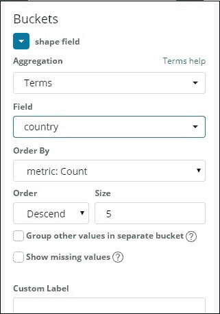

# Kibana 地区地图的创建与工作

> 原文：<https://www.javatpoint.com/creation-and-working-of-region-map-in-kibana>

在本节中，我们将了解区域地图的**创建及其特征。我们还将在中学习如何使用 Kibana 的开发工具来创建区域地图。**

### 索引映射的索引创建

为了实现区域地图的可视化，我们将上传一组数据。下图显示了数据集的一瞥。


请注意，在开发工具中，我们将使用批量上传来上传数据。

现在，我们需要像在前面的可视化过程中所做的那样，转到[Kibana](https://www.javatpoint.com/kibana)开发工具，并运行一些查询。查询一瞥如下。

```

PUT /allcountries
{
   "mappings": {
      "_doc": {
         "properties": {
            "country": {"type": "keyword"},
               "population": {"type": "integer"}
         }
      }
   }
}
POST /allcountries/_doc/_bulk?refresh
{"index":{"_id":1}}
{"country": "China", "population": "1313973713"}
{"index":{"_id":2}}
{"country": "India", "population": "1095351995"}
{"index":{"_id":3}}
{"country": "United States", "population": "298444215"}
{"index":{"_id":4}}
{"country": "Indonesia", "population": "245452739"}
{"index":{"_id":5}}
{"country": "Brazil", "population": "188078227"}
{"index":{"_id":6}}
{"country": "Pakistan", "population": "165803560"}
{"index":{"_id":7}}
{"country": "Bangladesh", "population": "147365352"}
{"index":{"_id":8}}
{"country": "Russia", "population": "142893540"}
{"index":{"_id":9}}
{"country": "Nigeria", "population": "131859731"}
{"index":{"_id":10}}
{"country": "Japan", "population": "127463611"}

```

现在让我们先建立索引，它将被命名为所有国家。在这里，我们将可视化中的国家字段类型定义为关键字。

为此，我们需要运行一些查询。我们需要运行的查询如下图所示。

必须注意的是，如果我们需要创建区域地图，那么必须指定我们希望在排序聚合函数中使用的字段或关键字的类型。


现在，我们需要使用 bulk 命令上传我们想要插入到索引中的数据，它将一直运行到完成。


现在，在这一步中，我们将构建我们希望在可视化中使用的索引模式。

为此，我们需要转到主仪表板上的管理选项卡，然后选择为索引选项创建模式选项。

作为参考，请看下图。


现在，经过这一步，我们可以清楚地看到所有国家指数中的数据及其类型以及屏幕上的一些其他信息。作为参考，请看下图。


## 区域地图

使用面积图，我们现在将创建可视化。选择区域地图并转到可视化。通过使用区域地图选项，我们将创建可视化。因此，我们需要点击在可视化选项中出现的区域地图，该选项在右停靠栏中可见，如下图所示。


一旦完成，现在我们需要选择并继续作为所有国家指数。

现在，下一步与我们在上次可视化中所做的相同。因此，现在为了在地图上使用聚合函数，我们需要选择聚合指标和桶指标，如下图所示。我们将在 mertix 的聚合选项中填充计数值。


在“桶”对话框的字段选项中，我们需要写国家，排序方式为公制:计数等，以供参考查看图像，我们将相应地填充所有细节，因为我们想要显示信息。



* * *