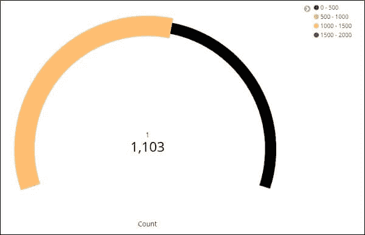

# Kibana 的可视化

> 原文：<https://www.javatpoint.com/visualization-in-kibana>

在这个 Kibana 教程中，我们将学习 Kibana 的可视化。我们将学习如何根据用户的需要，使用 Kibana 在 Kibana 中创建、编辑和自定义可视化。我们还将学习如何在 Kibana 中使用饼图和其他不同的图表选项来有效地使用可视化，如何创建量表图表，如何借助索引创建目标图表，如何在量表和目标图表上进行聚合。

## 可视化概述

要开始在[Kibana](https://www.javatpoint.com/kibana)中创建数据的可视化，请转到 Kibana 的可视化选项卡。

到目前为止，因为我们已经在 Kibana 工具中做了很多事情，所以我们已经创建了很多可视化，所以空间是空白的，所以没有保存或创建可视化。但是如果我们在过去创造了其中的任何一个，那么它们就会在你面前的窗户里。

这里我们也有一个创建可视化的按钮，通过点击它我们可以开始创建可视化。单击构建可视化按钮。

在这里，我们可以选择可视化数据的选项。在前面的章节中，我们已经详细地学习和理解了它们。在这里，我们可以选择我们想要创建的任何类型的图表。

现在，一旦我们完成了可视化类型的选择，现在是时候选择我们想要创建可视化的索引了。

## 仪表图类型的创建

仪表的可视化显示了为数据考虑的指标如何落在预定义的范围内。

对目标的模拟告诉我们您的目标，以及数据上的度量如何向目标移动。

转到可视化开始使用仪表，并从 Kibana 选择可视化选项卡

单击“仪表”按钮并选择要使用的索引。

我们将根据医疗指数-26.01.2019 进行操作。

选择 2017 年 2 月的时间范围

我们现在可以选择指标和桶的集合。

我们选择了计数作为度量聚合。

我们为桶聚合选择了单词，选择的字段是“家庭访问次数”。

从数据选项选项卡中选择的选项如下所示-

仪表的类型可以是圆形或弧形。作为默认值，我们选择了其他所有值作为弧线和静止。

这里显示了我们添加的预定义集

选择的颜色是从绿色到红色。

现在，要查看仪表形式的可视化，请单击分析按钮。它显示仪表，如下所示。

### 目标图的功能

转到可视化选项卡，选择目标，如下所示。

请选择一个目标并选择一个索引。

作为指数，使用 medicalvisits-26.01.2019。

选择指标聚合和桶聚合。

**度量聚合**

我们选择计数作为指标的集合。

**桶聚合**

由于桶聚合和字段是数字家访，我们选择了单词。所选选项如下:

所选范围如下:

单击分析，我们看到如下所示的目标。

* * *