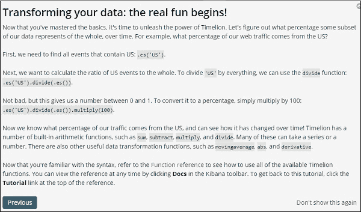

# 在基巴纳创造时间之狮

> 原文：<https://www.javatpoint.com/creation-of-timelion-in-kibana>

在这一节中，我们将了解基巴纳的时间狮子可视化的**创建。**我们还将了解如何以及**在哪里使用时间狮，**有什么用途，以及在基巴纳**时间狮可视化的不同方面和领域。**

另一种可视化方法是 **Timelion** ，也称为时间轴，主要用于基于时间的数据分析。

## 基巴纳的 Timelion 可视化

当我们想要比较与时间相关的数据时，使用 Timelion。例如，我们有一个博客，我们每天都有自己的观点。我们想要评估数据，在这些数据中，我们想要将当前一周的信息与前一周的信息等同起来，即周一-周一、周二-周二等等，想法甚至流量是如何变化的。

## 用 Timelion 可视化

现在在[基巴纳仪表盘](creation-of-dashboard-in-kibana)中，我们需要点击位于仪表盘选项正下方的左滑块菜单上的 Timelion 选项。使用下图作为参考。

Kibana Timelion 的主要功能是显示存在的所有索引的时间线。

Kibana 中的 Timelion 特性主要处理短语的语法。

es (*)表示它将 aal 现有的指数。

只需点击如下所示的文本区域，即可获得可供 Timelion 使用的功能信息。

一旦用户开始使用定时器，欢迎信息就会显示在 [Kibana](https://www.javatpoint.com/kibana) 定时器中。图示部分，即跳转到函数的引用，它提供了所有可用于 timelion 的函数的描述。

## Timelion 的欢迎辞

来自 Timelion 的欢迎消息如下所示

点击下一步按钮，它的基本功能和使用将指导我们完成它。现在当我们点击下一个时，它会显示以下信息。参考见下图。

## 定时器功能参考

为了获得 Timelion 函数引用的全部细节，可以点击顶部菜单栏中的帮助按钮。

## 配置定时器功能

在基巴纳管理⁇高级设置中，timelion 设置完成。

按高级设置，从类别中选择时间狮子。

选择定时器后，将显示定时器配置所需的所有必要字段。

我们可以在以下字段中调整默认索引和用于索引的时间字段-

默认的一个是 all，@timestamp 是时间区域。我们会保持原样，在 Timelion 本身中，修改索引和 Timefield。

使用时间轴的数据可视化

索引:medicalvisits-26.01.2019。我们可以需要它。从 2017 年 1 月 1 日至 2017 年 12 月 31 日，天狮的数据如下:

用于上面显示的表达式如下:

。es(索引= medicalvisits-26.01.2019，timefield =就诊日期)。条形)

我们使用了索引 medical visiots-26 . 01 . 2019，时间字段是“访问日期”和该索引上使用的条形特征。

我们评估了 2017 年 1 月的两个城镇，按天计算，如下所示。

使用的术语是-

。es(索引= medicalvisits-26.01.2019，timefield =就诊日期，

Q =城市:萨巴德尔)。标签(Sabadell)，。es(索引= 26.01.2019 患者就诊次数，

Timefield =访问日期，q =城市:Terrassa)。标签(Terrassa)

两天的时间表对比如下。

## 表示

。es(索引=医疗信息-26.01.2019，时间字段=就诊日期)。标签(“2018 年 8 月 2 日”)，

。es(索引= medicalvisits-26.01.2019，timefield=就诊日期，offset=-1d)。标签(“2018 年 8 月 1 日”)

我们在这里使用了偏移量，并给出了 1 天的差异。目前的日期已选定为 2018 年 8 月 2 日。因此，对于 2018 年 8 月 2 日和 8 月 1 日，它给出了一个数据缺口。

各城市 2017 年 1 月的前 5 名数据列表如下所示。我们在可视化中使用的关键词如下。

。es(索引= medicalvisits-26.01.2019，timefield =就诊日期，split = city .关键字:5)

在可视化的字段选项中，我们使用了分割，并在字段中给出了作为城市的字段名，我们将其作为分割=城市。关键字:5，因为在我们的可视化中，我们需要显示索引中的前五个城市。人们可以根据自己的需要和选择选择字段，并可以相应地更改字段。

它给出了每个城镇的数量，并列出了它们的名字，如图所示。

* * *