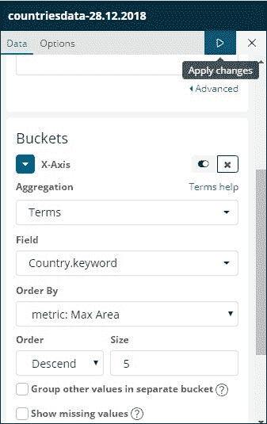
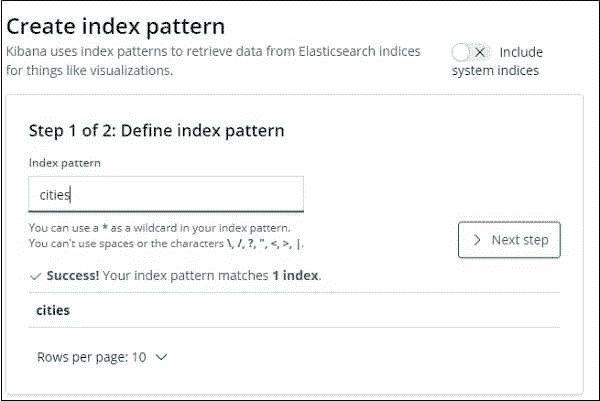

# 在Kibana使用热图

> 原文：<https://www.javatpoint.com/working-with-heat-map-in-kibana>

在本节中，我们将了解热图的**工作以及**Kibana**中索引的创建。与此同时，我们还将学习**如何在创建索引后在Kibana**中添加数据，以及**如何使用Kibana**中的开发工具来创建索引和添加数据。**

## Kibana的热图

为了开始，我们需要创建一个可视化，为此，我们需要点击可视化选项卡，该选项卡位于窗口的左面板。


我们可以清楚地看到，在可视化选项中有一个热图选项。点击那个选项，它会进一步要求我们选择索引。

如上图，选择指数国家数据-28.12.2018。一旦选择了索引，如下所示，我们就必须选择数据。

现在选择您想要使用的索引，在我们的案例中，我们将插入日期为 2018 年 12 月 28 日的国家数据。之后，我们需要从出现的提示或窗口中选择数据。为了更好的理解和参考，可以看看下图。


现在，在选择数据之后，我们需要选择我们想要处理的矩阵。

现在，在此选项中，我们需要选择要在矩阵上执行的聚合类型。这里我们将从下拉列表中选择最大聚合函数。


这里是因为我们对绘制国家最大面积感兴趣，所以我们选择了最大聚集函数。

接下来，它将要求您从桶中选择值。

这里我们将一个接一个地进行，所以现在我们将从桶的列表中选择 X 轴。


我们使用了聚合术语、作为区域的字段和按最大面积排序。如下所示，单击窗口中下面字段中的应用更改-现在，我们将选择聚合字段中的术语，字段中的国家关键字，以及字段矩阵最大面积的顺序，降序和大小将为 5。



当我们点击窗口上的添加变化按钮时，我们会看到如下图所示的地图。


该地图显示了各种颜色，它还显示了热图右侧的区域数量。此外，如果我们点击右边的小颜色圈，那么这些颜色将反映在地图上。


## 为索引创建地图

现在，我们将使用地理聚合函数。这是一种用于协调图的桶聚合函数。我们将在这种类型的地图中使用的索引必须由地理点类型字段组成，这对于这种类型的聚合是非常必要的。地理点由两个位置组成，即纬度和经度位置点字段。

通过使用 Kibana 开发软件，我们可以选择创建一个索引，并且我们可以根据需要向该索引添加大量数据。在这个例子中，我们将添加路由并添加我们需要的地理点。


现在，我们需要运行某种命令来获得所需的更改。代码如下:

```

PUT /cities
{
   "mappings": {
      "_doc": {
         "properties": {
            "location": {
               "type": "geo_point"
            }
         }
      }
   }
}

```

作为参考，可以看看下面的图片。


该命令成功运行后，由上述命令生成由 doc 类型城市名称组成的索引，字段位置以其类型作为地理点作为参考，我们可以在下图中看到。

现在，让我们向通过城市名称创建的索引中添加一些数据。在将数据添加到任何索引之前，必须确保我们要添加到任何索引中的数据必须与之前添加到索引中的数据具有相同的元数据。


我们已经完成了数据构建索引名称引用。现在，让我们使用“管理”选项卡为城市构建一个索引模式。

现在，我们已经成功地创建了索引，并向其中添加了数据。

现在，让我们使用“管理”选项卡为城市构建一个索引模式。



下图显示了城市索引中的区域描述。


我们可以看到位置的形式是地理点。我们现在可以将它用于可视化和开发目的。

* * *