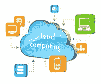
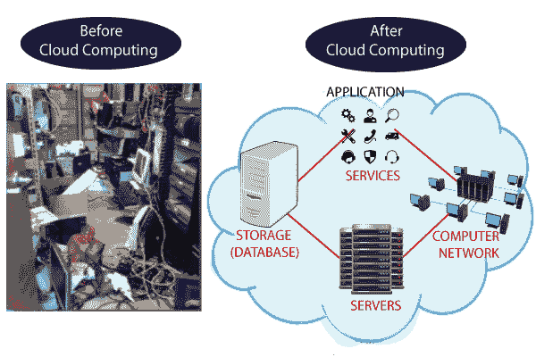

# 云计算教程

> 原文：<https://www.javatpoint.com/cloud-computing-tutorial>

云计算教程提供了云计算的基本和高级概念。我们的云计算教程是为初学者和专业人士设计的。

云计算是一种基于虚拟化的技术，允许我们通过互联网连接创建、配置和定制应用程序。云技术包括开发平台、硬盘、软件应用和数据库。

## 什么是云计算

术语云指的是网络或互联网。它是一种使用互联网上的远程服务器在线存储、管理和访问数据的技术，而不是本地驱动器。数据可以是任何东西，如文件、图像、文档、音频、视频等等。

我们可以使用云计算进行以下操作:

*   开发新的应用程序和服务
*   数据的存储、备份和恢复
*   托管博客和网站
*   按需交付软件
*   数据分析
*   流式视频和音频

## 为什么是云计算？

小型和大型信息技术公司都遵循传统方法来提供信息技术基础设施。这意味着**对于任何一家 IT 公司来说，我们都需要一个服务器机房，这是 IT 公司的基本需求**。

在服务器机房，应该有数据库服务器、邮件服务器、网络、防火墙、路由器、调制解调器、交换机、QPS(每秒查询数意味着服务器将处理多少查询或负载)、可配置系统、高速网络和维护工程师。

要建立这样的 IT 基础设施，需要花费大量的资金。为了克服所有这些问题，降低信息技术基础设施成本，云计算应运而生。

## 云计算的特点

云计算的特点如下:

**1)敏捷**

云**在分布式计算环境**中工作。它在用户之间共享资源，工作速度非常快。

**2)高可用性和可靠性**

服务器的可用性更高、更可靠，因为基础设施故障的可能性最小。

**3)高扩展性**

云提供**大规模的“按需”资源调配**，而无需工程师处理峰值负载。

**4)多共享**

在云计算的帮助下，**多个用户和应用可以更高效地工作**通过共享公共基础设施降低成本。

**5)设备和位置独立性**

云计算使用户能够使用网络浏览器访问系统，而不管他们的位置或使用的设备是什么，例如电脑、手机等。**由于基础设施在场外**(通常由第三方提供)**并通过互联网访问，用户可以从任何地方连接**。

**6)维护**

云计算应用的维护更容易，因为它们**不需要安装在每个用户的电脑上，可以从不同的地方**访问。所以，它也降低了成本。

**7)低成本**

通过使用云计算，成本将会降低，因为要获得云计算的服务， **IT 公司不需要设置自己的基础设施**和按资源使用量付费。

**8)按使用付费模式下的服务**

向用户提供应用编程接口**(API)，以便他们可以通过使用这些 API**访问云上的服务**，并根据服务的使用情况**支付费用。

## 先决条件

在学习云计算之前，你必须具备计算机基础的基础知识。

## 观众

我们的云计算旨在帮助初学者和专业人士。

## 问题

我们保证您在学习我们的云计算教程时不会发现任何困难。但如果本教程有任何错误，请将问题或错误张贴在联系表中。

* * *