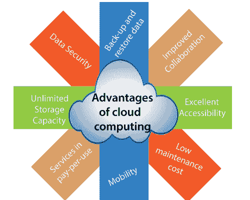

# 云计算的优缺点

> 原文：<https://www.javatpoint.com/advantages-and-disadvantages-of-cloud-computing>

## 云计算的优势

众所周知，云计算是一种趋势技术。几乎每家公司都将服务转移到云上，以促进公司增长。

在这里，我们将讨论云计算的一些重要优势-

### 1)备份和恢复数据

一旦数据存储在云中，使用云备份和恢复数据就更容易了。

### 2)改进协作

云应用程序通过允许人群通过共享存储快速、轻松地在云中共享信息来改善协作。

### 3)卓越的可访问性

云允许我们使用互联网连接，随时随地快速轻松地访问存储信息。互联网云基础架构通过确保我们的数据始终可访问来提高组织的生产力和效率。

### 4)维护成本低

云计算降低了组织的硬件和软件维护成本。

### 5)流动性

云计算让我们可以通过手机轻松访问所有云数据。

### 6)按使用量付费模式中的服务

云计算为用户在云上访问服务提供应用编程接口，并根据服务的使用情况支付费用。

### 7)无限存储容量

云为我们提供了巨大的存储容量，用于存储我们的重要数据，如文档、图像、音频、视频等。在一个地方。

### 8)数据安全

数据安全是云计算最大的优势之一。云提供了许多与安全相关的高级功能，并确保数据得到安全存储和处理。

## 云计算的缺点

云计算的缺点列举如下-

### 1)互联网连接

众所周知，在云计算中，每一个数据(图像、音频、视频等。)存储在云上，我们使用互联网连接通过云访问这些数据。如果您没有良好的互联网连接，您将无法访问这些数据。然而，我们没有任何其他方法从云中访问数据。

### 2)供应商锁定

厂商锁定是云计算最大的劣势。组织在将服务从一个供应商转移到另一个供应商时可能会遇到问题。由于不同的供应商提供不同的平台，这可能会导致从一个云转移到另一个云的困难。

### 3)有限控制

众所周知，云基础设施完全由服务提供商拥有、管理和监控，因此云用户对云基础设施中服务的功能和执行控制较少。

### 4)安全性

尽管云服务提供商实施最佳安全标准来存储重要信息。但是，在采用云技术之前，您应该意识到，您将把组织的所有敏感信息发送给第三方，即云计算服务提供商。在云上发送数据时，您组织的信息可能会被黑客入侵。

* * *