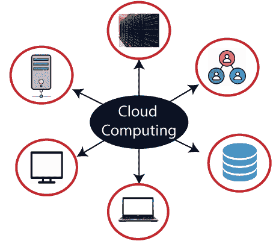
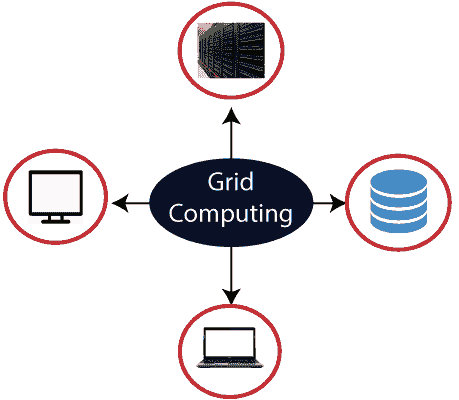

# 云计算与网格计算的区别

> 原文：<https://www.javatpoint.com/cloud-computing-vs-grid-computing>

## 云计算

云计算采用**客户端-服务器**架构，通过云(互联网)以现收现付的价格交付服务器、存储、数据库和软件等计算资源。

云计算通过提供各种优势，包括节约成本、提高生产率、效率、性能、数据备份、灾难恢复和安全性，成为组织非常流行的选择。

## 网格计算

网格计算也被称为“**分布式计算**”它将多个计算资源(个人电脑、工作站、服务器和存储元件)链接在一起，并提供了一种访问它们的机制。

网格计算的主要优点是，它通过提供对资源的透明访问来提高用户的工作效率，并且工作可以更快地完成。

让我们了解一下云计算和网格计算的区别。

| 云计算 | 网格计算 |
| 云计算遵循客户端-服务器计算架构。 | 网格计算遵循分布式计算架构。 |
| 可扩展性高。 | 可扩展性正常。 |
| 云计算比网格计算更灵活。 | 网格计算不如云计算灵活。 |
| 云作为一个集中的管理系统运行。 | 网格作为一个分散的管理系统运行。 |
| 在云计算中，云服务器归基础设施提供商所有。 | 在网格计算中，网格由组织拥有和管理。 |
| 云计算使用像 Iaas、PaaS 和 SaaS 这样的服务。 | 网格计算使用分布式计算、分布式信息和分布式普及等系统。 |
| 云计算是面向服务的。 | 网格计算是面向应用的。 |
| 它可以通过标准的网络协议访问。 | 它可以通过网格中间件访问。 |

* * *