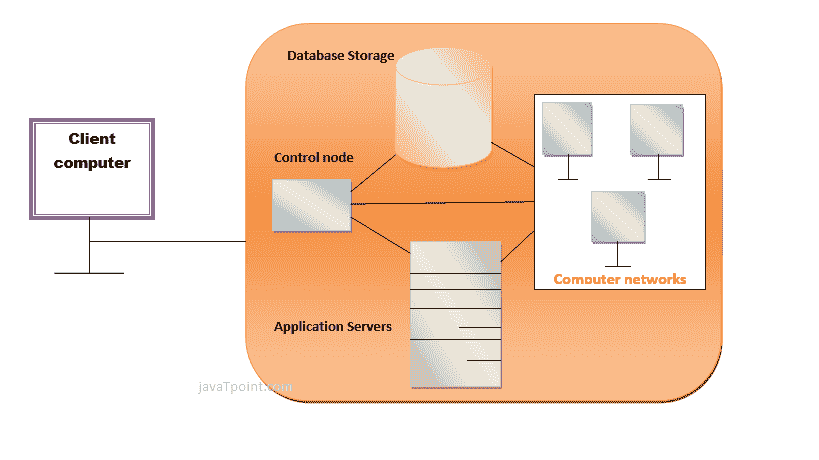

# 云计算是如何工作的

> 原文：<https://www.javatpoint.com/how-does-cloud-computing-work>

假设你是一家大公司的主管。你的特殊职责包括确保你所有的员工都有他们工作所需的合适的硬件和软件。给每个人买电脑是不够的。您还必须购买软件和软件许可证，然后根据员工的要求向他们提供这些软件。无论何时雇佣新员工，您都需要购买更多软件，或者确保您当前的软件许可证允许其他用户使用。压力太大了，你不得不花很多钱。

但是，对于像你这样的高管来说，可能还有一个选择。因此，您只需要加载一个应用程序，而不是为每台计算机安装一套软件。该应用程序将允许员工登录到一个基于网络的服务，该服务为用户托管其工作所需的所有程序。另一家公司拥有的远程服务器，可以运行从电子邮件到文字处理再到复杂的数据分析程序的一切。它被称为云计算，它可以改变整个计算机行业。

在云计算系统中，有一个显著的工作负载转移。当运行应用程序时，本地计算机不再需要做所有繁重的工作。但云计算可以轻松、自动地处理如此繁重的负载。用户方面的硬件和软件需求减少。用户的计算机唯一需要能够运行的就是系统的云计算接口软件，它可以像 Web 浏览器一样简单，云的网络负责其余部分。

* * *