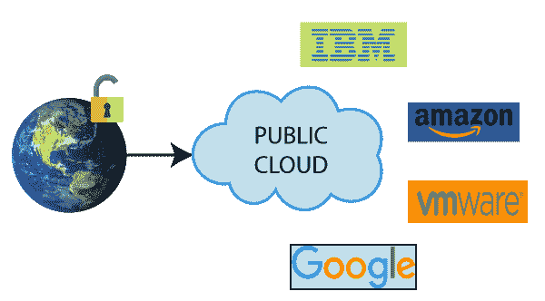

# 公共云

> 原文：<https://www.javatpoint.com/public-cloud>

*   公共云提供了一个**共享平台**，T2 公众可以通过互联网连接访问该平台。
*   公有云采用**按使用付费模式**，由**第三方**即云服务提供商管理。
*   在公共云中，多个用户同时使用相同的存储。
*   公共云由企业、大学、政府机构或它们的组合拥有、管理和运营。
*   亚马逊弹性计算云(EC2)、微软 Azure、IBM 的蓝云、太阳云和谷歌云都是公有云的例子。

## 公共云的优势

公有云有以下优势-

### 1)低成本

公共云的成本低于私有云或混合云，因为它与大量消费者共享相同的资源。

### 2)位置无关

公共云是独立于位置的，因为它的服务是通过互联网提供的。

### 3)节省时间

在公共云中，云服务提供商负责管理和维护存储数据的数据中心，因此云用户可以节省建立连接、部署新产品、发布产品更新、配置和组装服务器的时间。

### 4)快速轻松地设置

组织可以在互联网上轻松购买公有云，并在几小时内通过云服务提供商远程部署和配置。

### 5)业务敏捷性

公共云提供了一种根据组织需求弹性调整计算机资源大小的能力。

### 6)可扩展性和可靠性

公共云以可承受的成本向用户提供可扩展(易于添加和删除)和可靠(24*7 可用)的服务。

## 公共云的缺点

### 1)安全性低

公共云不太安全，因为资源是公开共享的。

### 2)性能

在公共云中，性能取决于互联网连接的速度。

### 3)不太可定制

公共云的可定制性不如私有云。

* * *