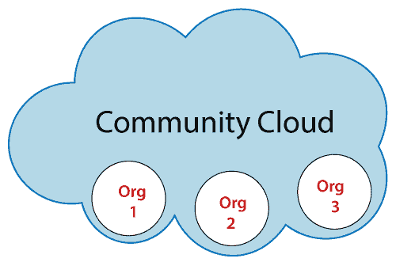

# 社区云

> 原文：<https://www.javatpoint.com/community-cloud>

社区云是一种云基础设施，允许几个组织的小组访问系统和服务，以共享信息。它由社区中的一个或多个组织、第三方或它们的组合拥有、管理和运营。

**示例:**我们在印度的政府机构可能会共享云中的计算基础设施来管理数据。

## 社区云的优势

社区云有以下优势-

### 成本效率

社区云具有成本效益，因为整个云在几个组织或一个社区之间共享。

### 灵活且可扩展

社区云是灵活且可扩展的，因为它与每个用户都兼容。它允许用户根据自己的需要和要求修改文档。

### 安全

社区云比公共云更安全，但不如私有云安全。

### 共享基础设施

社区云允许我们在各种组织之间共享云资源、基础设施和其他功能。

## 社区云的缺点

社区云有以下缺点-

*   社区云并不是每个组织的好选择。
*   数据采用缓慢
*   所有社区成员共享固定数量的数据存储和带宽。
*   社区云比公共云更昂贵。
*   在组织间分担责任是困难的。

* * *