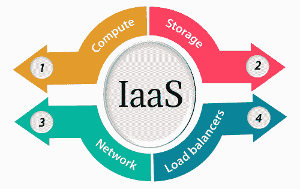
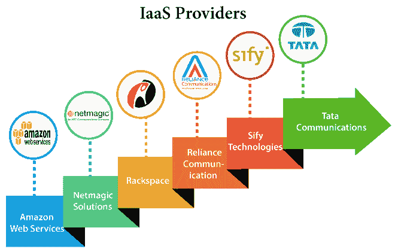

# 基础设施即服务| IaaS

> 原文：<https://www.javatpoint.com/infrastructure-as-a-service>

Iaas 也被称为**硬件即服务(HaaS)** 。它是云计算平台的一个层次。它允许客户外包他们的信息技术基础设施，如服务器、网络、处理、存储、虚拟机和其他资源。客户使用按使用量付费的模式在互联网上访问这些资源。

在传统的托管服务中，信息技术基础设施在特定的一段时间内被出租，并有预先确定的硬件配置。客户端为配置和时间付费，而不考虑实际使用。在 IaaS 云计算平台层的帮助下，客户端可以动态扩展配置以满足不断变化的需求，并且只为实际使用的服务付费。

IaaS 云计算平台层消除了每个组织维护 IT 基础架构的需要。

IaaS 有三种模式:公共云、私有云和混合云。私有云意味着基础架构驻留在客户所在地。在公共云的情况下，它位于云计算平台供应商的数据中心，而混合云是两者的结合，其中客户选择公共云或私有云中的最佳者。

IaaS 提供商提供以下服务-

1.  **计算:**计算即服务包括虚拟中央处理器和为最终用户调配的虚拟机虚拟主内存。
2.  **存储:** IaaS 提供者为存储文件提供后端存储。
3.  **网络:**网络即服务(NaaS)为虚拟机提供网络组件，如路由器、交换机和网桥。
4.  **负载平衡器:**它在基础设施层提供负载平衡能力。

## IaaS 云计算层的优势

IaaS 计算层有以下优势-

**1。共享基础设施**

IaaS 允许多个用户共享同一个物理基础设施。

**2。资源的网络访问**

Iaas 允许 IT 用户通过互联网访问资源。

**3。按使用付费模式**

IaaS 提供商基于按使用付费提供服务。用户需要为他们所使用的东西付费。

**4。聚焦核心业务**

IaaS 提供商专注于组织的核心业务，而不是 IT 基础设施。

**5。按需可扩展性**

按需可扩展性是 IaaS 最大的优势之一。使用 IaaS，用户不用担心升级软件和解决与硬件组件相关的问题。

## IaaS 云计算层的缺点

**1。安全**

安全性是 IaaS 中最大的问题之一。大多数 IaaS 提供商无法提供 100%的安全性。

**2。维护&升级**

虽然 IaaS 服务提供商维护软件，但他们不会为某些组织升级软件。

**3。互操作性问题**

很难将虚拟机从一个 IaaS 提供商迁移到另一个，因此客户可能会面临与供应商锁定相关的问题。

## 关于 IaaS 云计算层的一些要点

IaaS 云计算平台不能取代传统的托管方式，但它提供的不止这些，而且所使用的每一种资源都是可预测的。

IaaS 云计算平台可能无法消除对内部 IT 部门的需求。它将需要监控或控制 IaaS 设置。信息技术工资支出可能不会大幅减少，但其他信息技术支出可以减少。

IaaS 云计算平台供应商的故障会使您的业务陷入停滞阶段。评估 IaaS 云计算平台供应商的稳定性和财务状况。确保服务级别协议(即服务级别协议)为数据、硬件、网络和应用程序故障提供备份。图像可移植性和第三方支持是一个优点。

IaaS 云计算平台供应商可以访问您的敏感数据。因此，与可信的公司或组织合作。研究他们的安全策略和预防措施。

## 提供 Iaas 云计算平台的顶级 IaaS 提供商

| IaaS 供应商 | Iaas 解决方案 | 细节 |
| 亚马逊网络服务 | 弹性、弹性计算云(EC2) MapReduce、53 号路由、虚拟私有云等。 | 作为云计算平台的先驱，亚马逊提供自动扩展、云监控和负载平衡功能，作为其产品组合的一部分。 |
| 网络魔术解决方案 | 网络魔法 IaaS 云 | Netmagic 运行于孟买、钦奈和班加罗尔的数据中心以及美国的一个虚拟数据中心。正在计划将服务扩展到西亚。 |
| 存储空间 | 云服务器、云文件、云站点等。 | 云计算平台供应商主要专注于企业级托管服务。 |
| 信实通信 | 信实互联网数据中心 | RIDC 支持传统托管和云服务，数据中心位于孟买、班加罗尔、海得拉巴和钦奈。RIDC 提供的云服务包括 IaaS 和 SaaS。 |
| 赛菲科技 | Sify IaaS | Sify 的云计算平台由惠普的融合基础设施提供支持。该供应商提供所有三种类型的云服务:IaaS、PaaS 和 SaaS。 |
| 塔塔通信公司 | InstaCompute | InstaCompute 是塔塔通信的 IaaS 产品。InstaCompute 数据中心位于海得拉巴和新加坡，在这两个国家都有业务。 |

* * *