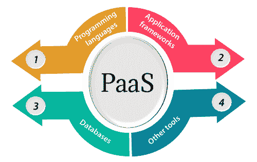
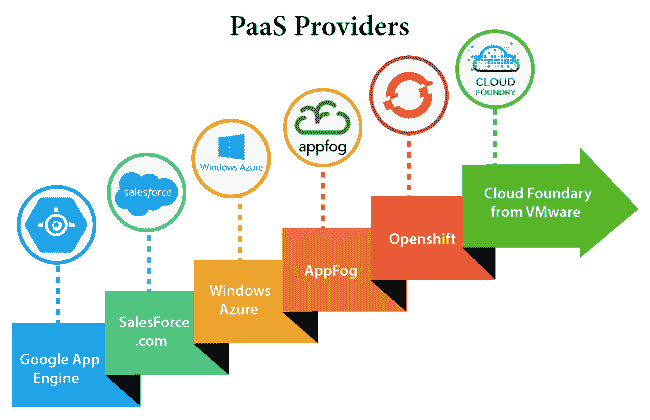

# 平台即服务|平台即服务

> 原文：<https://www.javatpoint.com/platform-as-a-service>

平台即服务提供了一个运行时环境。它允许程序员轻松地创建、测试、运行和部署 web 应用程序。您可以按使用付费的方式从云服务提供商处购买这些应用程序，并使用互联网连接进行访问。在 PaaS 中，后端可扩展性由云服务提供商管理，因此最终用户无需担心基础设施的管理。

PaaS 包括支持 web 应用生命周期的基础设施(服务器、存储和网络)和平台(中间件、开发工具、数据库管理系统、商业智能等)。

**示例:**谷歌 App 引擎，Force.com，Joyent，Azure。

平台即服务提供商提供编程语言、应用程序框架、数据库和其他工具:

### 1.编程语言

PaaS 提供商为开发人员开发应用程序提供各种编程语言。PaaS 提供者提供的一些流行的编程语言有 Java、PHP、Ruby、Perl 和 Go。

### 2.应用框架

PaaS 提供者提供应用程序框架，以便于理解应用程序开发。PaaS 提供商提供的一些流行的应用框架有 Node.js、Drupal、Joomla、WordPress、Spring、Play、Rack 和 Zend。

### 3.数据库

PaaS 提供者提供了各种数据库，如 ClearDB、PostgreSQL、MongoDB 和 Redis 来与应用程序进行通信。

### 4.其他工具

PaaS 提供商提供开发、测试和部署应用程序所需的各种其他工具。

## 部分授权协议的优势

PaaS 有以下优点-

**1)简化开发**

PaaS 允许开发人员专注于开发和创新，而不用担心基础设施管理。

**2)较低风险**

无需预先投资硬件和软件。开发人员只需要一台电脑和一个互联网连接就可以开始构建应用程序。

**3)预建业务功能**

一些平台即服务供应商还提供已经定义的业务功能，这样用户就可以避免从头开始构建所有东西，因此只能直接启动项目。

**4)即时社区**

PaaS 供应商经常提供在线社区，开发者可以在这里获得分享经验和寻求他人建议的想法。

**5)可扩展性**

部署的应用程序可以从一个用户扩展到数千个用户，而无需对应用程序进行任何更改。

## PaaS 云计算层的缺点

**1)供应商锁定**

人们必须根据 PaaS 供应商提供的平台编写应用程序，因此将应用程序迁移到另一个 PaaS 供应商将是一个问题。

**2)数据隐私**

公司数据，无论是否关键，都将是私有的，所以如果它不在公司的围墙内，在数据隐私方面可能会有风险。

**3)与其余系统应用的集成**

可能会发生一些应用程序是本地的，而一些是云中的。因此，当我们希望将云中的数据与本地数据一起使用时，复杂性可能会增加。

## 受欢迎的平台即服务提供商

下表显示了一些受欢迎的 PaaS 提供商及其提供的服务-

| 提供者 | 服务 |
| 谷歌应用引擎(GAE) | 应用程序标识、获取网址、云存储客户端库、日志服务 |
| Salesforce.com | 更快的实施、快速的可扩展性、客户关系管理服务、销售云、移动连接、聊天。 |
| 微软云操作系统 | 计算、安全、物联网、数据存储。 |
| AppFog | Justcloud.com，天空之路，谷歌 |
| openshift(打开 hift) | 微软 Azure 红帽。 |
| 来自 VMware 的云铸造 | 数据、消息和其他服务。 |

* * *