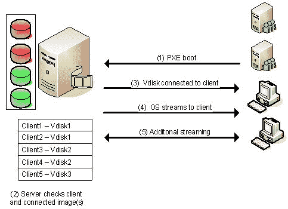

# 操作系统虚拟化

> 原文：<https://www.javatpoint.com/os-virtualization>

借助操作系统虚拟化，无需在本地设备上预装或永久加载任何东西，也无需硬盘。所有的东西都是使用一种虚拟磁盘从网络上运行的。该虚拟磁盘实际上是存储在远程服务器、存储区域网络(SAN)或网络连接存储(NAS)上的磁盘映像文件。客户端将通过网络连接到该虚拟磁盘，并将在虚拟磁盘上安装操作系统的情况下启动。

## 操作系统虚拟化是如何工作的？

在基础架构中使用操作系统虚拟化所需的组件如下所示:

第一个组件是操作系统虚拟化服务器。该服务器是操作系统虚拟化基础架构的中心点。服务器为客户端管理虚拟磁盘上的信息流，并确定哪个客户端将连接到哪个虚拟磁盘(使用数据库，存储此信息)。此外，服务器可以本地托管虚拟磁盘的存储，或者服务器通过存储区域网络连接到虚拟磁盘。在高可用性环境中，可以有更多的操作系统虚拟化服务器来实现无冗余和负载平衡。服务器还确保客户端在基础架构中是唯一的。

其次，有一个客户端会联系服务器以连接到虚拟磁盘，并请求存储在虚拟磁盘上的组件来运行操作系统。

可用的支持组件包括用于存储服务器配置和设置的数据库、虚拟磁盘内容的流服务、用于将客户端连接到操作系统虚拟化服务器的(可选)TFTP 服务和(也可选)PXE 启动服务。

正如已经提到的，虚拟磁盘包含来自系统的物理磁盘的映像，它将反映将使用虚拟磁盘的那些系统的配置和设置。创建虚拟磁盘后，需要将该磁盘分配给将使用该磁盘启动的客户端。客户机和磁盘之间的连接是通过管理工具建立的，并保存在数据库中。当客户端分配了磁盘时，机器可以使用虚拟磁盘启动，如下图所示的过程:

## 1)连接到操作系统虚拟化服务器:

首先，我们启动机器并建立与操作系统虚拟化服务器的连接。大多数产品都提供了几种连接服务器的方法。最流行和最常用的方法之一是使用 PXE 服务，但也经常使用引导带(因为 PXE 服务的缺点)。虽然每种方法都初始化网络接口卡(网卡)，接收一个(基于 DHCP 的)IP 地址和一个到服务器的连接。

## 2)连接虚拟磁盘:

当客户机和服务器之间建立连接时，服务器将查看其数据库，以检查客户机是已知的还是未知的，以及哪个虚拟磁盘分配给了客户机。当连接多个虚拟磁盘时，将在客户端显示引导菜单。如果只分配了一个磁盘，该磁盘将连接到步骤 3 中提到的客户端。

## 3)连接到客户端的虚盘:

客户端选择所需的虚拟磁盘后，该虚拟磁盘将通过操作系统虚拟化服务器进行连接。在后端，操作系统虚拟化服务器确保客户端在基础架构中是唯一的(例如，计算机名称和标识符)。

## 4)操作系统被“流式传输”到客户端:

一旦连接了磁盘，服务器就开始流式传输虚拟磁盘的内容。软件知道哪些部分是顺利启动操作系统所必需的，因此这些部分首先被流式传输。系统中流动的信息应该存储在某个地方(即缓存)。大多数产品都提供多种方法来缓存这些信息。例如，在客户端硬盘或操作系统虚拟化服务器的磁盘上。

## 5)附加流:

之后，第一部分被流式传输，然后操作系统将开始按预期运行。当运行或启动用户调用的功能(例如启动虚拟磁盘中可用的应用程序)需要时，将流传输额外的虚拟磁盘数据。

* * *