# linux 操作系统虚拟化

> 原文：<https://www.javatpoint.com/linux-virtualization>

Vmware 工作站软件用于操作系统的虚拟化。要虚拟安装任何操作系统，您需要安装 VMware 软件。我们正在使用 VMware 工作站 10。

在安装 linux 操作系统之前，您需要有 linux 操作系统的 iso 映像文件。让我们看看虚拟安装 linux 操作系统的步骤。

## 如何为 linux OS 创建新的虚拟机？

1)单击创建新虚拟机。

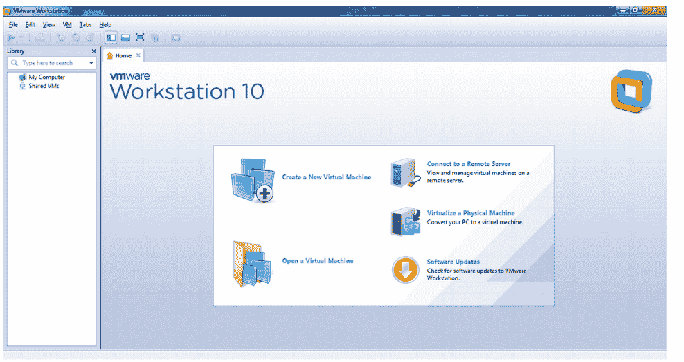

2)在欢迎窗口中，选择自定义选项，然后单击下一步按钮。

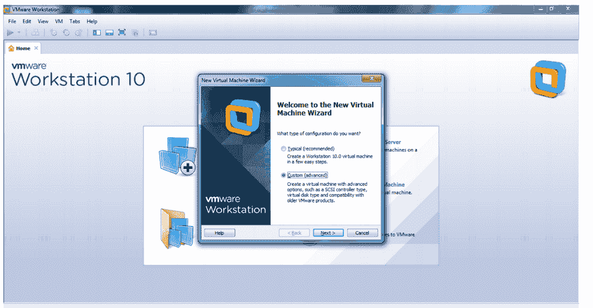

3)在选择虚拟机硬件兼容性窗口中，单击下一步按钮。

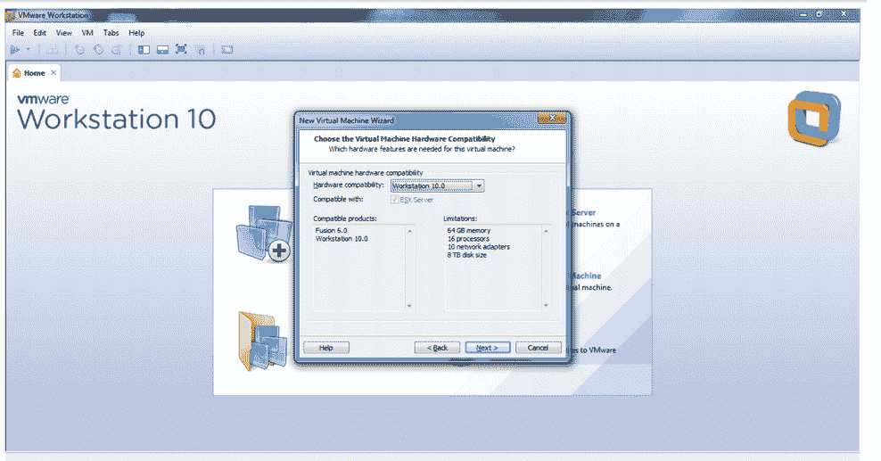

4)在来宾操作系统窗口中，从磁盘或任何驱动器中选择 iso 映像文件。我已经把 ubuntu 的 iso 文件放到 e: drive 了。所以浏览你的 iso 图像，点击下一步按钮。

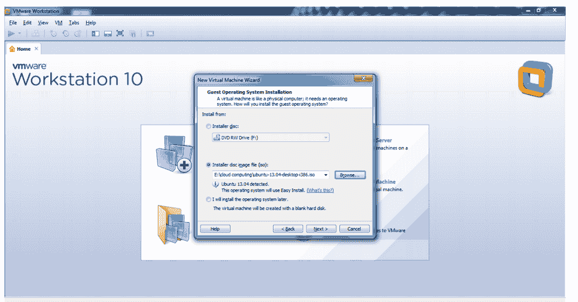

5)在简易安装信息窗口中，提供全名、用户名、密码和确认密码，然后单击下一步按钮。

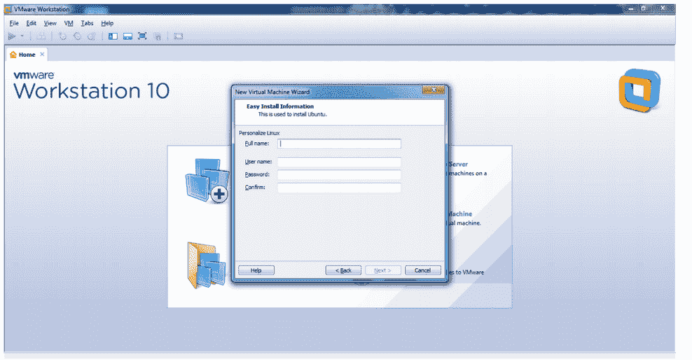

你可以看到给定的信息。

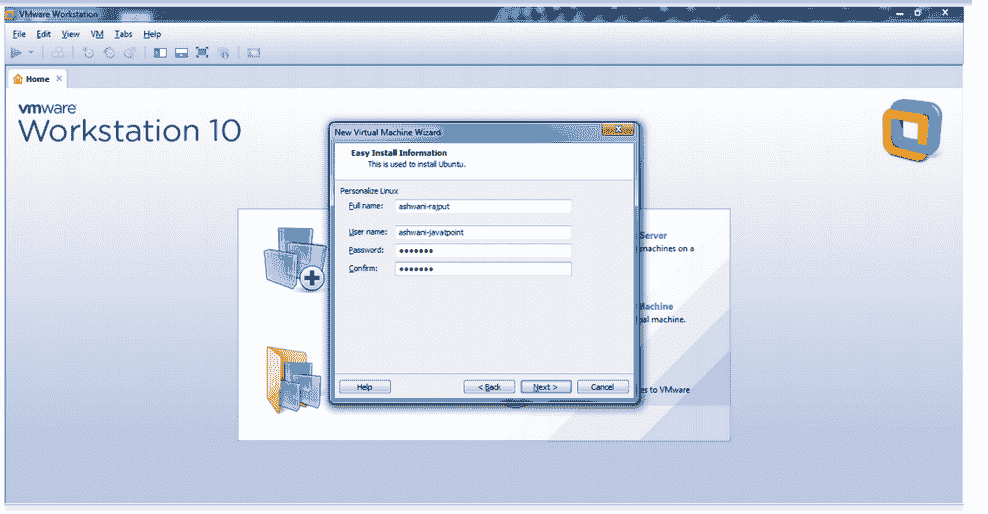

6)在处理器配置信息中，可以选择处理器数量、每个内核的处理器数量。如果您不想更改默认设置，请仅单击下一步。

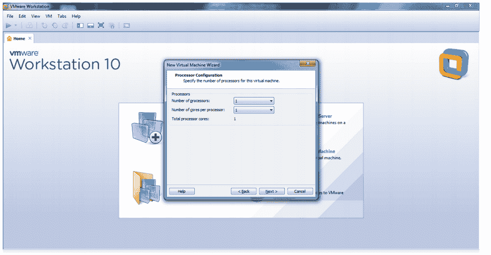

7)在虚拟机窗口的内存中，可以设置内存限制。点击下一步按钮。

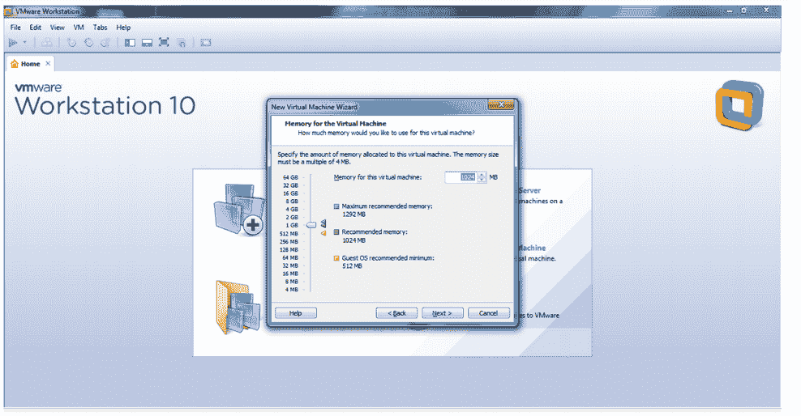

8)在指定磁盘容量窗口中，您可以设置磁盘大小。点击下一步按钮。

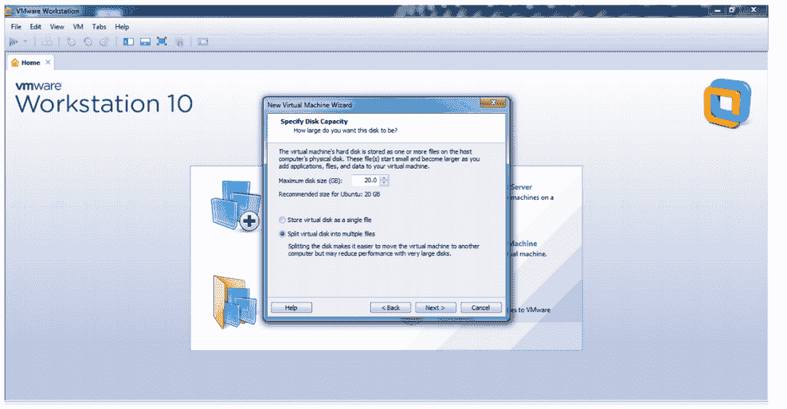

9)在指定磁盘文件窗口中，您可以指定磁盘文件，然后单击下一步按钮。

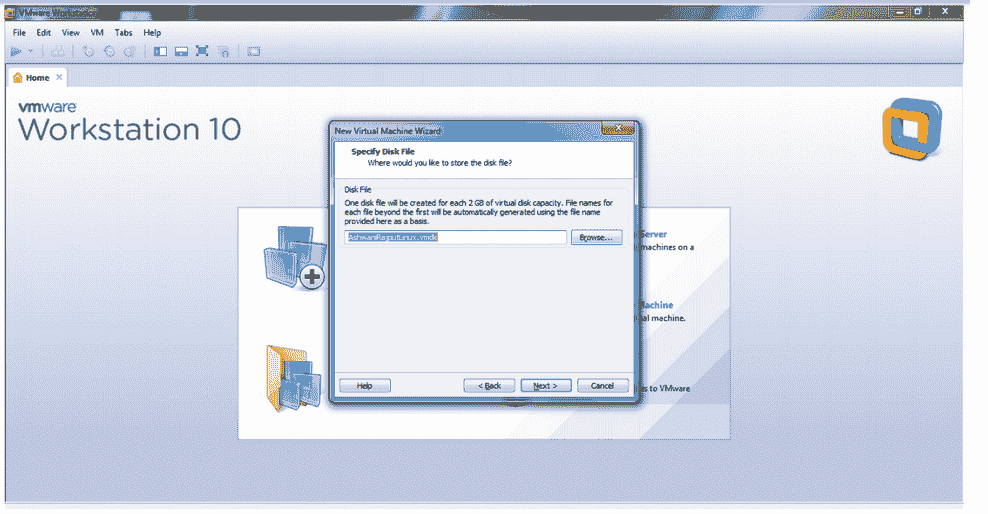

10)在准备创建虚拟机窗口中，单击完成按钮。

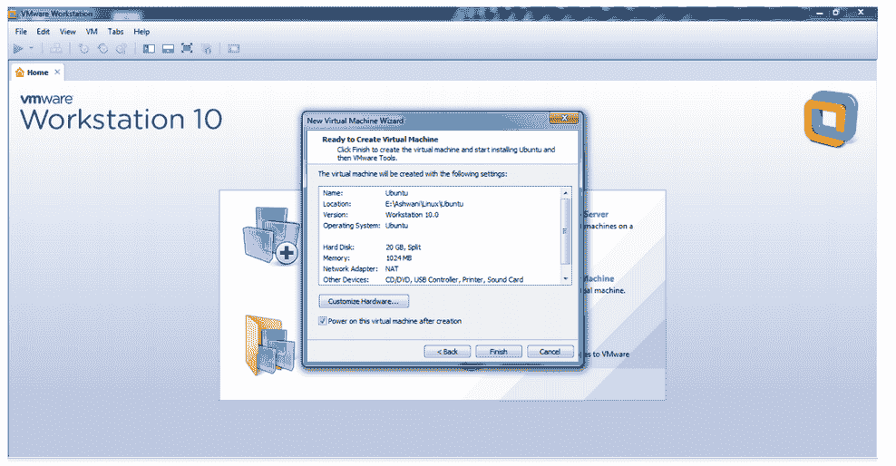

11)现在您将看到 vmware 屏幕，然后是 ubuntu 屏幕。

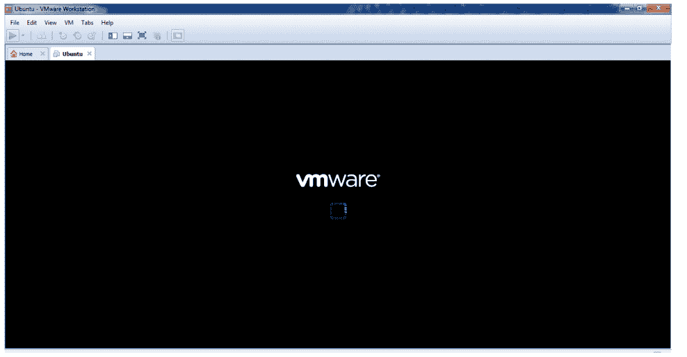 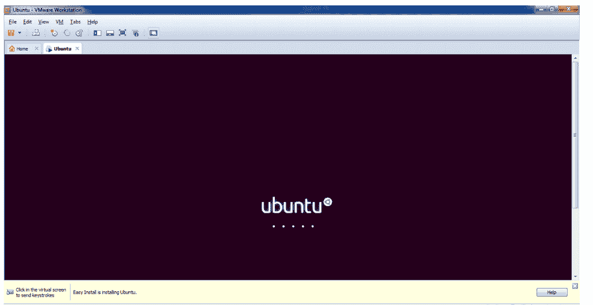

* * *