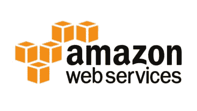

# 云服务提供商公司

> 原文：<https://www.javatpoint.com/cloud-service-provider-companies>

云服务提供商(CSP)在云中提供各种服务，如**软件即服务**、**平台即服务**、**基础设施即服务**、**网络服务**、**业务应用**、**移动应用**、**基础设施**。云服务提供商将这些服务托管在数据中心，用户可以使用互联网连接通过云提供商公司访问这些服务。

有以下云服务提供商公司-

## 亚马逊网络服务

[AWS](https://www.javatpoint.com/aws-tutorial) (亚马逊网络服务)是由**亚马逊**提供的**安全云服务平台**。它提供各种服务，如数据库存储、计算能力、内容交付、关系数据库、简单电子邮件、简单队列和其他功能，以促进组织的发展。

### AWS 的特点

AWS 为构建可扩展、经济高效的企业应用程序提供了各种强大的功能。AWS 的一些重要[特征如下-](https://www.javatpoint.com/features-of-aws)

*   AWS 是**可扩展的**，因为它有能力根据组织的需求向上或向下扩展计算资源。
*   AWS 是**性价比高的**，因为它采用的是**现收现付**定价模式。
*   它提供了各种灵活的存储选项。
*   它提供各种**安全服务**，如基础设施安全、数据加密、监控&日志记录、身份&访问控制、渗透测试和 DDoS 攻击。
*   它可以高效地管理和保护 Windows 工作负载。

* * *

## 2.Microsoft Azure

[微软 Azure](https://www.javatpoint.com/microsoft-azure) 又名 **Windows Azure** 。它支持各种操作系统、数据库、编程语言和框架，允许[信息技术](https://www.javatpoint.com/it-full-form)专业人员通过全球网络轻松构建、部署和管理应用程序。它还允许用户为相关实用程序创建不同的组。

### 微软 Azure 的特性

*   微软 Azure 提供**可扩展**、**灵活**和**高性价比**
*   它允许开发人员快速管理应用程序和网站。
*   它单独管理每个资源。
*   它的 IaaS 基础设施允许我们在不同的平台(如 Windows 和 Linux)上启动通用虚拟机。
*   它提供了一个用于传送图像、视频、音频和应用程序的内容传送系统。

* * *

## 3.谷歌云平台

谷歌云平台是**谷歌**的产物。它由一组物理设备组成，如计算机、硬盘驱动器和虚拟机。它还有助于组织简化迁移过程。

### 谷歌云的特点

*   谷歌云包括各种**大数据服务**，如谷歌 BigQuery、谷歌 CloudDataproc、谷歌 CloudDatalab、谷歌云 Pub/Sub。
*   它提供与**联网**相关的各种服务，包括谷歌虚拟私有云(VPC)、内容交付网络、谷歌云负载平衡、谷歌云互联和谷歌云域名系统。
*   它提供各种**可扩展**和**高性能**
*   GCP 提供各种**无服务器服务**，如消息传递、数据仓库、数据库、计算、存储、数据处理和机器学习(ML)
*   它提供了一个带有 Boost 模式的免费云外壳环境。

* * *

## 4.IBM 云服务

IBM Cloud 是一个开源、更快、更可靠的平台。它是用一套高级数据和 [AI](https://www.javatpoint.com/artificial-intelligence-tutorial) 工具构建的。提供[基础设施即服务](https://www.javatpoint.com/infrastructure-as-a-service)、[软件即服务](https://www.javatpoint.com/software-as-a-service)、[平台即服务](https://www.javatpoint.com/platform-as-a-service)等多种服务。您可以使用互联网连接访问其服务，如计算能力、云数据&分析、云使用案例和存储网络。

### IBM 云的特点

*   IBM 云提高了运营效率。
*   它的速度和敏捷性提高了客户的满意度。
*   它提供基础设施即服务(IaaS)、平台即服务(PaaS)以及软件即服务(SaaS)
*   它为我们的信息技术环境提供各种云通信服务。

* * *

## 5.VMware 云

VMware 云是混合云的软件定义数据中心(SSDC)统一平台。它允许云提供商构建敏捷、灵活、高效和强健的云服务。

### VMware 的功能

*   VMware 云采用**按使用付费**模式和**月订阅**
*   它通过保护用户的数据提供了更好的客户满意度。
*   它可以利用 RESTful API 轻松地在 AWS 云上创建新的 VMware **软件** - **定义的数据中心(SDDC)** 集群。
*   它提供了灵活的存储选项。我们可以按应用程序管理我们的应用程序存储。
*   它提供了一个专用的高性能网络来管理应用程序流量，还支持多播网络。
*   它消除了时间和成本的复杂性。

* * *

## 6\. Oracle cloud

[甲骨文](https://www.javatpoint.com/oracle-tutorial)云平台由**甲骨文公司**提供。它将平台即服务、基础架构即服务、软件即服务和数据即服务与云基础架构相结合。它用于执行任务，例如将应用程序移动到云中、管理云中的开发环境以及优化连接性能。

### 甲骨文云的特点

*   Oracle cloud 为构建、集成、监控和保护应用程序提供了各种工具。
*   它的基础设施使用各种语言，包括 Java、Ruby、PHP、Node.js。
*   它与 Docker、VMware 和其他 DevOps 工具集成在一起。
*   Oracle 数据库不仅在 IaaS、PaaS 和 SaaS 之间提供了无与伦比的集成，还与内部平台集成以提高运营效率。
*   它使信息技术投资的价值最大化。
*   它提供可定制的虚拟云网络、防火墙和 IP 地址，以安全地支持专用网络。

* * *

## 7\. Red Hat

红帽虚拟化是红帽生产的开放标准和桌面虚拟化平台。对于 [Linux](https://www.javatpoint.com/linux-tutorial) 环境来说，为虚拟化服务器以及技术工作站提供各种基础设施解决方案是非常流行的。大多数中小型组织使用红帽来平稳运行他们的组织。它为资源提供了更高的密度、更好的性能、敏捷性和安全性。它还通过提供更便宜、更容易的管理能力来提高组织的经济性。

### 拉德帽的特点

*   红帽通过红帽容器目录提供安全、经过认证和更新的容器映像。
*   红帽云包括 **OpenShift、**，这是一个应用开发平台，允许开发者**访问**、**更新**、**部署应用**
*   它最多支持 16 台虚拟机，每台虚拟机最多有 256GB 的内存。
*   它提供了更好的可靠性、可用性和可维护性。
*   它提供了灵活的存储功能，包括非常大的基于存储区域网络的存储、更好的内存分配管理、LVMs 的高可用性以及对特别是回滚的支持。
*   在桌面环境中，它包括新的屏幕键盘、GNOME 软件等功能，允许我们安装应用程序、更新应用程序以及扩展设备支持。

* * *

## 8.数字海洋

数字海洋是为组织提供计算服务的唯一云提供商。它由莫伊西·乌雷斯基和本于 2011 年创立。它是允许我们管理和部署 web 应用程序的最佳云提供商之一。

### 数字海洋的特征

*   它使用 KVM 虚拟机管理程序将物理资源分配给虚拟服务器。
*   它提供高质量的性能。
*   它提供了一个数字社区平台，帮助回答问题和保存反馈。
*   它允许开发人员使用云服务器为他们的项目快速创建新的虚拟机。
*   它为水滴提供一键式应用。这些应用包括 MySQL、Docker、MongoDB、Wordpress、PhpMyAdmin、LAMP 栈、Ghost 和机器学习。

* * *

## 9.存储空间

Rackspace 提供[云计算](https://www.javatpoint.com/cloud-computing-tutorial)服务，如托管网络应用程序、云备份、云数据块存储、数据库和云服务器。设计 Rackspace 的主要目的是轻松管理私有云和公共云部署。其数据中心在美国、英国、香港和澳大利亚运营。

### Rackspace 的特性

*   Rackspace 提供了各种工具来帮助组织更高效地协作和沟通。
*   我们可以使用任何设备随时随地访问存储在 Rackspace 云驱动器上的文件。
*   它提供 6 个全球数据中心。
*   它可以管理同一网络上的虚拟服务器和专用物理服务器。
*   它以更低的成本提供更好的性能。

* * *

## 10.阿里巴巴云

阿里巴巴云用于开发数据管理和高度可扩展的云计算服务。它提供各种服务，包括弹性计算、存储、网络、安全、数据库服务、应用服务、媒体服务、云通信和物联网。

### 阿里巴巴云的特点

*   阿里巴巴云为国际客户和阿里巴巴集团的电子商务生态系统提供了一套全球云计算服务。
*   它的服务是按使用付费的。
*   它在全球范围内处理其 14 个数据中心。
*   它提供可扩展和可靠的数据存储。

* * *