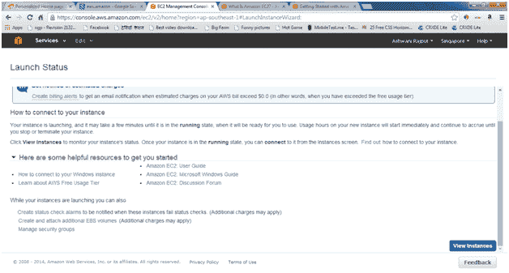

# 如何创建 amazon EC2 窗口实例:

> 原文：<https://www.javatpoint.com/how-to-create-amazon-ec2-window>

* * *

## 启动一个窗口实例

您可以使用 AWS 管理控制台启动一个窗口实例，如下所述。实例是 AWS 云中的虚拟服务器。在 Amazon EC2 的帮助下，您可以设置和配置运行在实例上的操作系统和应用程序。

### 启动实例

1.  登录 AWS 控制台，打开亚马逊 EC2 控制台。
2.  从导航栏中，选择实例的区域。这里我们要选择新加坡数据区。否则，这种选择很重要，因为亚马逊 EC2 的一些资源可以在地区之间共享，而另一些则不能。

4.  在控制台仪表盘上，点击**启动实例。**

6.  选择一个亚马逊机器映像(AMI) 页面显示了一个名为亚马逊机器映像(AMI)的基本配置列表，作为您实例的模板。选择 64 位版本的微软视窗服务器 2008 R2。请注意，该配置被标记为符合**免费等级。**

8.  到**选择实例类型**页面，您可以为您的实例选择硬件配置。默认情况下将选择 **t1.micro** 实例。点击**查看并启动**让向导为您完成或不完成其他配置设置，这样您就可以快速开始了。

10.  要进入**查看实例启动**页面，您需要转到实例的设置。

在**安全组**下，您会看到向导将会创建并为您选择一个安全组。安全组包括使您能够连接到实例的基本防火墙规则。对于 Windows 实例，您通过端口 3389 上的远程桌面协议(RDP)进行连接。

如果您有一个现有的安全组，那么您需要通过单击**编辑安全组**来使用，并在**配置安全组**页面上选择您的组。完成后，点击**评审并启动**返回**评审实例启动**页面。

14.  点击**启动。**

16.  在**选择现有密钥对或创建新密钥对**对话框中，您可以选择**选择现有密钥对**，以选择您已经创建的密钥对。

或者，您可以创建新的密钥对。选择**创建新的密钥对**，输入密钥对的名称，然后点击**下载密钥对。**

这是你保存私钥文件的唯一机会，所以一定要下载。将私钥文件保存在安全的地方。当您启动一个实例时，您需要提供密钥对的名称，以及每次连接到该实例时对应的私钥。

它将以。并将其保存以备将来使用。

**注意**

不要选择**在没有密钥对的情况下继续**选项。如果在没有密钥对的情况下启动实例，则无法连接到它。

准备就绪后，选中确认复选框，然后单击**启动实例。**

24.  将会打开一个确认页面，告知您的实例正在启动。点击**查看实例**关闭确认页面，返回控制台。

27.  在**实例**页面，您可以查看启动状态。实例启动需要很短的时间。当你启动一个实例时，它的初始状态是**待定**。实例启动后，其状态变为**运行**，并接收公共域名。

29.  记录实例的公共域名，因为下一步需要它。
30.  (可选)实例启动后，您可以查看其安全组规则。从“实例”页面中，选择实例。在**描述**选项卡中，找到**安全组**，点击**查看规则。**

如您所见，如果您使用向导为您创建的安全组，它包含一个允许 RDP 流量从任何 IP 源到达端口 3389 的规则。如果启动运行 IIS 和 SQL 的 Windows 实例，向导将创建一个安全组，该安全组包含允许 HTTP(用于 IIS)的端口 80 和 MS SQL 的端口 1433 通信的附加规则

* * *

## 连接到您的 Windows 实例

要连接到 Windows 实例，您必须检索初始管理员密码，然后在使用远程桌面连接到实例时指定该密码。

#### 注意:- Windows 实例一次只能有两个同时进行的远程连接。如果尝试第三次连接，将会出现错误。有关更多信息，请参见配置连接允许的同时远程连接数。

**连接到你的 Windows 实例**

1.  在亚马逊 EC2 控制台，选择实例，然后点击**连接。**

3.  在**连接到您的实例**对话框中，单击**获取密码**(实例启动后需要几分钟密码才可用)。

5.  单击**浏览**并导航到启动实例时创建的私钥文件。选择文件，点击**打开**将文件的全部内容复制到内容框中。

7.  点击**解密密码**。控制台在**连接到您的实例**对话框中显示该实例的默认管理员密码，用实际密码替换之前显示的**获取密码**的链接。

9.  点击**下载远程桌面文件**。浏览器会提示您打开或保存。rdp 文件。两种选择都可以。完成后，您可以单击**关闭**关闭**连接到您的实例**对话框。

11.  如果你打开了。rdp 文件，会看到**远程桌面连接**对话框。如果你救了。rdp 文件，然后导航到下载目录，并双击。显示对话框的 rdp 文件。您将收到一条警告，指出远程连接的发布者未知。单击**连接**连接到您的实例。您可能会收到安全证书无法通过身份验证的警告。点击**是**继续。

13.  使用默认的**管理员**帐户和您之前记录或复制的默认管理员密码，按照提示登录实例。

* * *

## 连接后，我们建议您执行以下操作:

*   将管理员密码从默认值更改为。您可以在登录到实例本身时更改密码，就像在任何其他 Windows 服务器上一样。
*   在实例上创建另一个具有管理员权限的用户帐户。如果您忘记管理员密码或管理员帐户有问题，另一个具有管理员权限的帐户是一种保护措施。

现在，您如何与新加坡或其他数据中心共享本地驱动器？

现在从 Windows 机器启动 RDP(远程桌面服务)，如下所示。从“运行”菜单中运行命令。

将显示“远程桌面连接”窗口。

单击**选项**按钮，然后选择**本地资源**选项卡。

 

在远程音频区域，选择**设置**来配置实例的音频设置。

在**本地资源**选项卡的**本地设备和资源**区域，单击**更多**。列出了 AWS EC2 服务器实例中所有可通过网络使用的即插即用设备以及磁盘驱动器。

 

点击**连接。**

  

现在，我们可以从本地驱动器在新加坡数据中心安装任何东西。

* * *