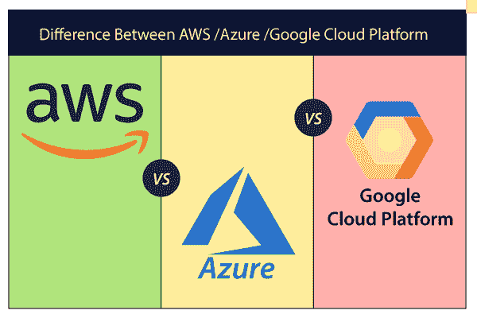

# AWS、Azure 和谷歌云平台的区别

> 原文：<https://www.javatpoint.com/aws-vs-azure-vs-google-cloud-platform>

## 亚马逊网络服务

[亚马逊网络服务(AWS)](https://www.javatpoint.com/aws-tutorial) 是 2002 年推出的云计算平台。它提供广泛的云服务，如[基础设施即服务(IaaS)](https://www.javatpoint.com/infrastructure-as-a-service) 、[平台即服务(PaaS)](https://www.javatpoint.com/platform-as-a-service) 、[软件即服务(SaaS)](https://www.javatpoint.com/software-as-a-service) 。

AWS 为全球最大的社区提供了数百万活跃客户和数千名合作伙伴。大多数组织通过将他们的信息技术管理转移到 AWS 来使用 AWS 来扩展他们的业务。

灵活性、安全性、可扩展性和更好的性能是 AWS 的一些重要特性。

## Microsoft Azure

[微软 Azure](https://www.javatpoint.com/microsoft-azure) 也叫 **Windows Azure** 。它是一个用于构建、部署和管理服务的全球云平台。它支持**[【Java】](https://www.javatpoint.com/java-tutorial)[Nodejs](https://www.javatpoint.com/nodejs-tutorial)[C](https://www.javatpoint.com/c-programming-language-tutorial)****[c#](https://www.javatpoint.com/c-sharp-tutorial)**等多种编程语言。使用微软 Azure 的优势在于，它允许我们提供各种各样的服务，而无需安排和购买额外的硬件组件。

微软 Azure 通过[互联网](https://www.javatpoint.com/internet)提供多种计算服务，包括服务器、存储、数据库、软件、网络和分析。

## 谷歌云平台(GCP)

[谷歌云平台(GCP)](https://www.javatpoint.com/google-cloud-platform) 由**谷歌**于 2011 年推出。它允许我们使用谷歌的产品，如**谷歌搜索引擎、Gmail、YouTube** 等。大多数公司使用该平台在云上轻松构建、移动和部署应用程序。它允许我们使用高速互联网连接访问这些应用程序。GCP 的优势在于支持 **SQL、MYSQL、Oracle、Sam** 、 **more** 等多种数据库。

谷歌云平台(GCP)提供各种云计算服务，包括计算、数据分析、数据存储和机器学习。

## AWS、Azure 和谷歌云平台(GCP)的区别

尽管 AWS、微软 Azure 和谷歌云平台在计算、管理、存储和其他服务方面提供了各种高级功能，但这三者之间也存在一些差异。

下表显示了 AWS、Azure 和谷歌云平台之间的区别-

| 参数 | 自动警报系统 | Azure的 | 谷歌云平台 |
| **应用测试** | 它使用设备场 | 它使用开发测试实验室 | 它使用云测试实验室。 |
| **原料药管理** | 亚马逊应用编程接口网关 | Azure API 网关 | 云端点。 |
| **立方管理** | EKS | 库比涅斯的服务，库比涅斯的服务，库比涅斯的服务，库比涅斯的服务，库比涅斯的服务，库比涅斯的服务，库比涅斯的服务，库比涅斯的服务 | 库柏发动机 |
| **Git 存储库** | AWS 源存储库 | Azure 源存储库 | 云源存储库。 |
| **数据仓库** | 红移 | SQL 仓库 | 大查询 |
| **对象存储** | S3 | 阻止博客和文件 | 谷歌云存储。 |
| **关系数据库** | 无线电数据系统 | 关系数据库 | 谷歌云 SQL |
| **块存储** | 东偏南(east by south) | 页面博客 | 永久磁盘 |
| **市场** | 自动警报系统 | Azure的 | g 套房 |
| **文件存储** | electrical field stimulation 电场刺激 | Azure文件 | ZFS 和阿维 |
| **媒体服务** | 亚马逊弹性转码器 | Azure 媒体服务 | 云视频智能 API |
| **虚拟网络** | 虚拟机 | 联合国志愿人员组织 | 子网络 |
| **定价** | 每小时 | 每分钟 | 每分钟 |
| **虚拟机中的最大处理器数** | One hundred and twenty-eight | One hundred and twenty-eight | Ninety-six |
| **虚拟机中的最大内存(千兆字节)** | Three thousand nine hundred and four | Three thousand eight hundred | One thousand four hundred and thirty-three |
| **捕捉** | 橡皮擦 | 重新计票 | CloudCDN |
| **负载平衡配置** | 弹性负载平衡 | 负载均衡器应用网关 | 云负载平衡 |
| **全球内容交付网络** | 内容推送服务 | 内容交付网络 | 云互联 |

* * *