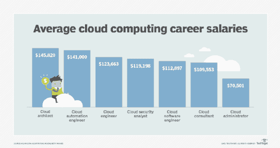

# 云计算工作

> 原文：<https://www.javatpoint.com/cloud-computing-jobs>

**云计算触及现代生活的很多方面，对云专业人才的需求很大。了解云计算职业所需的技能和教育。**

对云专业人员的需求很高，随着对远程访问的依赖持续增长，有才华的信息技术专业人员也越来越多。

云计算是一个数据库和软件系统，通常在数据中心和仓库中运行。这使用户和企业能够从任何地方通过互联网访问数字信息，而不是将物理服务器放在后台办公室的网络机柜中。云计算业务需要更少的信息技术。管理费用，尤其是对于小型企业和初创公司来说，他们可能没有资本投资大规模的内部信息技术部门。

无论是作为消费者还是在 IT 环境中，与云技术的交互几乎涉及到现代生活的方方面面。

在消费者方面，光盘、DVD 和视频游戏等实体媒体的缺乏导致了点播流媒体服务的兴起。这要求远程存储选项能够支持准确、快速地交付大量数据。在 it 领域，人工智能、机器学习和物联网兼容性的进步推动企业寻求云的敏捷性和灵活性。

如此复杂的系统需要特定的知识和技能，需要特定的培训和要求。

### 云计算职业要求

不管你处于职业生涯的哪个阶段，云计算所需的技能都是一样的。您需要在以下方面有坚实的基础:

*   **编程语言。**具体语言包括 Java、JavaScript 和 Python。
*   **数据库管理和编程。**熟悉 SQL、NoSQL、Linux 的人会有优势。
*   **人工智能和机器学习。**这两项技术通过处理和分析模式、基于这些数据提出见解以及促进更快、更准确的决策来帮助企业提高敏捷性和效率。
*   **对云技术和提供商的理解和体验。**这些厂商包括亚马逊网络服务(AWS)、谷歌云平台、微软 Azure 和甲骨文。

与任何信息技术专业一样，您也需要保持好奇心、分析能力，并愿意随时了解推动技术创新的快速变化的用户需求。

### 顶级云计算职业

虽然公司对特定云计算角色及其特定要求的工作描述可能会有所不同，但这里的信息在美国各地广泛适用

**你可以在这里找到下面的工资，还有其他云计算职业。**

### 1.云管理员

这些专家管理公司的云存在和基础设施。他们制定、实施和更新员工和用户访问云服务的策略，建立安全协议和策略，监控和确保正常运行时间，并评估技术更新的需求。

**学历要求:**计算机科学、管理信息系统(MIS)或相关领域本科学历；加上三到五年的系统或信息技术管理经验。

**平均工资:** $70，501

### 2.云架构师

将云架构视为所有其他云技术运行的框架。这是“房子”框架，以及所有特定于云的子专业，如地板、管道、干墙和装修。云架构师是设计和实施公司云计算战略的总承包商。他们确保一切按计划和预算进行，并确保公司顺利过渡到云运营。

**学历要求:**计算机科学、信息系统或相关领域本科及以上学历。一些公司要求或优先考虑那些拥有硕士学位或工商管理硕士学位的人。

**平均工资:**145，820 美元

### 3.云自动化工程师

随着世界变得越来越自动化，云自动化工程师必须在这种自动化技术迁移到云中时构建、实施和维护它。这种自动化将人类工人从重复的任务中解放出来。

教育要求:计算机科学或信息技术专业本科学历，专业为人工智能和机器学习。

**平均工资:**14.1 万美元

### 4.云顾问

一位云顾问拥有丰富的云技术知识，并指导公司寻找基于云的工具。通常，该专家将评估公司的需求，并建议最好的软件和工具来满足该公司的技术和预算需求。该顾问可以通过设计迁移策略和选择合适的平台来帮助向云的过渡。有时可能会要求顾问帮助优化公司的云存在，因此他们应该对主要的云平台有一个全面而深入的了解。

教育要求:计算机科学或信息技术学士学位。由于这个职位通常需要管理技能，工商管理硕士可以带来更多的客户。

**平均工资:**109，553 美元

### 5.云工程师

云工程师负责公司云战略的管理方面。工程师经常与架构师一起实施公司的云战略。尽管如此，他们还执行与客户和供应商谈判的管理任务，以保持每个人都在任务和预算范围内。

**学历要求**:计算机科学、信息系统或相关领域本科及以上学历；此外，还要有 Java 和 Python 等编程语言的经验。

**平均工资:**123，663 美元

### 6.云安全分析师

云安全分析师有责任确保公司云存在的完整性和安全性。他们通过评估威胁和加强防御来做到这一点，防止数据泄露，保护数据安全，并在发生泄露时弥补安全漏洞。

**学历要求:**网络安全、系统分析、计算机科学或信息技术专业本科学历，专业为安全分析。

**平均工资:** $119，198

### 7.云软件工程师

云软件工程师与程序员和相关的计算机科学家一起开发在云中工作的软件。这些人通常还负责升级、修复和维护他们开发的软件以及他们操作的数据库。

教育要求:软件工程、计算机科学、信息系统或相关专业本科以上学历；以及 Java、Python 等编程语言的经验。

**平均工资:**112，897 美元

### 启动云计算职业生涯的技巧

既然你已经知道了云计算中可用的角色，是时候追求一份可以将这些技能付诸实践的职业了。这里有一些小贴士可以帮助你:

**1。获得计算机科学或信息技术学位**

重要的是要明白，许多公司不需要高等教育。如果你能证明你理解并能满足这份工作的要求，你就有很大的机会被录用。然而，如果你有任何先前的信息技术经验，一个正式的计划可以为你提供一个坚实的基础来增加技能和专业知识。在简历上列出学位也能向雇主表明你有这个基础，可以致力于长期项目。

**2。获得与云计算相关的额外培训**

如果大学学位不适合你，或者如果你已经有了信息技术并想转向以云为中心的职业，在线继续教育和培训有无数的选择，包括面对面的课程和多部分认证课程。除了学习作为云专家所需的深入主题之外，这些课程还将向潜在的雇主——或者如果你想在公司内换一个职位，向当前的雇主——展示你对自己的技术和不断变化的技术环境的专注。

**3。获得认证**

亚马逊、微软和谷歌等供应商都有认证计划，教你各种云技术所需的知识和技能。获得云认证将使您能够向雇主和客户证明，您了解云计算的需求，并且拥有满足这些需求的知识和才能。它还能给你加薪。

**4。获得动手体验**

无论你是参加正式的四年制大学课程，还是只上一两节课，没有什么比亲身体验更好的了。如果你刚刚开始探索你的选择，在云服务器上注册一个帐户——比如 AWS 或 Azure——并尝试对这项技术有一个坚实的掌握。如果你已经有了信息技术领域，看看你是否能参与更多基于云的项目，以提高你现有的云计算技能并开发新的技能。

**5。建立你的投资组合**

一旦你有了几个项目，即使你已经完成了它们作为样本，而不是付费客户，把一个网站作为你的投资组合。这应该包括到您的各种云项目的链接以及您的教育和经验总结。如果你有客户的证明，一定要包括那些。

**6。收集好的推荐人**

当整理你的参考资料时，要有选择性。如果你刚起步，可以考虑增加一两位熟悉你表现的计算机科学或信息技术教授。如果你有更多的经验，包括以前的雇主、同事和积极评价你工作的客户。

**7。网络**

无论你是在积极找工作，还是只是留意机会，没有比通过人际关系网获得下一份工作更好的方法了。参加商业活动和会议，尤其是那些专注于云计算的活动和会议，在这些活动和会议中，你最感兴趣的公司有着强大的影响力。告诉你的专业圈子里的其他人，你正在探索职业选择，并询问他们是否会考虑你，看看他们是否知道适合你的职位空缺。

* * *