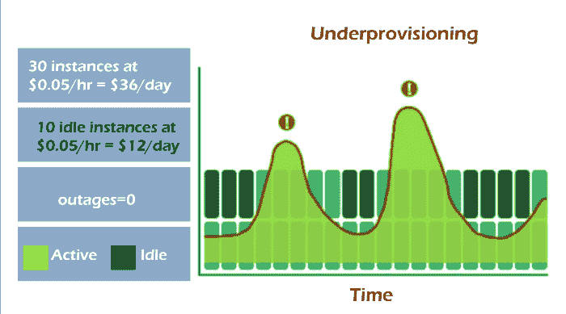

# 云计算中的快速弹性

> 原文：<https://www.javatpoint.com/rapid-elasticity-in-cloud-computing>

弹性是对可伸缩性的“重命名”，这是 IT 架构中已知多年的非功能性需求。可扩展性是指从 IT 环境中添加或删除容量的能力，主要是处理、内存或两者。

能够根据客户对空间和其他服务的需求动态扩展直接提供的服务。它是云计算的五个基本方面之一。

**通常有两种方式:**

*   **水平可伸缩性**:在池(如集群或服务器场)中添加或移除节点、服务器或实例。
*   **垂直可伸缩性**:向现有节点、服务器或实例添加或移除资源，以增加节点、服务器或实例的容量。

可伸缩性的大多数实现都是使用水平方法实现的，因为它是最容易实现的，尤其是在我们生活的当前基于网络的世界中。纵向扩展的动态性较低，因为这需要重新启动系统，有时还需要向服务器添加物理组件。

一个众所周知的例子是在分发请求的 web 服务器群前添加负载平衡器。

## 为什么称之为弹性？

传统的信息技术环境在其体系结构中内置了可扩展性，但是纵向扩展或横向扩展并不常见。这与规模以及时间、精力和成本有关。

服务器必须购买，操作需要拧入服务器机架，安装和配置，然后测试团队需要验证功能，只有这样做了，你才能得到大有。而且你不会只买几个月的服务器，通常是三到五年。所以这是一项长期投资。

门闩也在做同样的事情，但更像一根橡皮筋。你在需要的时候“拓展”能力，在没有能力的时候“释放”能力。而这之所以成为可能，是因为云计算的其他一些特性，比如“资源池化”和“按需自助服务”。将这些功能与高级映像管理功能相结合，您可以更高效地进行扩展。

## 可扩展性的三种形式

**下面我描述了我看到的三种可伸缩性形式，描述了它们之间的不同之处。**

*   **手动缩放**

手动可扩展性始于预测资源集群或场中的预期工作负载，然后手动添加资源以增加容量。订购、安装和配置物理资源需要大量时间，因此预测需要提前几周(如果不是几个月)完成。这主要是使用物理服务器来完成的，物理服务器是手动安装和配置的。

手动可伸缩性的另一个缺点是，移除资源不会节省成本，因为物理服务器已经付费了。

*   **半自动缩放**

半自动可扩展性利用了虚拟服务器，虚拟服务器是使用预定义的映像进行配置(安装)的。系统监控工具的手动预测或自动警告将触发操作来扩展或减少资源集群或群。

使用预定义的、经过测试和批准的映像，每个新的虚拟服务器都将与其他服务器相同(除了一些小的配置)，这为您提供了重复的结果。它还显著减少了系统上的人工劳动，众所周知，系统上的人工操作会导致大约 70%到 80%的错误。使用虚拟服务器也有巨大的好处；这在虚拟服务器取消配置后节省了成本。释放的资源可以直接用于其他目的。

*   **弹性缩放(全自动缩放)**

弹性(或全自动可伸缩性)利用了与半自动可伸缩性相同的概念，但消除了增加或减少容量所需的任何人工劳动。一切都由系统监控工具的触发器控制，这给了你这个“橡皮筋”效果。如果现在需要更多的容量，几分钟内就可以随时添加。根据系统监控工具，容量会立即减少。

## 云计算中的可扩展性与弹性

想象一家位置绝佳的餐厅。它可以容纳多达 30 名顾客，包括户外座位。顾客一整天都来来去去。因此，餐馆很少超过其座位容量。

这家餐馆增加和减少座位

在其座位范围内。但是，当更多的人涌入时，工作人员会在午餐和晚餐中增加一两张桌子。然后他们搬走桌椅，收拾空间。

附近的一个中心每两年举办一次活动，吸引了数百人参加为期一周的会议。

在会议周期间，这家餐馆的客流量经常增加。需求通常很高，以至于不得不赶走顾客。它经常会将业务和客户拱手让给附近的竞争对手。这家餐馆已经连续两年让那些潜在顾客失望了。

弹性允许云提供商的客户实现成本节约，这通常是采用云服务的主要原因。

根据云服务的类型，有时会为与云提供商的长期合同提供折扣。如果你愿意收取更高的价格而不被套牢，你就获得了灵活性。

**我们来看一些可以使用的例子。**

**云快速弹性示例 1**

让我们告诉你，三个月的项目需要 10 台服务器。该公司可以在几分钟内提供云服务，每月支付少量运营支出费用来运行它们，而不是大量前期资本支出成本，并在三个月后免费停用它们。

我们可以将其与云计算出现之前进行比较。假设一个客户带着同样的机会来找我们，我们必须采取行动来实现这个机会。我们必须再购买 10 台服务器，这是一笔巨大的资本成本。

当项目在三个月结束时完成，当我们不再需要服务器时，我们会剩下服务器。这不经济，这可能意味着我们不得不放弃这个机会。

因为云服务的成本效益要高得多，所以我们更有可能抓住这个机会，让我们比竞争对手更有优势。

**云快速弹性示例 2**

假设我们是一家电商商店。圣诞节前后，我们可能会有更多的季节性需求。随着需求的增长，我们可以使用云计算自动启动新服务器。

它可以监控中央处理器、内存、服务器带宽等负载。当达到某个阈值时，我们可以自动向池中添加新服务器，以帮助满足需求。当需求再次下降时，我们可能会有另一个下限，低于该下限，我们会自动关闭服务器。我们可以使用它来自动进出我们的资源，以满足当前的需求。

**基于云的软件服务示例**

如果我们需要短期使用基于云的软件，我们可以付费，而不是购买一次性永久许可证。大多数软件即服务公司提供一系列定价选项，支持不同的功能和持续时间长度，以选择最具成本效益的一种。

通常会有每月定价选项，因此如果您需要偶尔访问，您可以在需要时付费。

## 云弹性的目的是什么？

云弹性有助于用户防止过度调配或调配不足的系统资源。过度配置是指您购买的容量超出需求的情况。

资源调配不足是指分配的资源比您习惯的要少。

过度配置会导致云成本的浪费，而配置不足会导致服务器停机，因为可用的服务器工作过度。服务器关闭会导致收入损失和客户不满，这对业务不利。

弹性伸缩提供了一个中间地带。

弹性非常适合短期需求，例如处理网站流量峰值和数据库备份。

但是弹性云在与可扩展性相结合时，也有助于简化服务交付。例如，通过在同一台服务器上旋转更多虚拟机，您可以在该服务器上创建更多容量来处理动态工作负载激增。

**那么，云弹性在商业环境中是如何工作的呢？**

## 快速弹性用例和例子

在工作中，云弹性的三个优秀例子包括电子商务、保险和流媒体服务。

### 用例一:保险。

假设你从事汽车保险业务。也许您的客户每年都会在大致相同的时间更新汽车政策。投保人会急于超过续保期限。当你到达那个时候，你可以预料到交通会激增。

如果仅依赖可扩展性，流量峰值可能会迅速淹没您调配的虚拟机，从而导致服务中断。这将导致收入和客户的损失。

但是，如果您“租用”了更多的虚拟机，您可以在整个策略续订期间处理流量。因此，您将拥有多个可扩展的虚拟机来实时管理需求。

无论你今年服务的客户是否比前一年多，投保人都不会注意到业绩的任何变化。为了减少云支出，您可以在不再需要时，例如在非高峰月份，将其中一部分释放给虚拟机。

弹性云平台可以让你做到这一点。它只会对您使用的资源收取按使用付费的费用，而不会对您使用的虚拟机数量收取费用。

### 用例二:电子商务。

你越有效地开展宣传活动，潜在买家的兴趣就越有可能达到顶峰。假设你在笔记本上运行一个限时优惠，以纪念你的周年纪念日、黑色星期五或技术庆典。在此期间，您可以预期更多的流量和服务器请求。

新买家将注册新账户。与一年中的大多数时间相比，这将在活动期间给服务器带来大量负载。

现有客户也将从旧的愿望清单中重游废弃的火车，或者尝试兑换累积的积分。

你可以提供更多的资源，用一个有弹性的平台来吸纳节日的高需求。之后，您可以将多余的容量返还给您的云提供商，并保留日常运营中可行的容量。

### 用例三:流媒体服务。

网飞可能是最好的例子。当流媒体服务发布《纸牌屋》第二季的全部 13 集时，收视率跃升至网飞订户的 16%，相比之下，第一季首映周末的收视率仅为 2%。

那些订户在周五的 7 到 10 个小时内播放了其中的一集。现在，网飞拥有超过 5000 万用户(2014 年 2 月)。因此，收视率上升 16%意味着超过 800 万用户在一个工作日内在一天内观看了部分节目。

网飞工程师多次表示，他们利用 AWS 提供的弹性云服务，在短时间内提供多种此类服务器请求，并且零宕机。

**底线:**如果你的云提供商默认提供云弹性，并且你已经在账号中激活了该功能，平台会随时为你分配无限的资源。这意味着您将能够处理突发的和预期的工作负载峰值。

## 云弹性的优势和局限性

云中的弹性有许多强大的优势。

*   **弹性平衡性能和成本效益**

弹性云提供商提供跟踪资源使用情况的系统监控工具。然后他们会自动分析资源分配和使用情况。目标始终是确保这两个指标匹配，以确保系统在其峰值时经济高效地运行。

云提供商还根据按使用付费的模式对其进行定价，允许您为您使用的内容付费，仅此而已。按需付费的扩展模式将让您添加新的基础架构组件，为增长做好准备。

*   **有助于提供顺畅的服务。**

云弹性与云可扩展性相结合，确保客户和云平台在需要时满足不断变化的计算需求。

对于云平台，弹性有助于让客户满意。

虽然可扩展性有助于它处理长期增长，但弹性目前确保了完美的服务可用性。它还有助于防止系统过载或由于过度配置而导致的云成本失控。

**但是，云弹性的极限或劣势是什么？**

云弹性可能不适合所有人。如果您对在线产品或服务有相对稳定的需求，仅云可扩展性可能就足够了。

例如，如果您经营的企业没有遇到季节性或偶尔的服务器请求高峰，您可能不介意使用没有弹性的可伸缩性。**请记住，弹性需要可伸缩性，但不是相反。**

尽管如此，没有人能预测到你可能需要利用突然出现的对你公司的兴趣。那么，当您需要抓住这个机会，但又不想破坏您的云预算推测时，您会怎么做呢？输入云成本优化。

### 云成本优化与云弹性有什么关系？

弹性使用动态变化来尽可能使计算资源与工作负载的需求保持一致，以防止浪费并提高成本效益。另一个目标通常是确保您的系统能够继续令人满意地为客户服务，即使是在受到繁重、突然的工作负载的轰炸时。

但并非所有的云平台服务都支持云弹性的扩展。

**例如。**一些 AWS 服务将弹性作为其产品的一部分，如亚马逊简单存储服务(S3)、亚马逊简单队列服务(SQS)和亚马逊极光。亚马逊极光有资格成为无服务器弹性，而其他如亚马逊弹性计算云(EC2)与亚马逊自动扩展集成并支持弹性。

无论您是否使用弹性服务来动态降低云成本，您都希望以亚马逊云观察无法提供的方式提高云成本的可见性。

CloudZero 允许工程团队跟踪和监督驱动其产品、设施等的特定成本和服务。您可以按功能、产品、服务或客户对成本进行分组，以发现关于云成本的独特见解，这将有助于您回答发生了什么变化，为什么，以及为什么您想了解更多信息。

您还可以测量和监控单位成本，例如每个客户的成本。以下是 Cloud Xero 的每客户成本报告，您可以从中发现有关客户的重要成本信息，这些信息可以帮助指导您的工程和定价决策。

* * *