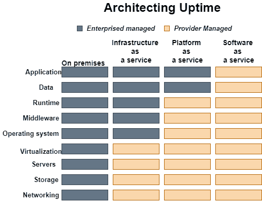

# 云计算中的服务级别协议

> 原文：<https://www.javatpoint.com/service-level-agreements-in-cloud-computing>

服务水平协议(SLA)是云服务提供商和客户之间进行协商的纽带。此前，在云计算中，所有服务级别协议都是由客户和服务消费者协商达成的。随着云计算提供商等大型公用事业公司的引入，大多数服务级别协议都实现了标准化，直到客户成为云服务的大型消费者。服务级别协议也在不同级别进行定义，如下所述:

*   基于客户的服务水平协议
*   基于服务的服务级别协议
*   多层次二语习得

一些服务级别协议可以作为合同强制执行，但大多数是更符合运营级别协议(OLA)的协议或合同，可能不受法律约束。在与云服务提供商达成任何重大和解之前，让律师审查文件是可以的。服务级别协议通常指定某些参数，如下所述:

*   服务可用性(正常运行时间)
*   延迟或响应时间
*   服务组件可靠性
*   各方责任
*   担保

如果云服务提供商未能达到规定的最低目标，提供商将不得不根据协议向云服务消费者支付罚款。因此，服务水平协议就像保险单，如果发生事故，公司必须按照协议支付费用。

微软发布了与 Windows Azure 平台组件相关的服务级别协议，展示了云服务供应商的行业实践。每个组件都有自己的服务级别协议。下面描述了两个主要的服务级别协议:

### Windows Azure SLA -

Windows Azure 有独立的计算和存储服务级别协议。对于计算，可以保证当客户端将两个或多个角色实例部署到不同的故障和升级域时，客户端面向互联网的角色至少 99.95%的时间具有外部连接。此外，客户端的所有角色实例都受到监控，并且在 99.9%的时间内，可以保证检测到角色实例的进程何时无法正常运行和启动。

### 蓝色 SLA SQL-

SQL Azure 客户端将在 SQL Azure 数据库和互联网网关之间建立连接。SQL Azure 将在一个月内处理 99.9%的“每月可用性”。特定租户数据库的每月可用性比率是数据库可供客户使用的时间与一个月总时间的比率。

时间以 30 天为一个月周期，每隔几分钟测量一次。如果 SQL Azure Gateway 拒绝连接到客户数据库的尝试，则部分时间不可用。可用性总是有整整一个月的报酬。

服务级别协议基于使用模式。通常，云提供商会对其按使用付费的资源收取额外费用，并为此目的强制执行标准服务级别合同。客户还可以订阅不同的层，以保证对特定数量的购买资源的访问。

与订阅相关的服务级别协议(SLa)通常提供不同的条款和条件。如果客户端需要访问特定级别的资源，则客户端需要订阅服务。使用模型可能不提供峰值负载条件下访问级别

云基础架构可以跨越物理和虚拟的地理位置、网络和系统。虽然云服务级别协议的确切指标可能因服务提供商而异，但涵盖的领域是相同的:

*   工作量和工作质量(包括精度和准确度)；
*   速度；
*   响应性；和
*   效率。

SLA 文档的目的是建立对服务、优先领域、责任、保证和担保的相互理解。它清楚地概述了参与云配置的各方之间的指标和责任，例如报告或解决系统故障的具体响应时间。

### 云服务级别协议的重要性

服务级别协议非常重要，因为越来越多的组织依赖外部提供商来提供关键系统、应用程序和数据。云服务级别协议确保云提供商满足某些企业级要求，并为客户提供一套明确定义的交付成果。它还描述了财务处罚，如服务时间信用，如果供应商未能满足保证条件。

云服务级别协议的角色本质上与任何合同的角色相同——它是管理客户和提供商之间关系的蓝图。这些约定条款构成了客户承诺使用云提供商服务的可靠基础。它们还反映了提供商对服务质量和底层基础设施的承诺。

### 在云服务级别协议中寻找什么

云服务级别协议应概述各方的责任、可接受的性能参数、协议涵盖的应用程序和服务的描述、监控服务级别的程序以及停机补救计划。服务级别协议通常使用技术定义来衡量服务级别，例如平均故障间隔时间(MTBF)或平均修复时间(MTTR)，这些定义指定了服务级别性能的目标或最小值。确实如此。

规定的服务水平必须是具体的和可衡量的，以便它们可以作为基准，并且如果合同有规定，相应地触发奖励或惩罚。

根据您选择的云模式，您可以控制大部分信息技术资产和服务的管理，或者让云提供商为您管理。

典型的计算和云服务级别协议表达了在提供商未能提供服务的情况下，用户有权获得的服务和追索权或补偿的确切级别。另一个重要方面是服务可用性，它指定了读取请求可以花费的最长时间、允许重试的次数以及其他因素。

如果不符合规范，云服务级别协议还应该定义对用户的补偿。云服务提供商通常提供分层服务信用计划，根据服务级别协议规范和实际服务级别之间的差异为用户提供信用。

### 选择和监控云服务级别协议指标

大多数云提供商公开提供用户可以预期的服务级别的详细信息，这些信息可能对所有用户都是一样的。然而，选择云服务的企业可能能够协商更定制的交易。例如，云存储服务的云服务级别协议可能包括保留策略、要维护的副本数量和存储空间的独特规范。

云服务级别协议可以更详细地涵盖治理、安全规范、合规性以及性能和正常运行时间统计。他们应该针对数据安全和数据隐私、灾难恢复预期、数据位置以及数据访问和可移植性，解决安全和加密实践问题。

### 验证云服务级别

客户可以监控服务指标，如正常运行时间、性能、安全性等。通过云提供商的本地工具或门户。另一种选择是使用第三方工具来跟踪云服务的性能基线，包括资源的分配方式(例如，虚拟机或 VM 中的内存)和安全性。

云 SLA 必须使用清晰的语言来定义术语。这种语言控制，例如，服务的不可访问性和谁负责-缓慢或间歇加载可归因于公共互联网的延迟，这超出了云提供商的控制范围。提供商通常会指定并放弃由于定期维护而导致的任何停机时间，这些时间通常(但不总是)定期安排并重复发生。

### 协商云服务级别协议

大多数常见的云服务简单且通用，但也有一些变化，例如基础架构(IaaS)选项。准备好协商通过云交付的任何定制服务或应用程序。在特定的定制领域，如数据保留标准或定价和补偿/罚款，可能有更多的谈判空间。谈判力通常会随着客户的规模而变化，但可能会有更有利的条件。

在进行任何云服务级别协议谈判时，通过明确正常运行时间来保护业务非常重要。一个好的服务水平协议可以保护客户和供应商免于错过期望。例如，99.9%的正常运行时间(“三个 9”)是一个常见的赌注，相当于每年中断 9 个小时；99.9999%(“五个九”)意味着每年停机时间约为五分钟。一些任务关键型数据可能需要高可用性，例如每年几分之一秒的停机时间。考虑几个区域来帮助减少重大停机的影响。

请记住，云服务级别协议谈判的某些领域有不必要的保险。某些使用情形需要最高的正常运行时间保证，需要额外的工程工作和成本，并且可能更适合私有内部基础架构。

注意给定云提供商的数据存放位置。许多合规性法规，如 HIPAA(健康保险可移植性和责任法案)要求数据保存在特定的区域，以及某些隐私准则。云客户拥有并负责这些数据，因此请确保将这些要求纳入服务级别协议，并通过审核和报告进行验证。

最后，云服务级别协议应该包括退出策略，该策略概述了提供商确保平稳过渡的期望。

### 扩展云服务级别协议

大多数服务级别协议都是为了满足客户当前的需求而协商的，但是随着时间的推移，许多企业的规模会发生巨大变化。一份可靠的云服务级别协议概述了合同审查和潜在调整的差距，以满足组织不断变化的需求。

一些供应商构建了通知工作流，当云服务级别协议接近违约时触发，以便根据规模变化启动新的谈判。这种正常运行时间可以涵盖超出可用性级别或标准的使用情况，并且可以保证升级到新的服务级别。

* * *