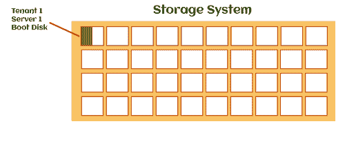
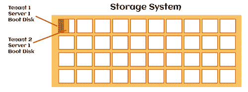
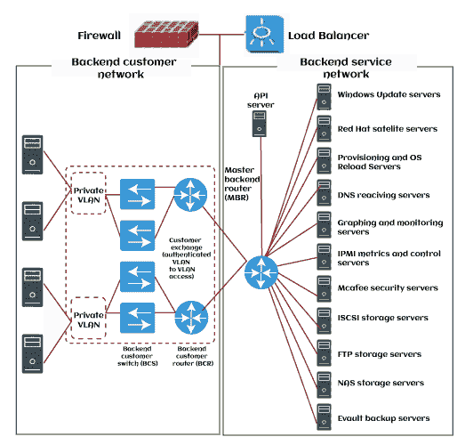

# 云计算中的资源池

> 原文：<https://www.javatpoint.com/resource-pooling-in-cloud-computing>

### 资源池

下一个我们可以共享的资源是存储。在下图中，蓝色大框代表一个包含许多硬盘的存储系统。每个较小的白色方块代表硬盘。

借助我的集中式存储，我可以随心所欲地分割我的存储，并为虚拟机提供他们自己的一小部分存储，无论它们需要多少空间。在下面的示例中，我将第一个磁盘的一部分分配给“租户 1，服务器 1”的引导磁盘。

我从我的存储中取出另一片，并将其配置为服务器 1 的租户 2 的引导磁盘。

共享集中式存储提高了存储分配效率-我可以为他们提供所需的确切存储容量，而不是将整个磁盘分配给不同的服务器。通过精简资源调配、重复数据消除和压缩等存储效率技术，可以进一步节省成本。

请查看我的**存储区域网络**和**网络连接存储**存储课程简介，了解有关集中式存储的更多信息。

## 网络基础设施池

下一个可以共享的资源是网络基础设施。

**下图顶部是物理防火墙。**

所有不同的租户都将有防火墙规则来控制允许哪些流量进入其虚拟机，例如用于管理的 RDP 和端口 80(如果是网络服务器)上的 HTTP 流量。

我们不需要给每个客户他们的物理防火墙；我们可以在不同的客户端之间共享同一个物理防火墙。传入连接的负载平衡器也可以虚拟化，并在多个客户端之间共享。

在图左侧的主要部分，您可以看到几个交换机和路由器。这些交换机和路由器是共享的，流量通过同一台设备到达不同的客户端。

### 服务池

云提供商还向客户提供各种服务，如图右侧所示。Windows Update 和红帽更新服务器，用于操作系统修补、DNS 等。将域名系统作为一项集中服务，使客户不必提供域名系统解决方案。

### 位置独立性

正如 NIST 所说，客户通常不知道或无法控制所提供资源的确切位置。然而，他们可能能够在更高的抽象级别上指定位置，例如国家、州或数据中心级别。

比如我们再用 AWS 当我创建虚拟机时，我是在新加坡数据中心创建的，因为我位于东南亚地区。我会得到最低的网络延迟和最好的性能。

使用 AWS，我知道虚拟机所在的数据中心，但不知道它运行的实际物理服务器。它可能在特定数据中心的任何地方。它可以使用数据中心的任何个人存储系统和任何个人防火墙。这些细节对客户来说并不重要。

## 资源池是如何工作的？

在这种私有云即服务中，用户可以根据自己的需求选择理想的资源细分。资源集中要考虑的主要问题是成本效益。它还确保品牌提供新的服务。

它通常用于无线电通信等无线技术。在这里，单个通道连接在一起，形成一个强大的连接。所以，连接可以无干扰地传输。

在云中，资源池化是一个依赖于用户需求的多租户过程。这就是为什么它被称为以集中方式控制的 SaaS 或软件即服务。此外，随着越来越多的人开始使用此类 SaaS 服务作为服务提供商。这些服务的收费往往很低。因此，拥有这样的技术在某一点上变得比它更容易获得。

在私有云中，池被创建，云计算资源被转移到用户的 IP 地址。因此，通过访问 IP 地址，资源继续将数据传输到理想的云服务平台。

## 资源共享的好处

**1。高可用率**

资源共享是让 SaaS 产品更容易获得的好方法。如今，这种服务的使用已经变得很普遍。而且它们中的大多数比拥有一个更容易接近和可靠。因此，初创企业和入门级企业可以获得这样的技术。

**2。服务器负载均衡**

负载平衡是基于资源池的服务的租户享受的另一个好处。在这种情况下，用户不必面对许多关于服务器速度的挑战。

**3。提供高计算体验**

多租户技术为用户提供了出色的性能。用户可以轻松、安全地保存数据或利用这种具有高安全性优势的服务。此外，许多预先构建的工具和技术使云计算先进且易于使用。

**4。虚拟和物理存储数据**

基于资源池的服务的最佳优势是用户可以使用主机提供的虚拟空间。但是，它们也转移到了服务提供商提供的物理主机上。

**5。业务灵活性**

基于池的云服务非常灵活，因为它们可以根据技术需求进行转换。此外，用户不必担心资本化或巨额投资。

**6。虚拟主机停机时物理主机工作**

虚拟主机变慢可能是一个常见的技术问题。因此，在这种情况下，SaaS 服务提供商的物理主机将开始工作。因此，用户或租户可以在没有技术挑战的情况下获得合适的计算环境。

## 资源池的缺点

**1。安全**

大多数提供基于资源池的服务的服务提供商都提供了高度安全的特性。然而，许多功能可以为这类服务提供高级别的安全性。但即便如此，该公司的机密数据可能会传递给第三方，即服务提供商。由于任何缺陷，该公司的数据可能会被滥用。但即便如此，仅仅依靠第三方服务提供商也不是一个好主意。

**2。不可扩展性**

这可能是组织使用资源池的另一个缺点。因为如果他们找到便宜的解决方案，他们在未来升级业务时可能会面临挑战。此外，另一个因素会阻碍整个过程，限制业务规模。

**3。受限访问**

在私有资源池中，用户对数据库的访问受到限制。在这种情况下，只有拥有用户凭据的用户才能访问公司存储的数据或云计算数据。因为可能有机密的用户详细信息和其他重要文件。因此，这样的服务提供商可以提供租户端口指定、域成员资格和协议转换。他们还可以为云计算中分配区域的用户使用另一个凭据。

## 结论

云计算中的资源池代表了技术术语。它用于描述服务提供商一次向多个客户提供信息技术服务。这些服务是可扩展的，企业也可以访问。另外，当品牌使用这种技术时，他们可以节省大量资本投资。

* * *