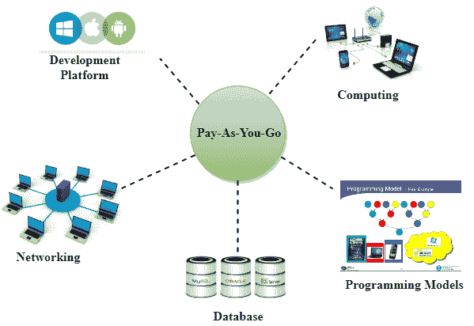

# AWS 教程

> 原文：<https://www.javatpoint.com/aws-tutorial>

AWS 教程提供基本和高级概念。我们的 AWS 教程是为初学者和专业人士设计的。

AWS 代表亚马逊网络服务，它使用分布式信息技术基础设施按需提供不同的信息技术资源。

我们的 aws 教程包括所有的主题，如介绍，aws 的历史，全球基础设施，AWS 的功能，IAM，存储服务，数据库服务等。

## 什么是 AWS？

*   AWS 代表**亚马逊网络服务**。
*   AWS 服务由亚马逊提供，它使用分布式信息技术基础设施来提供按需可用的不同信息技术资源。它提供不同的服务，如基础设施即服务、平台即服务和打包软件即服务(SaaS)。
*   亚马逊推出了 AWS，这是一个云计算平台，允许不同的组织利用可靠的信息技术基础设施。

## 自动气象站的用途

*   一个小型制造组织利用他们的专业知识，通过将他们的信息技术管理留给自动仓库来扩展他们的业务。
*   遍布全球的大型企业可以利用 AWS 向分散的员工提供培训。
*   建筑咨询公司可以使用 AWS 获得建筑原型的高计算渲染。
*   媒体公司可以使用 AWS 向全球文件提供不同类型的内容，如电子书或音频文件。

## 现收现付

基于现收现付的理念，AWS 为客户提供服务。

AWS 在需要时向客户提供服务，无需任何事先承诺或前期投资。现收现付使客户能够从 AWS 获得服务。

*   计算
*   编程模型
*   数据库存储
*   建立关系网

## 自动气象站的优势

### 1)灵活性

*   由于 AWS 中新功能和服务的即时可用性，我们可以获得更多时间来完成核心业务任务。
*   它可以轻松托管遗留应用程序。AWS 不需要学习新技术，应用程序迁移到 AWS 提供的先进计算和高效存储。
*   AWS 还提供了一个选择，即我们是否希望一起运行应用程序和服务。我们还可以选择在 AWS 中运行一部分 IT 基础架构，其余部分在数据中心运行。

### 2)成本效益

与需要巨额投资的传统 IT 基础架构相比，AWS 不需要前期投资、长期承诺和最低费用。

### 3)可扩展性/弹性

通过 AWS，当需求分别增加或减少时，自动缩放和弹性负载平衡技术会自动放大或缩小。AWS 技术非常适合处理不可预测或非常高的负载。由于这个原因，组织享受到了降低成本和提高用户满意度的好处。

### 4)安全性

*   AWS 为客户提供端到端的安全性和隐私保护。
*   AWS 拥有虚拟基础架构，可提供最佳可用性，同时管理其运营的完全隐私和隔离。
*   由于亚马逊在设计、开发和维护大型信息技术运营中心方面有多年的经验，客户可以期待高水平的物理安全性。
*   AWS 确保了安全性的三个方面，即用户数据的机密性、完整性和可用性。

* * *

## AWS 教程索引

* * *

**AWS 教程**

*   [AWS 教程](aws-tutorial)
*   [AWS 的历史](history-of-aws)
*   [自动气象站功能](features-of-aws)
*   [全球基础设施](aws-global-infrastructure)
*   [AWS 自由层](aws-free-tier)

**AWS IAM**

*   [AWS IAM](aws-iam)
*   AWS SAML
*   [IAM 身份](aws-iam-identities)
*   [IAM 角色](aws-iam-roles)
*   [IAM 角色用例](aws-iam-roles-use-cases)
*   [创建 IAM 角色](aws-creating-iam-roles)

**AWS 存储服务**

*   [S3 AWS](aws-s3)
*   [AWS S3 概念](aws-s3-concepts)
*   [创建 S3 桶](aws-creating-s3-bucket)
*   [AWS 存储类](aws-storage-classes)
*   [AWS 版本控制](aws-versioning)
*   [跨区域复制](aws-cross-region-replication)
*   [生命周期管理](aws-lifecycle-management)
*   [云锋 CDN](aws-cloudfront-cdn)
*   [创建云锋 CDN](aws-creating-a-cloudfront-cdn)
*   [存储网关](aws-storage-gateway)
*   [AWS 雪球](aws-snowball)
*   [S3 转移加速度](aws-s3-transfer-acceleration)

**EC2-AWS 的主干**

*   [AWS EC2](aws-ec2)
*   [AWS EBS](aws-ebs)
*   [创建 EC2 实例](aws-ec2-creating-an-instance)
*   [EBS 卷](aws-ebs-volume)
*   [安全组](aws-security-group)
*   [AWS AMI](aws-ami)
*   [创建 AMI](aws-creating-an-ami)
*   [AWS 负载平衡](aws-load-balancing)
*   [创建负载平衡器](aws-creating-load-balancer)
*   [AWSλ](aws-lambda)
*   [创建λ](aws-creating-a-lambda)
*   [CloudWatch EC2](aws-cloudwatch-ec2)
*   [AWS Bash 脚本](aws-bash-script)

**AWS Route53**

*   [什么是 DNS](aws-dns)

**AWS 数据库服务**

*   [关系数据库](aws-relational-databases)
*   [非关系数据库](aws-non-relational-database)
*   AWS 弹性缓存
*   [创建无线电数据系统实例](creating-an-rds-instance-in-aws)
*   [AWS DynamoDB](aws-dynamodb)
*   [AWS Aurora](aws-aurora)
*   [AWS 红移](aws-redshift)

**AWS 应用服务**

*   [AWS SQS](aws-sqs)
*   AWS swf
*   [AWS SNS](aws-sns)
*   [弹性转码器](aws-elastic-transcoder)
*   [API 网关](aws-api-gateway)
*   [AWS 驱动](aws-kinesis)

**AWS VPC**

*   [AWS VPC](aws-vpc)
*   [打造自己的定制 VPC](creating-your-own-custom-vpc)
*   [直连](aws-direct-connect)
*   [NAT 网关](aws-nat-gateways)
*   [AWS 堡垒主机](aws-bastion-host)
*   AWS VPC 端点
*   [AWS VPC 流量日志](aws-vpc-flowlogs)
*   [AWS NACL](aws-nacl)
*   [NACL vs 保安集团](aws-nacl-vs-security-group)
*   [AWS 数据管道](aws-data-pipeline)

**AWS 面试问题**

*   [AWS 面试问题](aws-interview-questions)

* * *

## 先决条件

在学习 AWS 之前，你应该对云计算有一个基本的了解。

## 观众

我们的 AWS 教程旨在帮助初学者和专业人士。

## 问题

我们保证您在本 AWS 教程中不会发现任何问题。但是如果有任何错误，请在联系表格中发布问题。

* * *