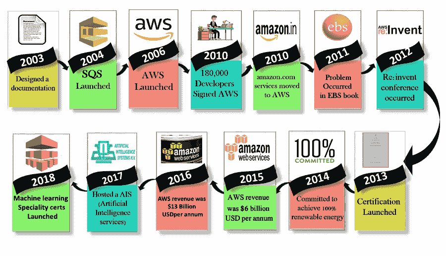

# AWS 的历史

> 原文：<https://www.javatpoint.com/history-of-aws>

*   **2003 年:**2003 年，Chris Pinkham 和 Benjamin Black 提交了一篇关于亚马逊自己的内部基础设施应该是什么样子的论文。他们建议把它作为一项服务来销售，并准备了一个商业案例。他们准备了一份六页的文件，看了一下是否继续。他们决定继续处理文件。
*   **2004 年:** SQS 代表“简单排队服务”于 2004 年正式推出。一个团队在南非开普敦推出了这项服务。
*   **2006 年:** AWS(亚马逊网络服务)正式上线。
*   **2007 年:**2007 年，超过 18 万名开发者注册了 AWS。
*   **2010 年:**2010 年，Amazon.com 零售 web 服务迁移到了 AWS，即 Amazon.com 现在运行在 AWS 上。
*   **2011 年:** AWS 出现了一些重大问题。EBS(弹性块存储)卷的某些部分被卡住，无法读写请求。这个问题花了两天时间才解决。
*   **2012 年:** AWS 举办了名为 re:Invent 大会的首次客户活动。第一次:发明大会召开，会上推出了新产品。在 AWS 中，另一个主要问题发生了，影响了许多受欢迎的网站，如 Pinterest、Reddit 和 Foursquare。
*   **2013 年:**2013 年推出认证。AWS 为拥有云计算专业知识的软件工程师启动了一个认证项目。
*   **2014 年:** AWS 致力于为其全球足迹实现 100%的可再生能源使用率。
*   **2015 年:** AWS 收入破亿，达到每年 60 亿美元。收入每年增长 90%。
*   **2016 年:**到 2016 年，收入翻了一番，达到每年 130 亿美元。
*   **2017 年:**2017 年，AWS re: invent 发布了一系列人工智能服务，因此 AWS 的收入翻了一番，达到每年 270 亿美元。
*   **2018 年:**2018 年，AWS 推出了**机器学习专业证书**。它非常注重自动化人工智能和机器学习。

* * *