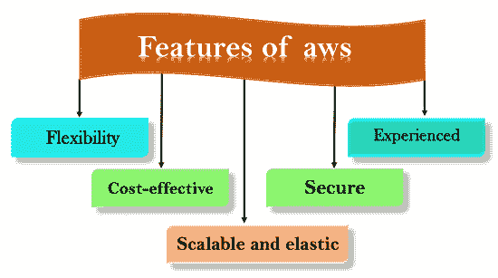

# 自动气象站的特点

> 原文：<https://www.javatpoint.com/features-of-aws>

以下是自动气象站的特点:

*   灵活性
*   性价比高
*   可扩展且有弹性
*   安全的
*   有经验的

* * *

## 1)灵活性

*   AWS 与传统 IT 模式的区别在于**灵活性**。
*   用于交付信息技术解决方案的传统模型需要在新的体系结构、编程语言和操作系统上进行大量投资。尽管这些投资很有价值，但采用新技术需要时间，还会降低您的业务速度。
*   AWS 的灵活性允许我们选择哪些编程模型、语言和操作系统更适合他们的项目，因此我们不必学习新技能来采用新技术。
*   灵活性意味着将遗留应用程序迁移到云中既简单又经济。您只需要将应用程序迁移到云中并利用先进的计算能力，而不是重写应用程序以采用新技术。
*   在 aws 中构建应用程序就像使用现有的硬件资源构建应用程序一样。
*   较大的组织以混合模式运行，即应用程序的某些部分在其数据中心运行，而应用程序的其他部分在云中运行。
*   aws 的灵活性对于组织来说是一项巨大的资产，可以及时交付具有最新技术的产品，并从整体上提高生产力。

## 2)成本效益

*   成本是交付信息技术解决方案时需要考虑的最重要因素之一。
*   例如，开发和部署一个应用程序可能会产生较低的成本，但是在成功部署之后，就需要硬件和带宽。拥有自己的基础设施可能会产生相当大的成本，例如电力、冷却、房地产和员工。
*   云提供按需的信息技术基础设施，让您可以消耗实际需要的资源。在 aws 中，您并不局限于一定数量的资源，例如存储、带宽或计算资源，因为很难预测每个资源的需求。因此，我们可以说云通过保持资源的适当平衡来提供灵活性。
*   AWS 不提供前期投资、长期承诺或最低支出。
*   您可以随着资源需求的增加或减少而相应地扩大或缩小规模。
*   aws 允许您更即时地访问资源。它有能力更快地响应变化，无论变化是大是小，都意味着我们可以抓住新的机会来应对业务挑战，从而增加收入，降低成本。

## 3)可扩展且有弹性

*   在传统的 IT 组织中，可扩展性和弹性是根据投资和基础架构计算的，而在云中，可扩展性和弹性可以节省成本并提高投资回报率。
*   aws 中的可伸缩性能够在需求增加或减少时分别向上或向下扩展计算资源。
*   aws 中的弹性被定义为传入的应用程序流量在多个目标之间的分布，例如 Amazon EC2 实例、容器、IP 地址和 Lambda 函数。
*   弹性负载平衡和可扩展性可自动扩展您的 AWS 计算资源，以满足意外需求，并在需求减少时自动缩减。
*   aws 云对于实现短期作业、关键任务作业以及定期重复的作业也很有用。

## 4)安全

*   AWS 提供了一个可扩展的云计算平台，为客户提供端到端的安全性和端到端的隐私保护。
*   AWS 将安全性纳入其服务中，并记录如何使用安全功能。
*   aws 维护您的数据的机密性、完整性和可用性，这是 AWS 的重中之重。

**物理安全:**亚马逊在大型数据中心的设计、建设和运营方面拥有多年经验。aws 基础设施包含在全球 AWS 控制的数据中心中。数据中心受到物理保护，以防止未经授权的访问。

**安全服务:**AWS 云提供的每项服务都是安全的。

**数据隐私:** A 可以对个人和企业数据进行加密，维护数据隐私。

## 5)经验丰富

*   AWS 云提供了一定级别的规模、安全性、可靠性和隐私性。
*   AWS 已经在管理数十亿美元 Amazon.com 业务的 16 年经验的基础上建立了一个基础设施。
*   亚马逊继续通过增强客户的基础设施能力使其受益。
*   如今，亚马逊已经成为一个服务于数百万客户的全球网络平台，AWS 自 2006 年以来不断发展，服务于全球数十万客户。

* * *