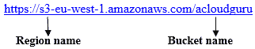
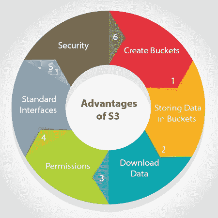

# S3-101

> 原文：<https://www.javatpoint.com/aws-s3>

*   S3 是 aws 推出的首批服务之一。
*   S3 代表简单存储服务。
*   S3 为开发人员和 IT 团队提供安全、耐用、高度可扩展的对象存储。
*   通过简单的 web 服务界面，可以很容易地在 web 上的任何地方存储和检索任意数量的数据。

## 什么是 S3？

*   S3 是存放文件的安全地方。
*   它是基于对象的存储，即可以存储图像、word 文件、pdf 文件等。
*   存储在 S3 的文件可以从 0 字节到 5 TB。
*   它拥有无限的存储空间，这意味着您可以随心所欲地存储数据。
*   文件存储在存储桶中。一个桶就像 S3 的一个文件夹，用来存储文件。
*   S3 是一个通用名称空间，即名称必须是全球唯一的。桶包含一个域名系统地址。因此，存储桶必须包含唯一的名称才能生成唯一的 DNS 地址。

如果您创建了一个存储桶，网址如下所示:

*   如果你上传一个文件到 S3 桶，那么你会收到一个 HTTP 200 代码，表示文件上传成功。

### 亚马逊 S3 的优势

*   **创建桶:**首先，我们创建一个桶，并为桶提供一个名称。桶是 S3 存储数据的容器。存储桶必须具有唯一的名称才能生成唯一的域名系统地址。
*   **将数据存储在桶中:**桶可以用来存储无限量的数据。您可以将您想要的文件上传到亚马逊 S3 存储桶中，也就是说，存储文件没有最大限制。每个对象最多可以包含 5 TB 的数据。每个对象都可以通过使用唯一的开发人员分配的密钥来存储和检索。
*   **下载数据:**你也可以从一个桶里下载你的数据，也可以给别人权限下载同样的数据。你可以随时下载数据。
*   **权限:**您还可以授予或拒绝想要从您的亚马逊 S3 桶下载或上传数据的其他人的访问权限。身份验证机制保护数据安全，防止未经授权的访问。
*   **标准接口:** S3 与标准接口 REST 和 SOAP 接口一起使用，它们的设计方式使得它们可以与任何开发工具包一起工作。
*   **安全性:**亚马逊 S3 通过保护未经授权的用户不访问您的数据来提供安全功能。

### S3 是一个简单的键值存储

**S3 是基于对象的。对象包括以下内容:**

*   **键:**简单来说就是对象的名字。例如 hello.txt、电子表格. xlsx 等。您可以使用键来检索对象。
*   **值:**它只是由一系列字节组成的数据。它实际上是文件中的一个数据。
*   **版本号:**版本号唯一标识对象。它是 S3 在向 S3 桶添加对象时生成的字符串。
*   **元数据:**是关于你正在存储的数据的数据。一组名称-值对，可以用来存储关于对象的信息。元数据可以分配给亚马逊 S3 桶中的对象。
*   **子资源:**子资源机制用于存储对象特定的信息。
*   **访问控制信息:**您可以将权限单独放在您的文件上。

* * *