# 创建 S3 桶

> 原文：<https://www.javatpoint.com/aws-creating-s3-bucket>

*   登录到 AWS 管理控制台。登录后，屏幕出现如下所示:

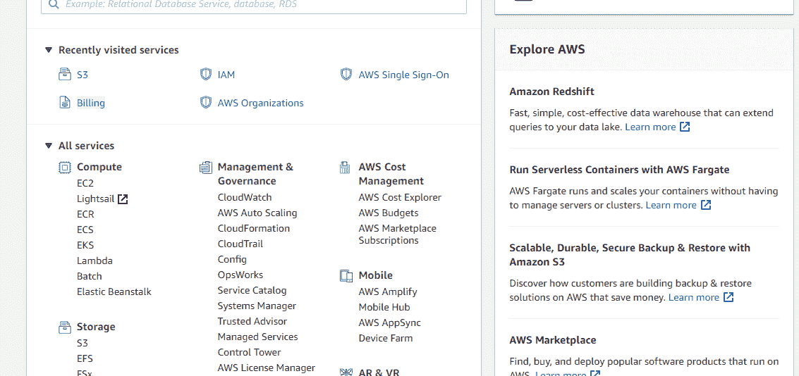

*   转到 S3 服务。点击 S3 后，屏幕出现如下所示:

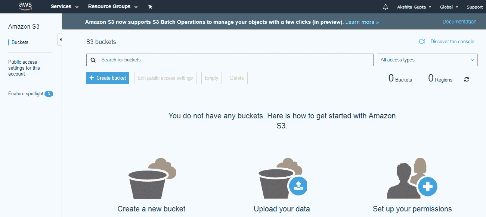

*   要创建 S3 桶，请单击“创建桶”。点击“创建桶”按钮，屏幕显示如下:

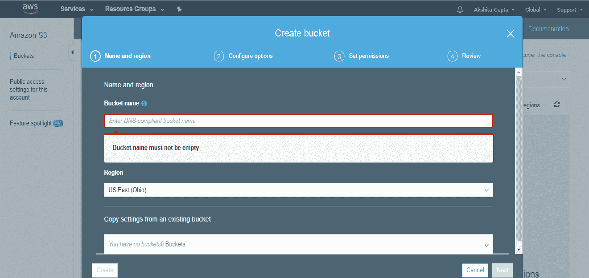

*   输入看起来像域名系统地址的桶名，并且应该是可解析的。桶就像一个存放物品的文件夹。桶名应该是唯一的。存储桶名称应以小写字母开头，不得包含任何无效字符。长度应为 3 到 63 个字符。

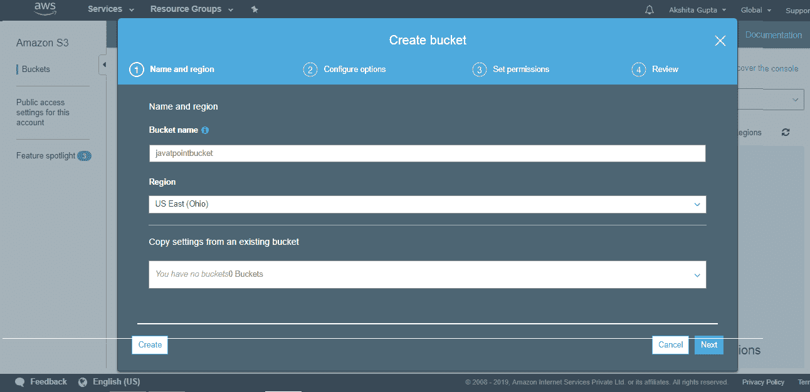

*   点击“创建”按钮。现在，桶被创建了。

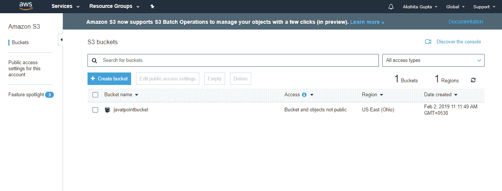

我们从上面的屏幕中看到，bucket 及其对象不是公共的，因为默认情况下，所有对象都是私有的。

*   现在，点击“javatpointbucket”在这个 bucket 中上传一个文件。点击后，屏幕显示如下:

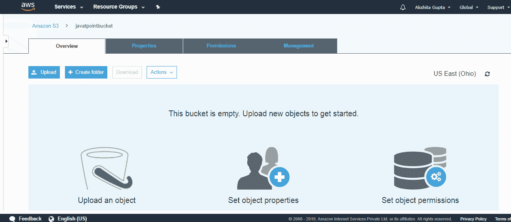

*   点击“上传”按钮，将文件添加到您的存储桶中。

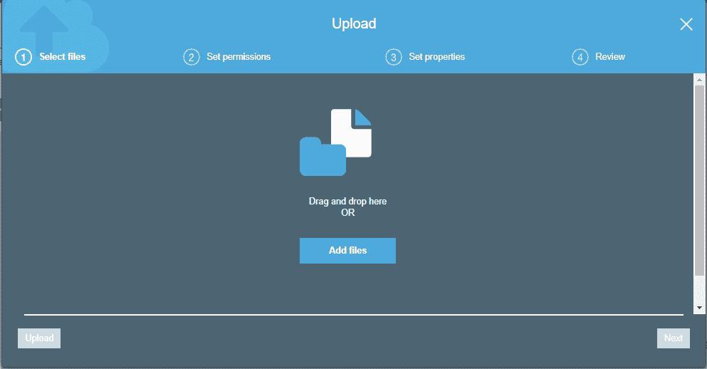

*   点击“添加文件”按钮。

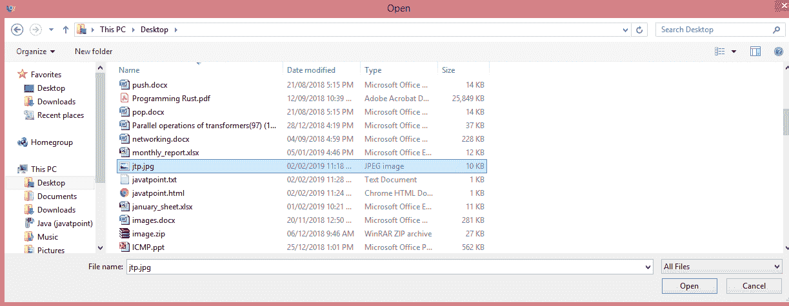

*   添加**jtp.jpg**文件。

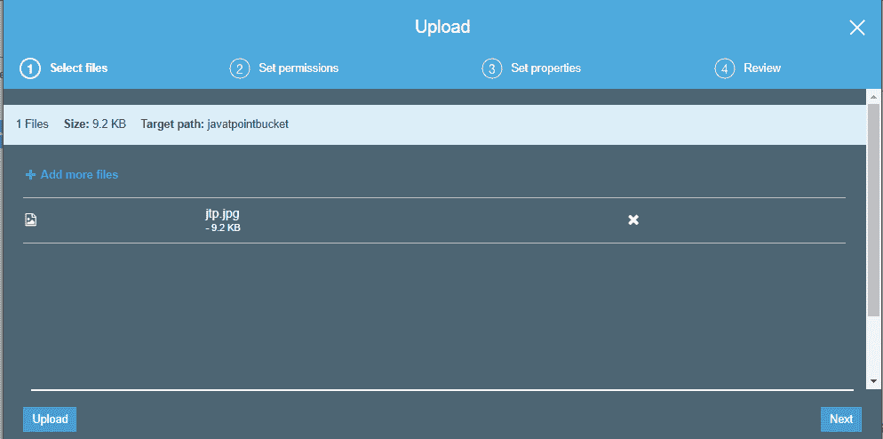

*   点击“上传”按钮。

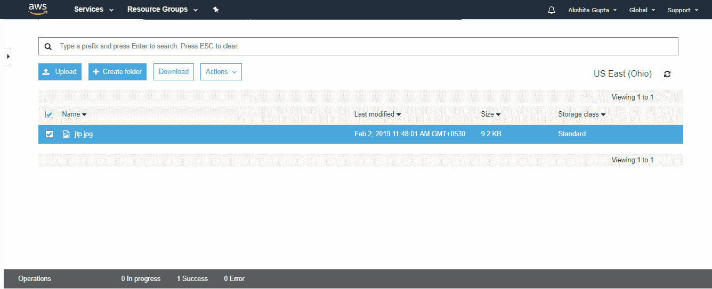

从上面的屏幕中，我们观察到“jtp.jpg”已经成功上传到桶“javatpoint”。

*   移动到对象的属性**“jtp . jpg”**并点击对象网址运行出现在屏幕右侧的文件

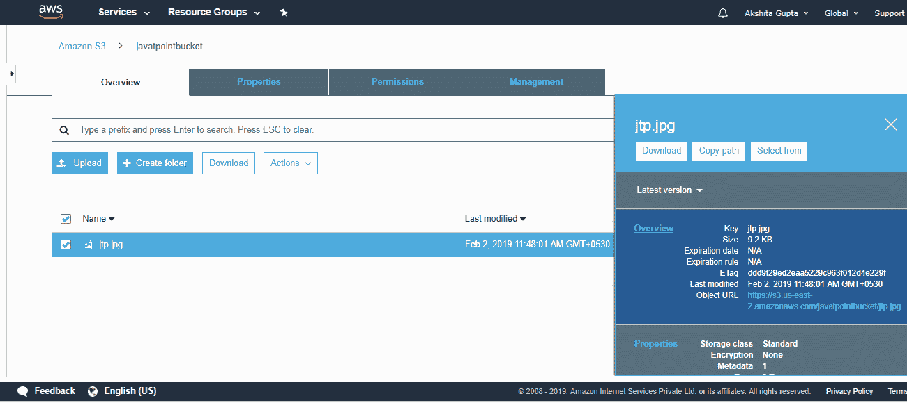

*   单击对象网址时，屏幕显示如下:

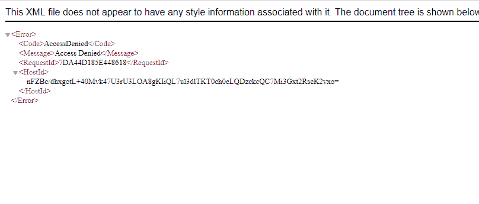

从上面的屏幕中，我们观察到不允许我们接近铲斗的对象。

*   为了克服上述问题，我们需要设置一个桶的权限，即“javatpointbucket”，并取消选中所有这些权限。

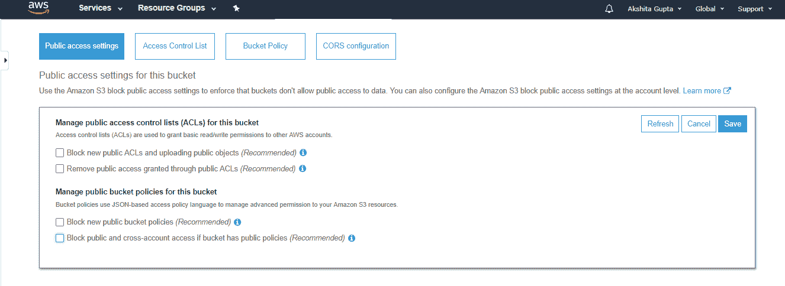

*   保存这些权限。
*   在文本框中输入“确认”，然后点击“确认”按钮。

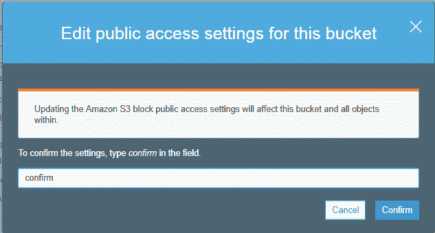

*   点击**“动作”**下拉菜单，然后点击“公开”。

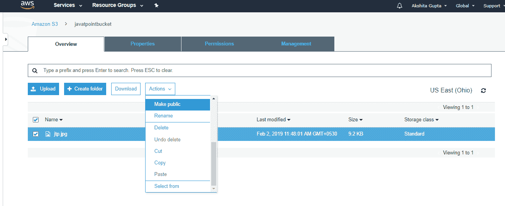

*   现在，点击一个对象的对象网址来运行文件。

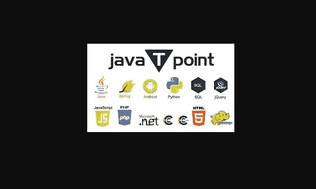

## 要记住的要点

*   桶是一个通用命名空间，即桶名必须是唯一的。
*   如果一个对象上传到 S3 桶成功，我们会收到一个 HTTP 200 代码。
*   S3、S3-IA、S3 减少冗余存储是存储类别。
*   加密有两种类型，即客户端加密和服务器端加密
*   可以使用 ACL(访问控制列表)或桶策略来控制对桶的访问。
*   默认情况下，存储桶是私有的，存储在存储桶中的所有对象也是私有的。

* * *