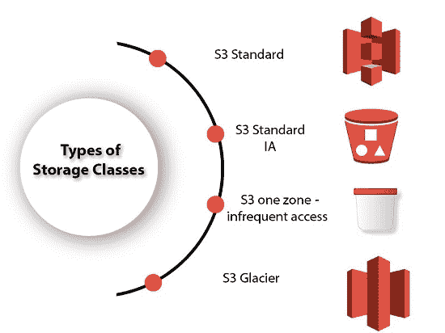

# 自动仓库存储类

> 原文：<https://www.javatpoint.com/aws-storage-classes>

*   S3 存储类用于帮助一个或两个设施同时丢失数据。
*   S3 存储类使用校验和来维护数据的完整性。
*   S3 为自动迁移对象提供生命周期管理，以节省成本。

**S3 包含四种类型的存储类:**

*   S3 标准
*   S3 标准工业区
*   S3 一区-不经常出入
*   S3 冰川

* * *

### S3 标准

*   标准存储类跨多个设施中的多个设备冗余地存储数据。
*   它旨在同时承受两个设施的损失。
*   如果在上载过程中未指定任何存储类，则 Standard 是默认存储类。
*   它提供低延迟和高吞吐量性能。
*   它具有 99.99%的可用性和 99.9999999999%的耐用性

### S3 标准工业区

*   IA 代表不常访问。
*   当数据访问频率较低，但需要快速访问时，使用标准 IA 存储类。
*   它的费用比 S3 低，但你会被收取检索费。
*   它旨在同时承受两个设施的损失。
*   它主要用于保存至少 30 天的大于 128 KB 的较大对象。
*   它提供低延迟和高吞吐量性能。
*   它具有 99.99%的可用性和 99.9999999999%的耐用性

## S3 一区-不经常出入

*   当数据访问频率较低，但需要快速访问时，使用 S3 一区非频繁访问存储类。
*   它将数据存储在单个可用性区域中，而其他存储类将数据存储在最少三个可用性区域中。由于这个原因，它的成本比标准 IA 存储类低 20%。
*   它是访问频率较低的数据的最佳选择，但不要求标准或标准 IA 存储类的可用性。
*   这是存储备份数据的好选择。
*   这是一种经济高效的存储，使用 S3 跨区域复制从其他 AWS 区域复制而来。
*   它具有相同的耐用性、高性能和低延迟，存储价格低，检索费用低。
*   它旨在为单个可用性区域中的对象提供 99.5%的可用性和 99.999999999%的持久性。
*   它为将对象自动迁移到其他 S3 存储类提供了生命周期管理。
*   数据可能会在销毁可用性区域时丢失，因为它将数据存储在单个可用性区域中。

### S3 冰川

*   S3 冰川存储类是最便宜的存储类，但只能用于存档。
*   您可以以比其他存储类别更低的成本存储任意数量的数据。
*   S3 冰川提供三种类型的模型:
    *   **加急:**在这个模型中，数据存储几分钟，费用非常高。
    *   **标准:**标准模型的检索时间为 3 至 5 小时。
    *   **批量:**批量模型的检索时间为 5 至 12 小时。
*   你可以将这些物体直接上传到 S3 冰川。
*   它针对跨多个可用性区域的 99.999999999%的对象持久性而设计。

**跨存储类别的性能**

|  | S3 标准 | S3 标准工业区 | S3 一区 | S3 冰川 |
| **专为耐用性设计** | 99.99999999% | 99.99999999% | 99.99999999% | 99.99999999% |
| **专为可用性设计** | 99.99% | 99.9% | 99.5% | 不适用的 |
| **可用性服务级别协议** | 99.9% | 99% | 99% | 不适用的 |
| **可用性区域** | >=3 | >=3 | one | >=3 |
| **每个物体的最小容量费用** | 不适用的 | 128 千字节 | 128 千字节 | 40KB |
| **最小存储持续时间充电** | 不适用的 | 30 天 | 30 天 | 90 天 |
| **检索费** | 不适用的 | 检索到的每 GB | 检索到的每 GB | 检索到的每 GB |
| **第一字节延迟** | 毫秒 | 毫秒 | 毫秒 | 选择分钟或小时 |
| **存储类型** | 目标 | 目标 | 目标 | 目标 |
| **生命周期过渡** | 是 | 是 | 是 | 是 |

* * *