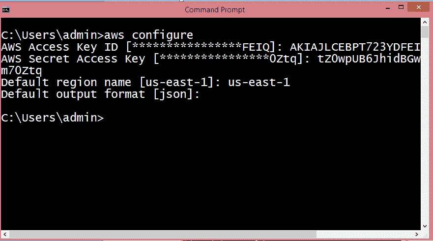

# 跨区域复制

> 原文：<https://www.javatpoint.com/aws-cross-region-replication>

*   跨区域复制是将数据从一个存储桶复制到另一个可能位于不同区域的存储桶的功能。
*   它提供跨存储桶的对象异步复制。假设 X 是源桶，Y 是目的桶。如果 X 想将其对象复制到 Y 桶，则不会立即复制对象。

**跨区域复制需要记住的几点**

*   **创建两个桶:**在 AWS 管理控制台内创建两个桶，其中一个桶为源桶，另一个桶为目的桶。
*   **启用版本控制:**跨区域复制只有在两个桶都启用版本控制时才能实现。
*   **亚马逊 S3 使用 SSL 加密跨 AWS 区域传输的数据:**当数据跨不同区域传输时，它还提供安全性。
*   **已经上传的对象将不会被复制:**如果桶中已经存在任何类型的数据，那么当您执行跨区域复制时，该数据将不会被复制。

**跨区域复制用例**

*   **合规要求**
    默认情况下，亚马逊 S3 将数据存储在不同的地理区域或可用性分区，以保证数据的可用性。有时可能会有法规遵从性要求，要求您将数据存储在某个特定区域。跨区域复制允许您在某个特定区域复制数据以满足要求。
*   **最小化延迟**
    假设您的客户位于两个地理区域。为了最大限度地减少延迟，您需要在地理位置更靠近用户的 AWS 区域维护数据副本。
*   **维护不同所有权下的对象副本:**无论源存储桶的所有者是谁，您都可以告诉亚马逊 S3 将所有权更改为拥有目标存储桶的 AWS 帐户用户。这被称为所有者覆盖选项。

**我们通过一个例子来理解跨区域复制的概念。**

*   登录到 AWS 管理控制台。
*   现在，我们在 **jtpbucket** 中上传文件。jtpbucket 是我们创建的 s3 桶。

*   将文件添加到桶中。

*   现在，我们在一个桶中添加两个文件，即 version.txt 和 download.jpg。

*   现在，我们创建一个名为 **jtp1bucket** 的新 bucket，它有一个不同的区域。

现在，我们有两个桶，即 s3 中的 jtpbucket 和 jtp1bucket。

*   点击 **jtpbucket** ，然后进入 **jtpbucket** 的管理。

*   点击**复制**。单击时，屏幕显示如下:

*   点击**开始**按钮。
*   启用两个桶的版本控制。
*   您可以将整个存储桶或标签复制到目标存储桶。假设您想要复制整个存储桶，然后单击下一步。

*   输入您的目标存储桶，即 jtp1 存储桶。

*   创建一个新的 IAM 角色，角色名为 S3CRR，然后点击下一步。

*   保存设置后，屏幕显示如下:

上面的屏幕显示跨区域复制已成功更新。我们还可以看到源桶和目标以及它们的相关权限。

*   现在，我们将看到文件是否已经从 jtpbucket 复制到 jtp1bucket。点击 **jtp1bucket** 。

上图显示铲斗是空的。因此，我们可以说对象不会自动从一个桶复制到另一个桶，我们只能使用 AWS 命令行界面进行复制。要使用 AWS 命令行界面，您需要安装命令行界面工具。

*   安装后，打开 cmd，输入 **aws 配置**。

*   现在，我们需要生成作为用户名的访问密钥标识和作为密码的秘密访问密钥。为此，我们首先需要创建一个 IAM 组。

*   设置组名，即 javatpoint。

*   检查**管理员访问**策略，通过 AWS 命令行界面访问 AWS 控制台。
*   现在，创建一个 IAM 用户。
*   添加具有编程访问权限的用户名。

*   将用户添加到组中，即 javatpoint。

*   最后，创建用户。

从上面的屏幕中，我们观察到访问键和 scret 访问键已经生成。

*   将访问密钥和秘密访问密钥复制到 cmd。

*   要查看 S3 铲斗，运行命令 **aws s3 ls** 。

*   要将 **jtpbucket 的对象复制到 jtp1bucket，运行命令 aws s3 cp？递归 S3://jtpbucket S3://jtp1bucket**。

上图显示 **jtpbucket** 的对象已经复制到 **jtp1bucket** 中。

*   点击**“jtp1bucket”**。

从上面的屏幕中，我们观察到原始存储桶中的所有文件都已复制到另一个存储桶，即 JT P1 存储桶。

#### 注意:如果在原始存储桶中进行了任何进一步的更改，将始终复制到其复制存储桶中。

### 需要记住的要点:

*   必须在源桶和目标桶上启用版本控制。
*   两个桶的区域必须是唯一的。
*   原始存储桶中的所有文件不会自动复制，可以通过 AWS 命令行界面进行复制。所有后续文件都会自动复制。
*   文件中的文件不能复制到多个存储桶。
*   删除标记不会被复制。
*   不复制删除版本或删除标记。

* * *