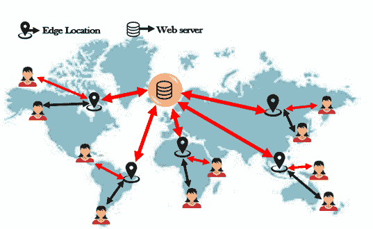

# CloudFront CDN

> 原文：<https://www.javatpoint.com/aws-cloudfront-cdn>

CloudFront CDN(计算机交付网络)是一个分布式服务器系统，它根据用户的地理位置、网页的来源和内容交付服务器向用户交付网页和其他网络内容。

假设我在英国以外的地方运营网站，并在世界各地为该网站提供服务。当用户想要访问我的网站时，他们会向网络服务器请求，来自不同国家的用户会有不同的延迟。例如，住在澳大利亚的人比住在印度的人有更多的潜伏期。南非有一个可怕的延迟，但他们将运行互联网主干，使更快地连接到英国。这就是它与 CloudFront CDN 的工作原理，在 CloudFront CDN 中，人们分布在世界各地，他们可以打开对网页、音频文件等的访问。在英国。

**云锋 CDN 关键术语**

*   **边缘位置:**边缘位置是将缓存内容的位置。它独立于自动气象站区域或自动气象站可用性区域。
*   **原点:**定义 CDN 将要分发的所有文件的原点。原点可以是 S3 桶、EC2 实例或弹性负载平衡器。
*   **分布:**它是由边缘位置集合组成的 CDN 的名称。当我们在带有 aws 的网络中创建一个新的 CDN 时，意味着我们正在创建一个分发。

分布可以有两种类型:

*   **网页分发:**一般用于网站。
*   **RTMP:** 用于流媒体。

【CloudFront CDN 如何工作

*   边缘位置遍布全球，目前有 50 个边缘位置。
*   当第一个用户请求获取内容，并且该请求到达最近的边缘位置时。将首先读取最近的边，以确定它是否包含缓存的数据。如果边缘不包含缓存的数据，边缘位置将从 S3 存储桶中提取数据。假设 S3 桶在爱尔兰。但是对于第一个用户来说，这个过程并不是更快。但是，当第二个用户访问同一文件时，该文件已经缓存到边缘位置，因此它会从其边缘位置提取数据。它加快了数据的传递。

**云锋 CDN 相关要点**

*   Amazon CloudFront CDN 用于使用全球边缘位置网络交付您的整个网站，包括动态、静态、流式和交互式内容。
*   当用户请求内容时，该请求会自动路由到最近的边缘位置，以便以最佳性能交付内容。
*   亚马逊 CloudFront CDN 经过优化，可与其他亚马逊网络服务协同工作，如亚马逊简单存储服务(S3)、亚马逊弹性计算云(EC2)、亚马逊弹性负载平衡和亚马逊 53 号路由。亚马逊云前端 CDN 还与存储文件原件和版本的非 AWS 原始服务器合作。

* * *