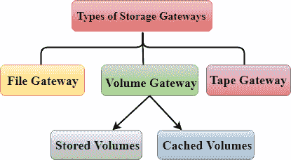
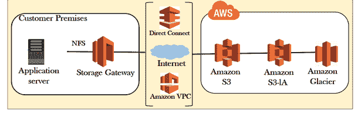
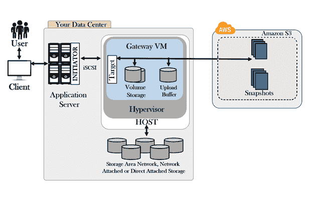
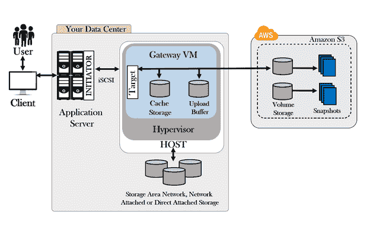
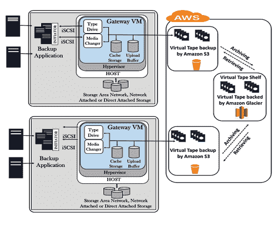

# 存储网关

> 原文：<https://www.javatpoint.com/aws-storage-gateway>

*   存储网关是 AWS 中的一项服务，它将内部软件设备与基于云的存储连接起来，以在组织的内部 IT 环境和 AWS 存储基础架构之间提供安全集成。

#### 注意:在这里，内部部署意味着组织将其 IT 环境保留在现场，而云保留在异地，由其他人负责维护。

*   存储网关服务允许您将数据安全地存储在 AWS 云中，以实现可扩展且经济高效的存储。
*   存储网关是安装在数据中心运行的虚拟机管理程序中的虚拟设备，用于将信息复制到 AWS，尤其是 S3。
*   亚马逊存储网关的虚拟设备可以作为虚拟机映像下载，您可以将其安装在数据中心的主机上。
*   存储网关支持 Vmware EXI 或微软 Hyper-V
*   安装存储网关后，通过激活过程将其与您的 AWS 帐户链接，然后您可以使用 AWS 管理控制台创建存储网关选项。

**存储网关有三种类型:**

*   文件网关(NFS)
*   音量网关(iSCSI)
*   磁带网关(VTL)

上图显示存储网关分为三个部分:文件网关、卷网关和磁带网关。卷网关进一步分为两部分:存储卷和缓存卷。

## 文件网关

*   它使用的是 NFS 技术。
*   它用于存储 S3 的平面文件，如 word 文件、pdf 文件、图片、视频等。
*   它用于将文件直接存储到 S3。
*   文件作为对象存储在 S3 存储桶中，并通过网络文件系统(NFS)装载点进行访问。
*   所有权、权限和时间戳持久地存储在 S3 与文件相关联的对象的用户元数据中。
*   一旦对象传输到 S3，它们就可以用作本地 S3 对象，并且存储桶策略(如版本控制、生命周期管理和跨区域复制)可以直接应用于存储在存储桶中的对象。

**文件网关的架构**

*   存储网关是内部运行的虚拟机。
*   存储网关主要通过互联网连接到 aws。
*   它可以使用直接连接。直接连接是数据中心和 aws 之间的直接连接线。
*   它还可以使用亚马逊 VPC(虚拟私有云)将存储网关连接到 aws。VPC 是一个虚拟数据中心。它表示应用服务器和存储网关不需要在内部。在亚马逊 VPC，存储网关位于 VPC 内部，然后存储网关将信息发送到 S3。

## 音量网关

*   卷网关是一个使用 Iscsi 数据块协议向您的应用程序呈现磁盘卷的接口。iSCSI 数据块协议是基于数据块的存储，可以存储操作系统和应用程序，也可以运行 SQL Server 数据库。
*   写入硬盘的数据可以异步备份为硬盘中的时间点快照，并作为 EBS 快照存储在云中，其中 EBS(弹性块存储)是连接到 EC2 实例的虚拟硬盘。简而言之，我们可以说，卷网关将虚拟硬盘备份到 aws。
*   快照是增量备份，以便备份上次快照中所做的更改。所有快照存储也被压缩，以最大限度地减少您的存储费用。

**卷网关有两种类型:**

### 存储卷

*   这是一种在本地存储整个数据副本并将数据异步备份到 aws 的方法。
*   存储卷提供对本地应用程序和异地备份的整个数据集的低延迟访问。
*   您可以创建一个存储卷，它可以是一个虚拟存储卷，作为 iSCSI 设备装载到您的内部应用程序服务(如数据服务、web 服务)中。
*   写入存储卷的数据存储在本地存储硬件上，这些数据以亚马逊弹性块存储快照的形式异步备份到亚马逊简单存储服务。
*   存储卷的大小为 1GB - 16 TB。

**卷网关的架构**

*   客户端正在与可能是应用服务器或网络服务器的服务器进行对话。
*   应用程序服务器正在与卷网关建立 Iscst 连接。
*   卷网关安装在虚拟机管理程序上。
*   卷存储也称为虚拟硬盘，存储在物理基础设施中，虚拟硬盘的大小为 1TB。
*   卷存储获取快照并将它们发送到上传缓冲区。
*   上传缓冲区执行到 S3 的多次上传，所有这些上传都存储为 EBS 快照。

### 缓存网关

*   这是一种在现场存储最近访问的数据的方式，其余的数据存储在 aws 中。
*   缓存卷允许使用 Amazon Simple Storage 服务作为您的主要数据存储，同时将最近访问过的数据的副本保存在您的存储网关中。
*   缓存卷最大限度地减少了对扩展内部存储基础架构的需求，同时仍能提供对其频繁访问的数据的低延迟访问。
*   缓存网关存储您写入卷的数据，并且仅保留本地存储网关中最近读取的数据。
*   缓存卷的大小为 1GB - 32 TB。

**缓存网关的架构**

*   客户端连接到应用服务器，应用服务器与网关建立 iSCSI 连接。
*   客户端发送的数据存储在缓存中，然后上传到上传缓冲区。
*   上传缓冲区中的数据被传输到虚拟磁盘，即位于亚马逊 S3 内部的卷存储。
*   卷存储是基于数据块的存储，不能存储在 S3，因为 S3 是基于对象的存储。因此，拍摄快照，即平面文件，然后将这些平面文件存储在 S3。
*   最近读取的数据存储在缓存中。

## 磁带网关

*   磁带网关主要用于进行备份。
*   它使用磁带网关库接口。
*   磁带网关为在 AWS 云中归档您的数据提供了一个持久、经济高效的解决方案。
*   VTL 接口提供了基于磁带的备份应用程序基础架构，可将数据存储在您在磁带网关上创建的虚拟磁带盒中。
*   它由 NetBackup、Backup Exec、Veeam 等支持。他们不再使用物理磁带，而是使用虚拟磁带，这些虚拟磁带进一步存储在亚马逊 S3。

**磁带网关的架构**

*   服务器连接到备份应用程序，备份应用程序可以是网络备份、Backup Exec、Veeam 等。
*   备份应用程序通过 iSCSI 连接连接到存储网关。
*   虚拟网关表示为通过 iSCSI 连接到备份应用程序的虚拟设备。
*   虚拟磁带被上传到亚马逊 S3。
*   现在，我们有了生命周期管理策略，可以归档到亚马逊冰川的虚拟磁带架。

### 要记住的要点:

*   文件网关用于基于对象的存储，其中所有平面文件(如 word 文件、pdf 文件等)都直接存储在 S3。
*   卷网关用于基于数据块的存储，并且使用 iSCSI 协议。
*   存储卷是一个用于在现场存储整个数据集并备份到 S3 的卷网关。
*   缓存卷是一个卷网关，用于将整个数据集存储在云中(亚马逊 S3)，只有最常访问的数据保留在现场。
*   磁带网关用于备份，并使用流行的备份应用程序，如网络备份、Backup Exec、Veeam 等。

* * *