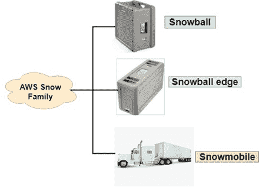
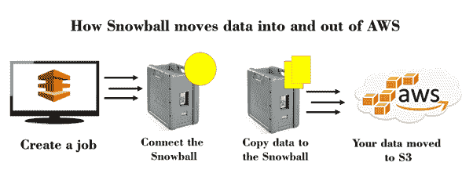
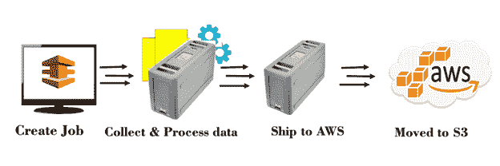

# 雪球

> 原文：<https://www.javatpoint.com/aws-snowball>

## 导入/导出磁盘

*   它使用便携式存储设备进行传输，加快了将大量数据移入和移出 AWS 云的速度。
*   例如，如果您有 500 TB 的数据，并且您的互联网连接很慢，即 1mbps。您可以通过外部硬盘将数据发送到亚马逊，而不是通过互联网发送，他们会使用亚马逊的高速内部网络，绕过互联网，将您的数据直接传输到存储设备上或从存储设备上传输出去。
*   许多人开始使用它，他们都发送不同类型的磁盘，连接变得难以管理。

**Re: invent 2015:亚马逊发布标准雪球。**

**Re: invent 2016:亚马逊发布了雪球边缘以及雪地摩托。**

## 雪球

*   雪球是一个 petabyte 规模的数据传输解决方案，使用安全设备将大量数据传输到 aws 和从 AWS 传输出去。
*   这是一种将数据引入 aws 并绕过互联网的流程。亚马逊没有管理所有的外部磁盘，而是为您提供了一个设备，您将数据加载到了一个设备中。最后，数据从设备导出到亚马逊 S3。
*   使用雪球地址解决了大规模数据传输的常见挑战，如高网络成本、长传输时间和安全问题。
*   用雪球传输数据简单、快速、安全，成本仅为高速互联网的五分之一。
*   最后，所有地区都有 80TB 的雪球。
*   雪球提供防篡改外壳、256 位加密和行业标准可信平台模块(TPM)以确保安全性。
*   一旦处理并验证了数据传输作业，AWS 就会对软件设备执行软件擦除。

## 雪球边缘

*   雪球边缘是一款 100 TB 数据传输设备，具有板载存储和计算能力。
*   雪球边缘就像一个 AWS 数据中心，您可以在内部使用。
*   雪球边可用于将大量数据移入和移出 AWS。
*   我们也可以从雪球边缘运行 Lambda 函数，它在我们做不到的地方带来了计算能力。例如，飞机发动机制造商可以将雪球边缘放在飞机上，以收集飞机发动机如何运行的信息。当飞机着陆时，从飞机上取出雪球边缘，并将其运送到自动气象站数据中心。因此，我们观察到雪球边缘同时具有存储和计算能力。

**雪球边缘的主要特点如下:**

*   **S3 兼容端点:**雪球边包含亚马逊 S3 和亚马逊 EC2 端点，支持编程用例。
*   **文件接口:**文件接口用于通过网络文件系统(NFS)挂载点读写数据到 AWS 雪球设备。
*   **集群:**您可以将雪球边缘集群在一起，形成一个本地存储层，并在内部处理您的数据，从而在 5-10 台设备上实现 99.99%的数据持久性，并确保您的应用程序即使无法访问云也能继续运行。
*   **更快的数据传输:**它以高达 100 GB/秒的速度传输数据。
*   **加密:**传输到雪球边缘的数据自动加密，由亚马逊密钥管理服务(KMS)管理。
*   **运行 AWS Lambda 功能:**每个雪球设备都有 AWS IOT 绿草核心软件，可以让你运行 Lambda 功能。

#### 注意:Greengrass 软件将云计算能力扩展到雪球边缘设备，这样数据可以在本地计算，同时仍然使用云进行管理。

## 雪地摩托

*   它是在 re: invent 2016 中宣布的。
*   雪地摩托是一种超字节级的数据传输服务。
*   它可以在 AWS 内外传输大量数据。
*   每辆雪地车可以转移 100 PB，雪地车是一个 45 英尺长的加固集装箱，由半挂卡车牵引。
*   Snowmobile 允许您将海量数据移动到云中，包括视频库、图像存储库甚至数据中心的完全迁移。
*   使用雪地摩托传输数据安全、快速且经济高效。

* * *