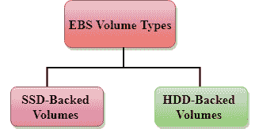

# 什么是 EBS？

> 原文：<https://www.javatpoint.com/aws-ebs>

*   EBS 代表**弹性块存储**。
*   EC2 是云中的虚拟服务器，而 EBS 是云中的虚拟磁盘。
*   Amazon EBS 允许您创建存储卷并将它们附加到 EC2 实例。
*   创建存储卷后，您可以在这些卷上创建文件系统，然后运行数据库，存储文件和应用程序，甚至可以以其他方式将它们用作数据块设备。
*   Amazon EBS 卷被放置在特定的可用性区域中，并且它们被自动复制以保护您免受单个组件故障的影响。
*   EBS 卷不存在于一个磁盘上，它分布在整个可用性区域。EBS 卷是连接到 EC2 实例的磁盘。
*   连接到安装了 windows 或 Linux 的 EC2 实例的 EBS 卷称为卷的根设备。

## 电子病历卷类型

亚马逊 EBS 提供两种不同性能特征和价格的卷。电子制动系统卷类型分为两部分:

*   固态硬盘支持的卷
*   硬盘备份卷

### （同 solid-statedisk）固态（磁）盘

*   固态硬盘代表固态硬盘。
*   2014 年 6 月，推出固态硬盘存储。
*   这是一个通用存储器。
*   它支持高达 4000 IOPS，这是相当高的。
*   固态硬盘存储的性能非常高，但与硬盘存储相比相当昂贵。
*   固态硬盘卷类型针对事务性工作负载进行了优化，例如频繁的读/写操作和较小的输入/输出大小，其中性能属性是 IOPS。

**SSD 进一步分为两部分:**

*   通用固态硬盘
*   调配的 IOPS 固态硬盘

#### 通用固态硬盘

*   通用固态硬盘有时也被称为 GP2。
*   这是一款兼顾价格和性能的通用固态硬盘。
*   对于 3334 千兆字节及以上的卷，您可以获得高达 10，000 IOPS 的每 GB 3 IOPS 的比率，以及在较长时间内爆发高达 3000 IOPS 的能力。例如，如果你得到少于 10，000 IOPS，那么 GP2 是更好的，因为它给你最好的性能和价格。

#### 调配的 IOPS 固态硬盘

*   它也被称为 IO1。
*   它主要用于高性能应用程序，如密集应用程序、关系数据库。
*   它是为输入/输出密集型应用程序设计的，如大型关系数据库或 NOSQL 数据库。
*   当您需要超过 10，000 IOPS 时，可以使用它。

* * *

## 硬盘驱动器

*   它代表硬盘驱动器。
*   基于硬盘的存储于 2008 年推出。
*   基于硬盘的存储大小可能在 1 GB 到 1TB 之间。
*   它最多可以支持 100 个 IOPS，这是非常低的。

### 吞吐量优化硬盘(st1)

*   它也被称为 ST1。
*   吞吐量优化硬盘是一款低成本硬盘，专为需要高达 500 兆字节/秒的更高吞吐量的应用而设计
*   这对于那些需要频繁访问数据的应用程序非常有用。
*   它用于大数据、数据仓库、日志处理等。
*   它不能是引导卷，因此它包含一些额外的卷。例如，如果我们在 C:驱动器中安装了 Windows 服务器，那么 C:驱动器不能是吞吐量优化硬盘，D:驱动器或其他驱动器可以是吞吐量优化硬盘。
*   吞吐量硬盘的大小可以是 500 千兆字节到 16 千兆字节。
*   它支持多达 500 个 IOPS。

### 冷硬盘(sc1)

*   它也被称为 SC1。
*   这是为不常访问工作负载的应用程序设计的最低成本存储。
*   当数据很少被访问时，它很有用。
*   它主要用于文件服务器。
*   它不能是引导卷。
*   冷硬盘的大小可以是 500 千兆字节到 16 千兆字节。
*   它最多支持 250 个 IOPS。

### 磁性体积

*   它是所有 EBS 卷类型中每千兆字节存储成本最低的。
*   它非常适合数据不常被访问的应用程序
*   对于最低存储成本非常重要的应用程序，它非常有用。
*   磁卷是唯一可引导的硬盘。因此，我们可以说它可以用作引导卷。

* * *