# 安全组

> 原文：<https://www.javatpoint.com/aws-security-group>

*   安全组是一个虚拟防火墙，它控制到您的 EC2 实例的流量。
*   首次启动 EC2 实例时，可以将其与一个或多个安全组相关联。
*   安全小组是抵御黑客的第一道防线。

**我们通过一个例子来理解安全组的概念。**

*   登录到 AWS 管理控制台。
*   启动新的 EC2 实例。
*   选择亚马逊机器图像。

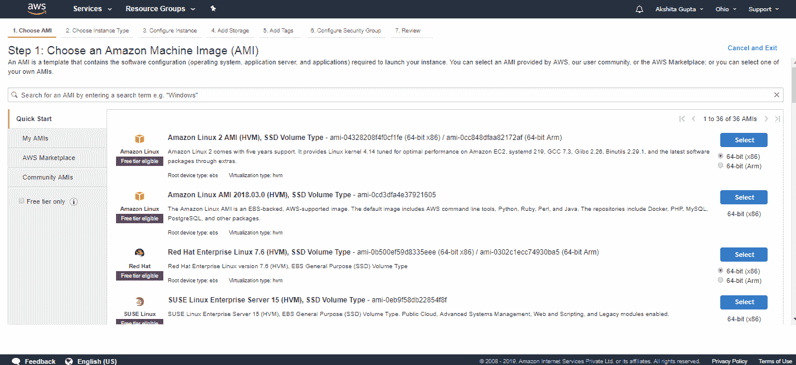

*   选择实例类型。假设我选择实例，即 t2.micro，然后点击**下一步。**

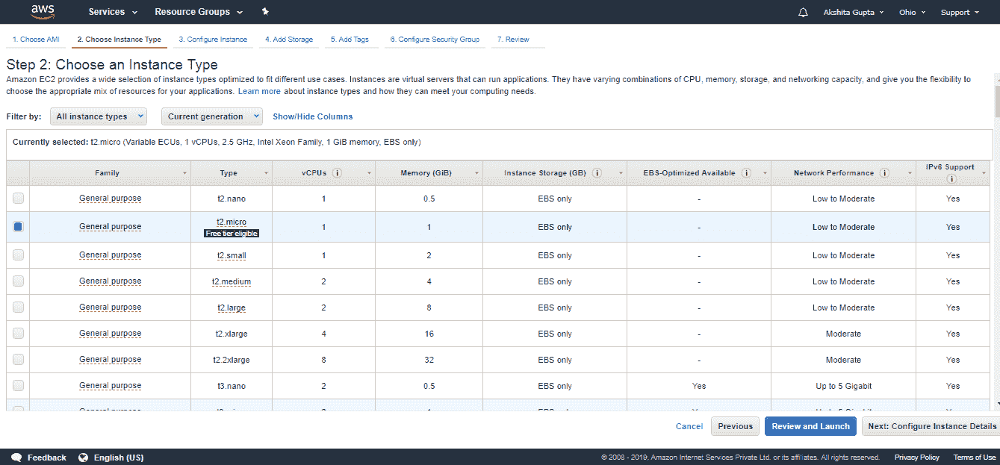

*   现在，配置实例详细信息。保留所有细节为默认，然后点击**下一步。**

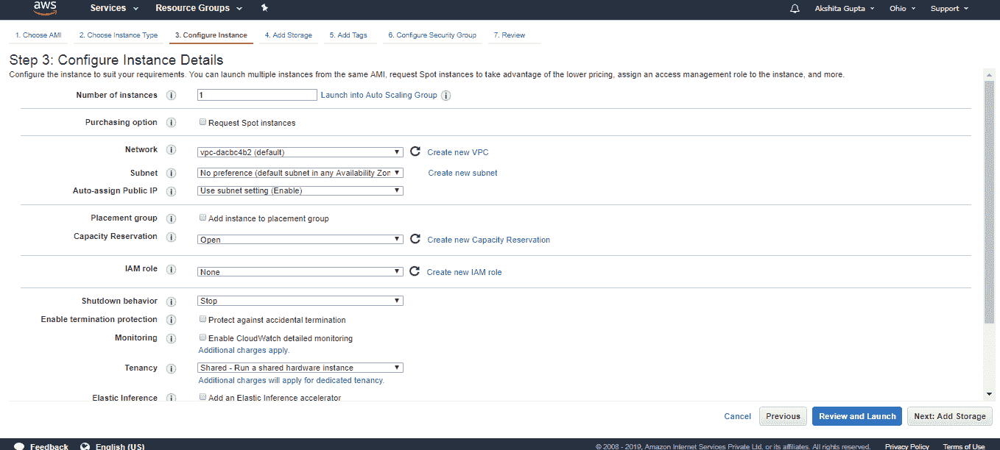

*   将 EBS 卷附加到您的 EC2 实例。默认情况下，根卷是连接到 EC2 实例的默认 EBS 卷。点击**下一步。**

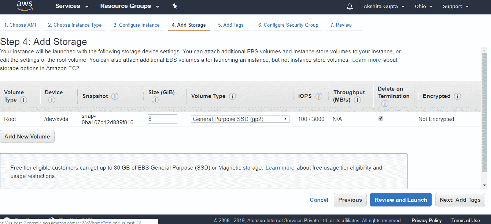

*   添加标签。

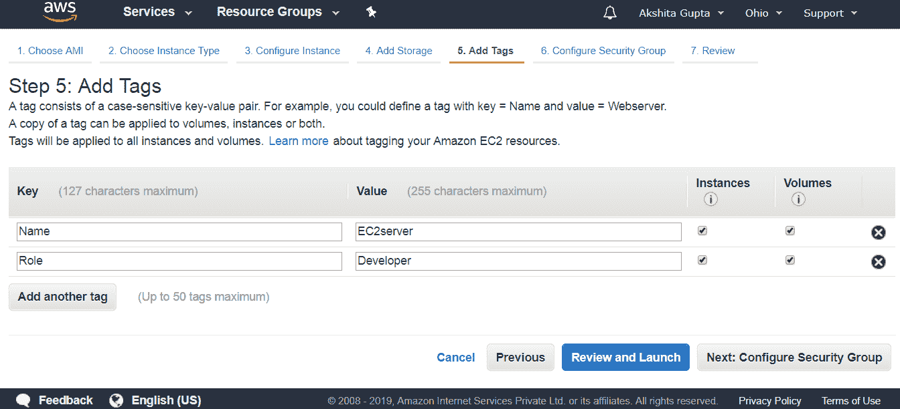

*   配置安全组。选择您之前创建的现有安全组，即**网络服务器。**

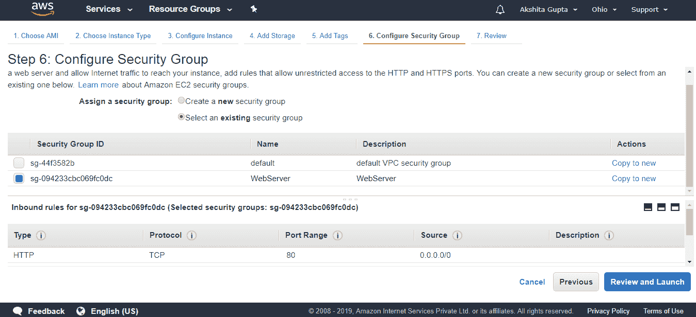
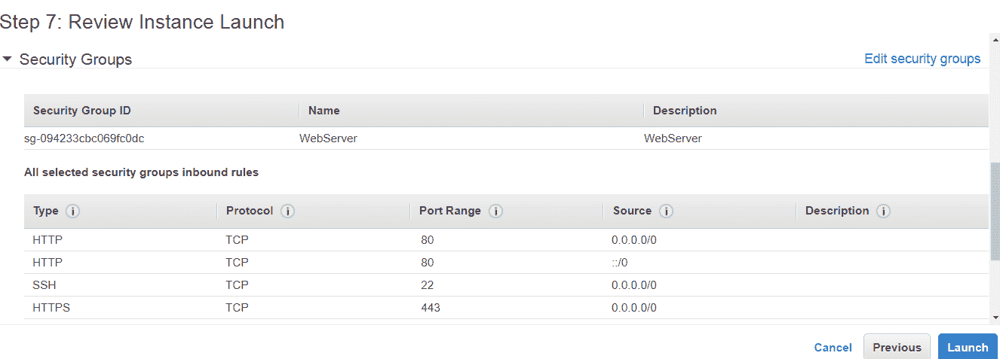

上面的屏幕显示，网络服务器是一个安全组，由入站规则组成，如协议、端口范围和源地址。

*   点击**查看并启动**按钮。

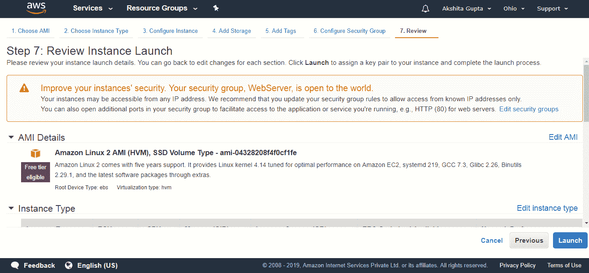

从上面的屏幕中，我们观察到安全组，WebServer 对世界开放意味着 SSH 端口对世界开放。

*   点击**启动**按钮。
*   创建新的密钥对。密钥对允许您安全地连接到实例。

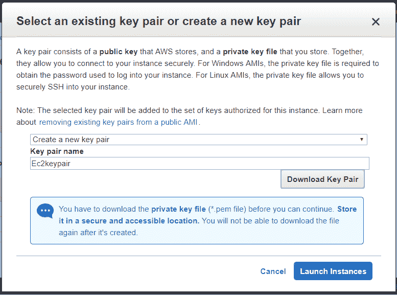

*   点击**启动实例。**
*   密钥对是用。pem 分机。使用 **putygen** 工具将 pem 文件转换为 ppk 文件。
*   打开**油灰。**
*   输入主机名，即[【邮件保护】](/cdn-cgi/l/email-protection)，并将主机名保存在会话日志中。
*   单击出现在 putty 右侧的 SSH，移动到 Auth，然后附加 ppk 文件。
*   运行命令 **sudo su** 移动到根级别，然后通过运行命令 **yum update -y.** 更新 EC2 实例
*   安装 Apache 服务器，通过运行命令 **yum install httpd -y.** ，使 EC2 实例成为网络服务器
*   运行命令 **cd /var/www/html** 设置路径。
*   现在，使用命令 nano**index.html 创建一个文本编辑器。**
*   通过运行命令**服务 httpd start 启动 Apache 服务器。**
*   启动服务器后，复制公共 IP 地址，并粘贴到浏览器中。

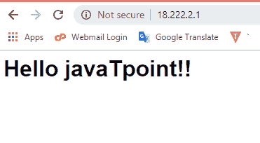

*   安全组由入站规则组成，入站规则仅由我们创建。假设我添加了三个入站规则，即 HTTP、SSH 和 HTTPS。

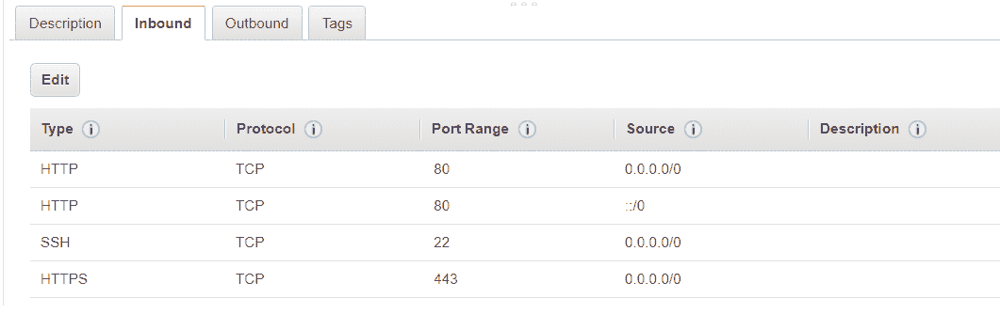

*   我们还可以删除入站规则。假设我想删除 Http 协议，那么点击**编辑**按钮，然后点击**保存**按钮。

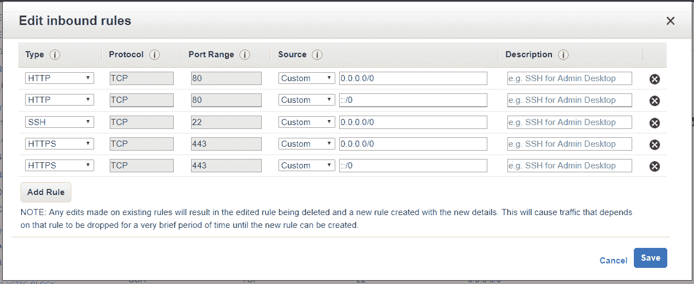

从安全组中删除 HTTP 协议将不允许我们看到 Http，并且该更改会立即应用于该组。

#### 注意:入站规则由流量来源和端口范围组成。如果我们在安全组中实施任何规则，那么它发生得非常快。

*   我们也可以**编辑**出站规则。假设我删除了**所有交通**规则，点击**保存**按钮。

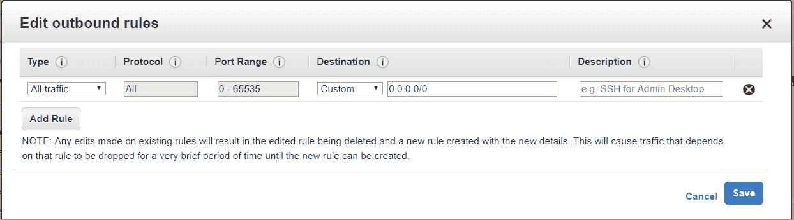

复制并粘贴一个 IP 地址到网络浏览器并运行它。

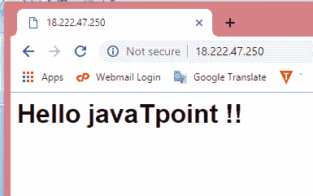

我们得到了相同的输出。因此，我们可以说它允许流量进入 EC2 实例，并且还将提供响应，甚至没有任何出站规则集。

#### 注意:当我们添加入站规则时，它会自动添加到出站规则中。

移动到默认安全组。默认组的入站规则由 MYSQL/Aurora 和 RDP 组成。

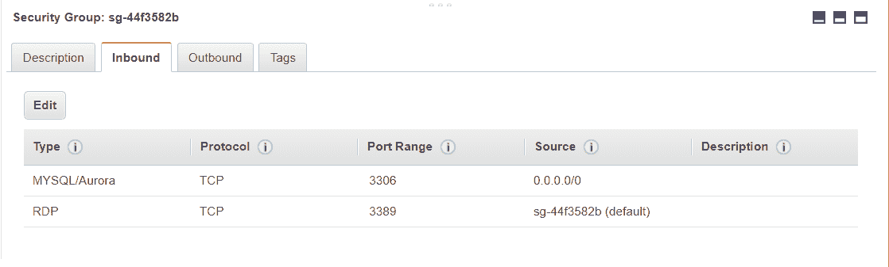

*   我们可以向单个 EC2 实例添加多个组。假设我想给 EC2 实例添加一个**默认安全组**。移动到 EC2 实例，单击操作下拉菜单。转到网络，然后单击更改安全组。

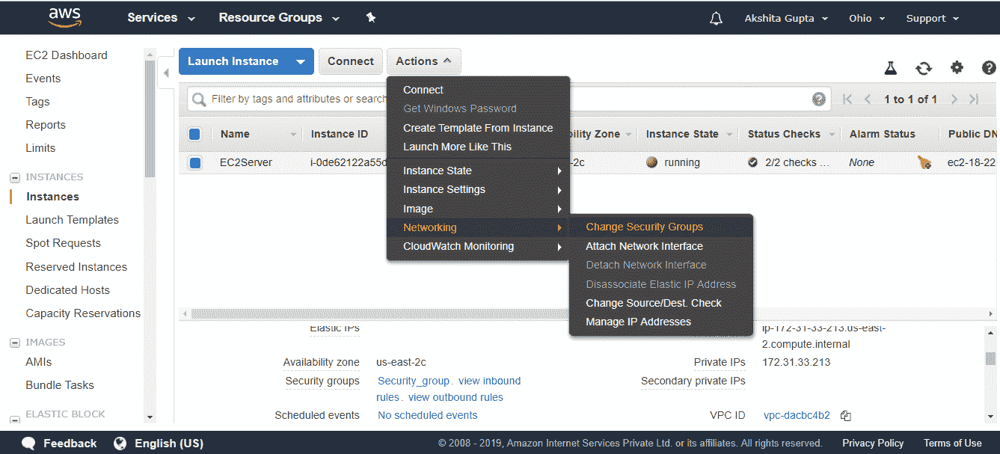

*   现在，检查要添加到 EC2 实例中的默认安全组。

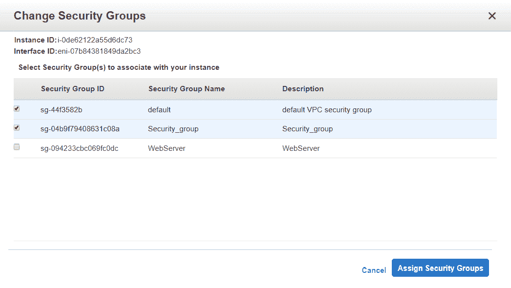

### 需要记住的一些要点:

*   默认情况下，所有入站流量都会被阻止，即您需要添加 HTTP、HTTPs 等流量。
*   自动允许所有出站流量。
*   安全组中可以有任意数量的 EC2 实例。
*   您可以将多个安全组附加到 EC2 实例。/li >
*   安全组是有状态的，也就是说，如果您创建了一个允许流量进入的入站规则，该流量将被自动允许再次退出。

* * *