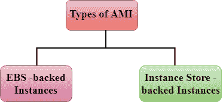
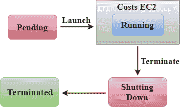
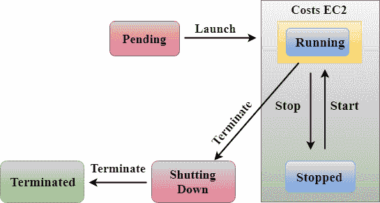

# 高级材料情报(Advanced Material Information)

> 哎哎哎:# t0]https://www . javatppoint . com/AWS-ami

*   AMI 代表**亚马逊机器图像**。
*   AMI 是用于在 EC2 实例中创建虚拟机的虚拟映像。
*   当您需要具有相同配置的实例时，也可以使用单个 AMI 创建多个实例。
*   当您需要具有不同配置的实例时，也可以使用不同的 AMI 创建多个实例。
*   它还为实例的根卷提供了一个模板。

## 急性心肌梗死生命周期

*   首先，您需要创建并注册一个 AMI。
*   您可以使用 AMI 来启动 EC2 实例。
*   您也可以将 AMI 复制到不同的地区。
*   当不再需要 AMI 时，您也可以将其注销。

## 伙计们

急性心肌梗死分为两类:

*   基于电子商务系统的实例
*   实例存储支持的实例

### 基于电子商务系统的实例

*   EBS 只不过是一个为您提供持久存储的卷。
*   当您运行为您提供临时存储的 EC2 实例时，如果您删除 EC2 实例，则存储在 EC2 实例中的数据也将被删除。为了使数据持久化，亚马逊提供了一个 EBS 卷。如果您启动 EC2 实例并希望使某些数据持久化，则需要使用 EBS 卷附加一个实例，以便您的数据即使在删除 EC2 实例时也可用。
*   当您启动 EC2 实例时，它将始终有一个根设备作为 EBS 卷，这使得数据持久化。因此，我们可以说，当我们删除 EC2 实例时，数据在根设备中是可用的。
*   在 EBS 支持的情况下，您将因存储静态数据(如操作系统文件等)而被收取费用。

### 实例存储支持的实例

*   在实例存储中，一个实例包含大约 1 TB 或 2 TB 的临时存储。一旦实例终止，所有数据都将丢失。例如，如果您启动一个实例，并在其中部署数据库。如果删除一个实例，那么所有的数据都将丢失，这就成为了一个挑战。在这种情况下，您可以添加一个额外的 EBS 卷来存储数据，这样即使删除一个实例，您的数据也不会丢失。
*   在这种情况下，EBS 卷不是根卷。这是您手动附加到 EC2 实例的附加卷。

### 为什么 EBS 支持的实例比实例存储支持的实例更受欢迎？

### 实例存储支持的实例

在**实例存储支持的实例**中，如果您启动一个实例，它将处于挂起状态。在挂起状态之后，实例进入运行状态，然后处于关闭状态。亚马逊只会在运行状态下向你收费。当您终止一个实例时，亚马逊不会向您收取任何费用。例如，如果您想每天运行一个实例 4 小时，每小时将花费 10 美分。在实例存储中，我的实例将每天运行 24 小时，因为它没有停止状态。因此，每月要花费 72 美元。

*   **EBS 支持的实例**

在 EBS 支持的实例中，实例可以处于运行状态，也可以处于停止状态。在这种情况下，亚马逊将只为运行状态而不是停止状态花费你。例如，如果您想每天运行一个实例 4 小时，每小时将花费 10 美分。在 EBS 支持的实例中，实例将运行 4 小时，因为它也处于停止状态。我选择一个 100 GB 的卷，这将花费您 5 美元。一个实例的运行成本是一个月 12 美元。因此，该实例的总成本是体积成本加上运行成本，等于 17 美元。

EBS 支持的实例为我们节省了 55 美元。因此，我们得出结论，为什么 EBS 支持的实例比实例存储支持的实例更受欢迎，速度更快。

## 带实例存储和 EBS 支持的实例的差异

| 特征 | EBS 支持的实例 | 实例存储支持的实例 |
| **生命周期** | 它支持通过将状态保存到 EBS 卷来停止和重新启动实例。 | 在这种情况下，无法停止实例。它可以处于运行或终止状态。 |
| **数据持久化** | 数据保存在 EBS 卷中。如果实例被终止，则不会丢失任何数据。 | 数据不会持续存在，因此当实例终止时，数据将会丢失。 |
| **开机时间** | 不到 1 分钟。 | 通常不到 5 分钟。 |
| **尺寸限制** | 1 TB | 10 - 16 TB |
| **AMI 创作** | 使用一个命令就可以非常容易地创建 AMI。 | 要创建一个 AMI，它需要安装和 AMI 工具。 |
| **贵** | 它不太贵。 | 与实例存储支持的实例相比，它更昂贵。 |

* * *