# 创建急性心肌梗死

> 原文：<https://www.javatpoint.com/aws-creating-an-ami>

*   登录到 AWS 管理控制台。
*   转到 EC2 服务。
*   我们有一个运行中的实例，它的名字叫 WebServer。

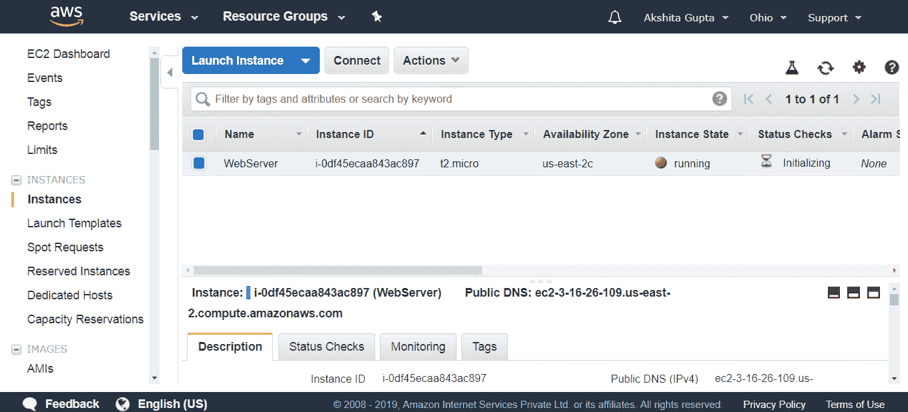

*   现在，我想创建一个一致的快照。为此，请停止实例。单击操作下拉菜单。

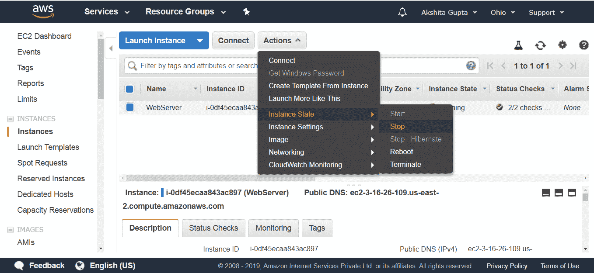

*   移至控制台左侧出现的**卷**。单击操作下拉菜单创建快照。

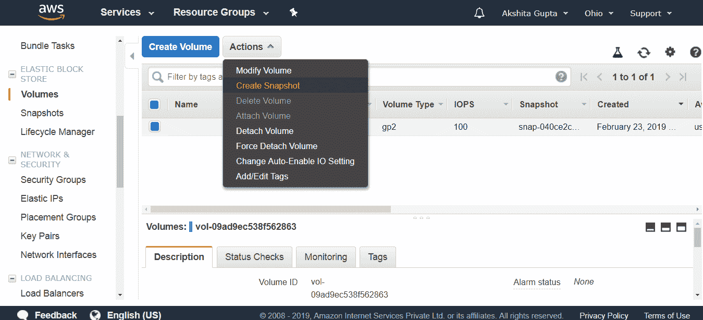

*   创建快照。

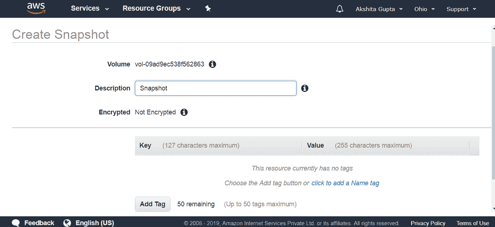

*   要查看快照，点击控制台左侧出现的**快照**。

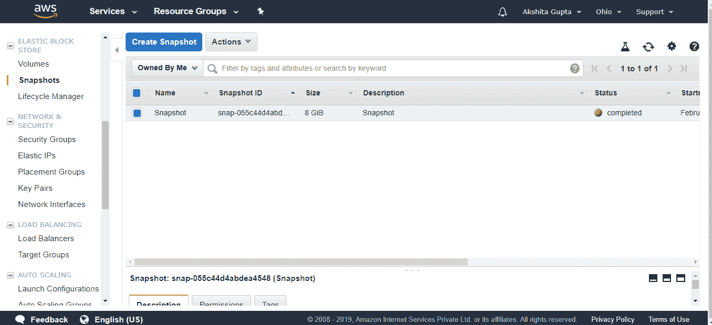

*   我们还可以将快照复制到另一个区域。点击**动作**下拉菜单，然后点击**复制**。

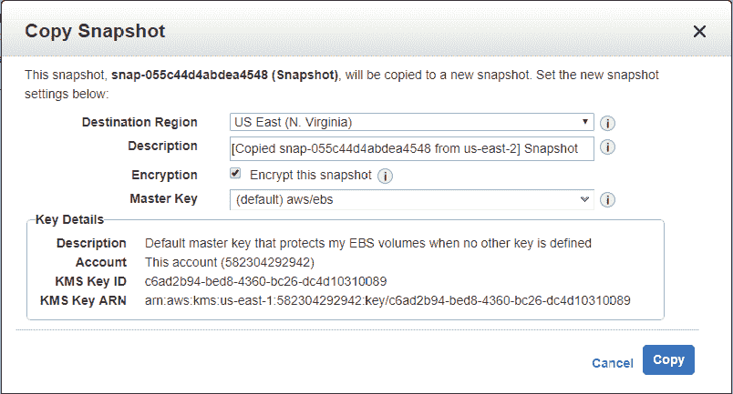

从上面的屏幕中，我们观察到我们还可以加密快照，因此选中加密框以启用加密。

*   移动到美国东部(北弗吉尼亚州)区域，我们已经在那里复制了快照。
*   现在，我们将创建一个图像。点击**动作**下拉菜单，然后点击**创建图像**。

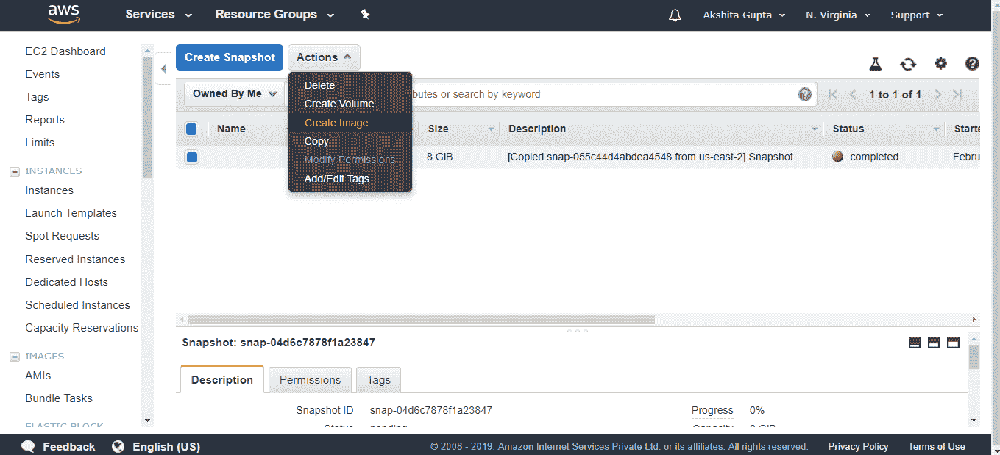

*   输入图像的名称及其描述。

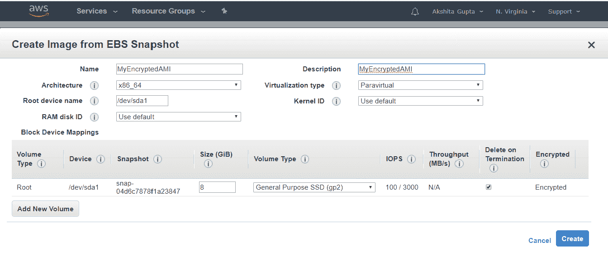

*   单击出现在控制台左侧的 AMI。

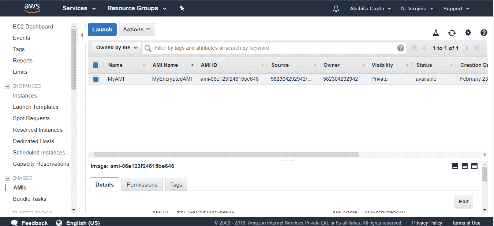

*   点击**启动**按钮。
*   选择一个实例类型，点击**下一步**。

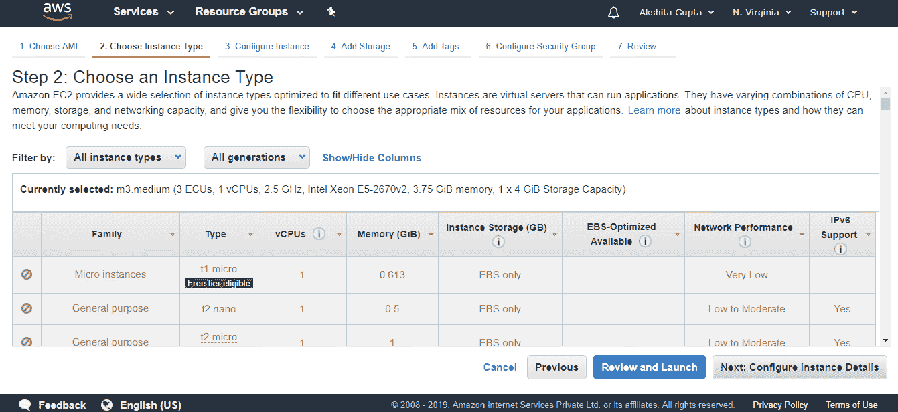

*   配置实例详细信息。保留所有实例细节为默认，然后点击**下一步按钮**。

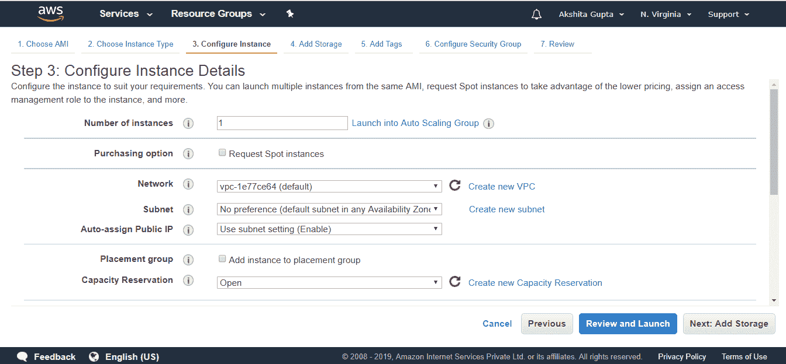

*   (可选)您可以添加新的 EBS 卷。
*   添加标签。点击**下一步**。

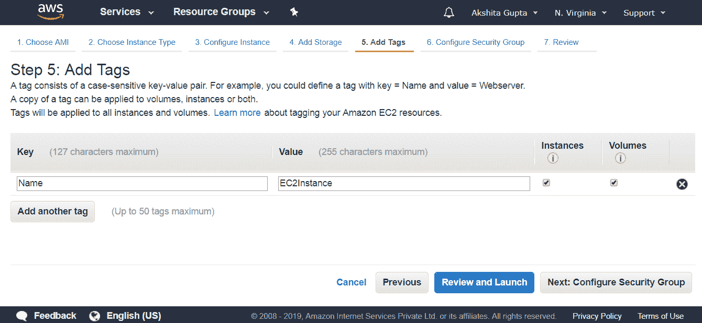

*   配置安全组。点击**查看并启动按钮**。
*   点击**启动**按钮。

## 要记住的要点:

*   要为充当根设备的 Amazon EBS 卷创建快照，您应该在拍摄快照之前停止实例。
*   加密卷的快照会自动加密。
*   从加密快照恢复的卷会自动加密。
*   您可以共享快照，但前提是它们未加密。
*   这些快照可以与其他 AWS 帐户共享或公开。

* * *