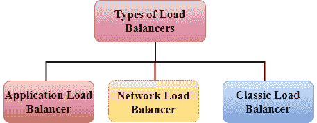
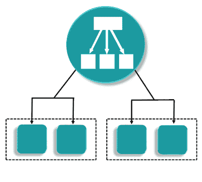
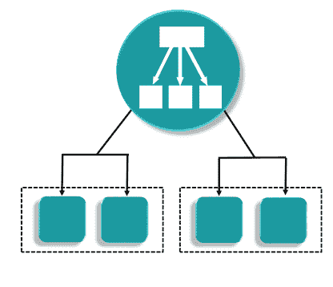
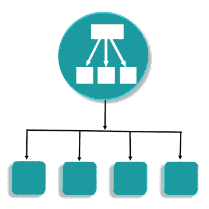
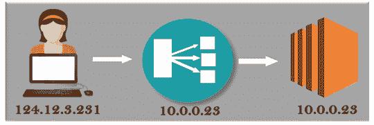

# 什么是负载平衡器？

> 原文：<https://www.javatpoint.com/aws-load-balancing>

负载平衡器是一个虚拟机或设备，用于平衡您的 web 应用程序负载，这些负载可能是您正在进入的 Http 或 Https 流量。它平衡了多个 web 服务器的负载，因此没有一个 web 服务器不堪重负。

## 应用程序负载平衡器

*   亚马逊网络服务公司于 2016 年 8 月 11 日推出了一种新的负载平衡器，称为应用负载平衡器。
*   它用于将用户流量导向公共 AWS 云。
*   它识别传入的流量，并将其转发到正确的资源。例如，如果一个 URL 有/ **API** 扩展，那么它将被路由到适当的应用程序资源。
*   它在现场视察模型的第 7 层运行。
*   它最适合于 HTTP 和 HTTPs 流量的负载平衡。
*   应用程序负载平衡器是智能的，向特定的 web 服务器发送特定的请求。
*   如果我们以特斯拉为例。我们有三种型号的特斯拉，即特斯拉 Model X、特斯拉 models 和特斯拉 Model 3，特斯拉拥有板载计算设施。您将有一组服务于模型 X 的网络服务器，一组服务于模型 S 的网络服务器，类似于模型 3。我们有一个负载均衡器，它检查传入的流量是来自模型 X、模型 S 还是模型 3，然后将其发送到预期的服务器组。

## 网络负载平衡器

*   它在现场视察模型的第 4 层运行。
*   它在传输层(TCP/SSL)做出路由决定，每秒可以处理数百万个请求。
*   当负载平衡器接收到连接时，它会使用流哈希路由算法从目标组中选择一个目标。它打开到所选端口目标的 TCP 连接，并在不修改报头的情况下转发请求。
*   它最适合在需要高性能时对 TCP 流量进行负载平衡。

## 经典负载平衡器

*   它在现场视察模型的第 4 层运行。
*   它根据 IP 地址在客户端和后端服务器之间路由流量。
*   例如，弹性负载平衡器在 TCP 端口 80 上接收来自客户端的请求，然后将该请求路由到后端服务器的指定端口。负载平衡器路由到目标服务器的端口将具有端口号 80。后端服务器会将请求的数据发送回 ELB，然后后者会将后端服务器的回复转发给客户端。根据客户端的观点，请求是由 ELB 完成的，而不是由后端服务器完成的。
*   经典负载平衡器是传统的弹性负载平衡器。
*   它还可以用于 HTTP 或 HTTPs 流量的负载平衡，并使用第 7 层特定的功能，如 X 转发和粘性会话。
*   您还可以对纯粹依赖于 TCP 协议的应用程序使用第 4 层负载平衡。

* * *

## 负载平衡器错误

*   **经典负载平衡器**

如果出现错误 504，这是网关超时错误。负载平衡器仍然可用，但它在与 EC2 实例通信时出现问题。如果您的应用程序停止响应，ELB(经典负载平衡器)会以 504 错误响应。这意味着应用程序有问题，可能是在 web 服务器层，也可能是在数据库层。

以便对应用程序出现故障的地方进行故障排除，并在可能的情况下进行纵向扩展或横向扩展。

**X-转发邮件头**

当您使用传统负载平衡器时，X-forward-For-Header 用于确定客户端的 IP 地址。

**X-转发头的工作**

*   用户位于 Ipv4 地址，即 124.12.3.23。
*   用户向经典负载平衡器发送请求，负载平衡器又将请求折叠成 EC2 实例。EC2 实例将使用私有地址，即 10.0.0.23，这是 EC2 实例看到的唯一地址。
*   EC2 实例只捕获私有地址，因为类负载平衡器包含公共 IP 地址。公共地址是必要的，因为它提供了有价值的信息，如“谁在使用你的网站”。
*   EC2 实例从经典负载均衡器中获取以 X-forward-For 请求头形式的 Ipv4 地址。

* * *