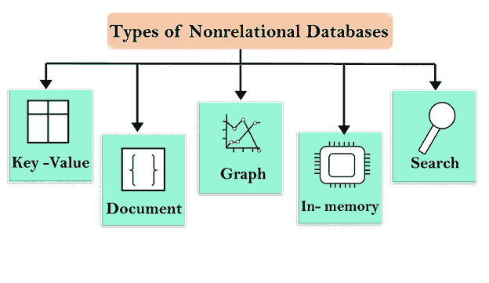
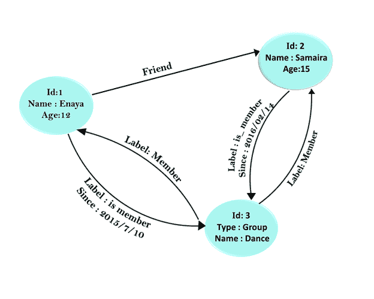

# 什么是非关系数据库？

> 原文：<https://www.javatpoint.com/aws-non-relational-database>

*   **非关系数据库**是不遵循关系数据库管理系统提供的关系数据库模型的数据库。
*   这是一个 NoSQL 数据库，随着大数据应用的兴起，我们看到了非关系数据库的稳步增长。
*   我们有一个非关系数据库。在数据库中，我们有一个集合。在集合中，我们有一个文档，在文档中，我们有键值对。如果我们从关系的角度来说，那么 Collection 就是一个表，文档就是一行，而行是由键值对组成的。

## 非关系数据库是如何工作的？

非关系数据库模型使用各种不同的数据模型，如键值、文档、图形、内存和搜索。

**我们通过一个例子来了解一下。**

*   在关系数据库中，图书记录由单独的表组成，表之间的关系由主约束和外部约束定义。例如**图书**表有三列，即**图书 id、图书标题**和**版号，作者**表有三列，即**作者 id、作者姓名**和**图书 id** 。关系模型的设计使得数据库可以在表之间强制引用完整性，以减少冗余。
*   在非关系数据库中，记录以 json 格式存储。每个图书项目(如图书 id、图书标题、版本号、作者 id、作者姓名)都作为属性存储在文档中。

```

JSON/NoSQL
 {
     "Book id": "1",
     "Book title": "Computer",
     "Edition Number": "121",
     "Author id": "23",
     "Author name": "Ankita"
}

```

## 为什么要使用非关系数据库

使用非关系数据库是因为以下特性:

*   **灵活性:**它有一个非常灵活的数据模型，提供更快和迭代的开发。非关系数据库的灵活模型是结构化、半结构化和非结构化数据的理想选择。
*   **可扩展性:**非关系数据库通过使用分布式硬件集群提供横向扩展，而不是通过添加昂贵的服务器进行纵向扩展。
*   **高性能:**非关系数据库使用一些特定的数据模型，如键值、文档等，比关系数据库提供更高的性能。
*   **高功能:**非关系数据库为各自的数据模型提供高功能的 API 和数据类型。

## 非关系数据库类型

*   关键字值
*   文件
*   图表
*   内存中
*   搜索



## 关键字值

*   键值数据库是以键值的形式存储数据的非关系数据库。
*   键值数据库提供了其他类型的数据库无法实现的高度可分区和水平扩展。
*   那些希望存储大量数据而没有任何性能开销的企业使用键值数据库。
*   键值对中的键必须是唯一的，并且它允许您访问与该键关联的值。
*   Redis、Riak 和 Oracle NoSQL 都是键值数据库的例子。
*   键值存储是键和值的大哈希表。
*   密钥是自动生成的，而值可以是字符串、JSON、BLOB 等。
*   键值有一个哈希表，该哈希表由一个键和指向特定数据的指针组成。
*   哈希表是由一组逻辑关键字组成的桶。

**考虑一个简单的例子，其中 key 是学生 id，与 key 相关联的值是学生的名字。**

| 钥匙 | 价值 |
| one | 明日 |
| Two | 安塔 |
| three | 叶莎 |

### 键值数据库的缺点:

*   它没有提供传统数据库系统所提供的功能，如多个事务同时执行时的一致性。这种能力是由应用程序本身提供的。
*   当数据量增加时，维护唯一的密钥就成为一项困难的任务。

## 文件

*   文档数据库是一个非关系数据库，用于将半结构化数据存储为文档。
*   开发人员需要文档数据库，因为应用层中的数据以 JSON 格式表示。
*   在文档数据库中，文档可以具有相同或不同的数据结构。
*   文档被分组到集合中，集合的行为类似于关系数据库中的表。
*   文档数据库非常受欢迎，因为它允许您通过使用应用程序代码中使用的相同模型将数据保存在数据库中。
*   **Apache CouchDB、MongoDB** 都是文档数据库的例子。

## 图表



*   图形数据库是由边和节点表示的网络数据库，用于存储数据。
*   通过使用图形数据库，图形可以很容易地从一个模型转换到另一个模型。
*   节点之间有一些关系，由节点之间的边来表示。
*   一些定义的属性与节点和边都相关联。
*   该图包含节点和边。节点用于存储实体，而边用于存储边之间的关系。
*   边有开始节点、结束节点、类型和方向。它还描述了亲子关系。
*   遍历 Graph 数据库中的连接非常快，因为节点之间的关系不是在查询时计算的，而是保存在数据库中。

## 内存中

*   内存数据库是一种非关系数据库，它依赖内存来存储数据，而不是将数据存储在磁盘或固态硬盘上。
*   它消除了访问磁盘的需要，从而最大限度地缩短了响应时间。
*   由于数据存储和管理在主内存中，因此存在服务器故障时数据丢失的风险。
*   内存数据库非常适合需要微秒响应时间的应用程序。
*   内存数据库的用例是实时竞价、游戏排行榜和缓存。

## 搜索

*   搜索数据库是用于搜索数据内容的非关系数据库。
*   它使用索引对数据中相似的特征进行分类，并提高搜索能力。
*   它主要用于可能是长的、半结构化或非结构化数据的数据。
*   它提供了一些专门的方法，如全文搜索、复杂的搜索表达式和搜索结果排名。

* * *