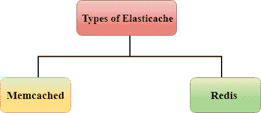
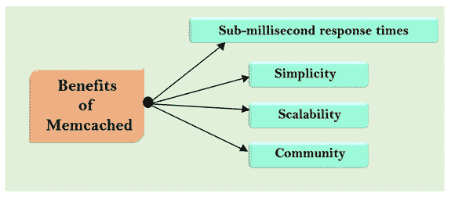
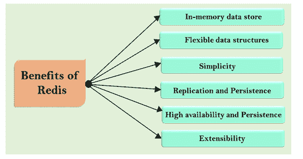

# 什么是弹性缓存？

> 哎哎哎:# t0]https://www . javatppoint . com/AWS 弹性缓存

*   Elasticache 是一种网络服务，用于部署、操作和扩展云中的内存缓存。
*   它允许您从快速、托管的内存缓存中检索信息，而不是完全依赖速度较慢的基于磁盘的数据库，从而提高了 web 应用程序的性能。
*   例如，如果你在经营一家在线企业，客户会不断地询问特定产品的信息。您可以使用弹性缓存来缓存数据，而不是去前端并总是询问产品的信息。
*   它用于提高许多阅读量大的应用程序工作负载(如社交网络、游戏、媒体共享和问答门户)或计算密集型工作负载(如推荐引擎)的延迟和吞吐量。
*   缓存通过将关键数据存储在内存中以实现低延迟访问来提高应用程序性能。
*   缓存的信息可能包括输入/输出密集型数据库查询的结果或计算密集型计算的结果。

## 弹性缓存的类型

弹性缓存有两种类型:

*   [Memcached](#Memcached)
*   [再说一遍](#Redis)

* * *

## Memcached

*   Amazon Elasticache for Memcached 是一个 Memcached 兼容的内存键值存储服务，将被用作缓存。
*   它是一个易于使用、高性能、内存中的数据存储。
*   它可以用作缓存或会话存储。
*   它主要用于实时应用，如网络、移动应用、游戏、广告技术和电子商务。

### Memcached 的工作

*   数据库用于将数据存储在磁盘或固态硬盘上，而 Memcached 通过消除访问磁盘的需要将其数据保存在内存中。
*   Memcached 使用内存中键值存储服务，避免了寻道时间延迟，并且可以在微秒内访问数据。
*   这是一种分布式服务，意味着它可以通过添加新节点来扩展。
*   这是一种多线程服务，意味着它可以扩展其计算能力。因此，它的速度、可伸缩性、简单的设计、高效的内存管理和对大多数流行语言的 API 支持使 Memcached 成为缓存用例的流行选择。

### Memcached 的优势

*   **亚毫秒响应时间**

因为，Memcached 将数据存储在服务器的主内存中，而内存中的存储不必为这些数据去磁盘。因此，它具有更快的响应时间，并且还支持每秒数百万次操作。

*   **简约**

Memcached 的设计非常简单，这使得它功能强大，易于在应用程序开发中使用。它支持 Java、Ruby、Python、C、C++等多种语言。

*   **可扩展性**

Memcached 的架构是分布式和多线程的，易于扩展。您可以将数据分割到多个节点中，这样就可以通过添加新节点来扩展容量。它是多线程的，这意味着您可以扩展计算能力。

*   **社区**

社区是由充满活力的社区支持的开源社区。WordPress 和 Django 等应用程序使用 Memcached 来提高性能。

### 以下是 Memcached 的用例

*   **缓存**

它实现了高性能内存缓存，减少了数据访问延迟，增加了延迟，减轻了后端系统的负载。它可以在不到一毫秒的时间内为缓存的项目提供服务，并使您能够轻松且经济高效地扩展更高的负载。

*   **会话商店**

应用程序开发人员通常使用它来存储和管理基于互联网的应用程序的会话数据。它提供了亚毫秒级的延迟，还可以根据需要进行扩展，以管理用户配置文件、凭据和会话状态等会话状态。

* * *

## 使用心得

*   Redis 代表**远程词典服务器**。
*   它是一个快速、开源和内存中的键值数据存储。
*   它的响应时间为一毫秒，还可以满足游戏、AdTech、金融服务、医疗保健和物联网等实时应用的每秒数百万次请求。
*   它用于缓存、会话管理、游戏、排行榜、实时分析、地理空间等。

### 工作安排

*   Redis 将其数据保存在内存中，而不是将数据存储在磁盘或固态硬盘中。因此，它消除了从磁盘访问数据的需要。
*   它避免了寻道时间延迟，并且可以在微秒内访问数据。
*   它是一个开源的内存键值数据存储，支持排序集和列表等数据结构。

### 累西腓的好处

*   **内存数据存储**
    *   Redis 将数据存储在内存中，而 PostgreSQL、MongoDB 等数据库将数据存储在磁盘中。
    *   它不会将数据存储在磁盘中。因此，它具有更快的响应时间。
    *   读写操作不到一毫秒，每秒支持数百万个请求。

*   **灵活的数据结构**
    *   它支持多种数据结构来满足您的应用需求。以下是 Redis 支持的数据结构:

| 数据类型 | 描述 |
| **琴弦** | 这是一个文本，大小高达 512 兆字节。 |
| **列表** | 它是字符串的集合。 |
| **设置** | 它是一个无序的字符串集合，能够相交、并集。 |
| **分类集** | 按值排序的集合。 |
| **散列** | 它是一种用于存储字段及其相关值的数据结构。 |
| **位图** | 它是一种提供位级操作的数据类型。 |
| **超对数** | 它是一种概率数据结构，用于估计数据集中的唯一项目。 |

*   **简约**
    *   它允许您编写更少的代码行来存储、访问和使用应用程序中的数据。
    *   例如，如果您的应用程序的数据存储在 Hashmap 中，并且您想要存储在数据存储中，那么您可以使用 Redis 哈希数据结构来存储数据。如果存储数据时没有任何哈希数据结构，那么需要编写多行代码来从一种格式转换为另一种格式。

*   **复制和持久化**
    *   它提供了一个主副本架构，其中数据被复制到多个服务器。
    *   当任何服务器出现故障时，它都可以提高读取性能并加快恢复速度。
    *   它还通过提供时间点备份来支持持久性，即将数据集复制到磁盘。

*   **高可用性和可扩展性**
    *   它构建了具有一致性能和可靠性的高可用性解决方案。
    *   有多种选项可以调整您的集群大小，例如向内扩展、向外扩展或向上扩展。这样，可以根据需求改变集群大小。

*   **延展性**
    *   这是一个由充满活力的社区支持的开源项目。

* * *

## Memcached 和 Redis 的区别

| 比较的基础 | Memcached | 使用心得 |
| **亚毫秒延迟** | 它的响应时间为亚毫秒，因为它将数据存储在内存中，读取数据的速度比磁盘快。 | 它的响应时间为亚毫秒，因为它将数据存储在内存中，这比磁盘读取数据更快。 |
| **开发者易用性** | 它的语法易于理解和使用。 | 它的语法易于理解和使用。 |
| **分布式架构** | 其分布式体系结构将数据分布在多个节点上，这允许在需求增长时横向扩展更多数据。 | 其分布式体系结构将数据分布在多个节点上，这允许在需求增长时横向扩展更多数据。 |
| **支持多种不同的编程语言** | 它支持 C、C++、java、python 等语言。 | 它支持 C、C++、java、python 等语言。 |
| **高级数据结构** | 它不支持高级数据结构。 | 它支持各种高级数据结构，如集合、排序集合、散列、位数组等。 |
| **多线程架构** | 它支持多线程架构意味着它有多个处理核心。这允许您通过扩展计算能力来处理多个操作。 | 它不支持多线程体系结构。 |
| **快照** | 它不支持快照。 | Redis 还将数据保存在磁盘中，作为从故障中恢复的时间点备份。 |
| **复制** | 它不会复制数据。 | 它提供了一个主副本体系结构，可以跨多台服务器复制数据并扩展数据库读取。 |
| **交易** | 它不支持事务。 | 它支持允许执行一组命令的事务。 |
| **Lua 脚本** | 它不支持 Lua 脚本。 | 它允许您执行 Lua 脚本，从而提高性能并简化应用程序。 |
| **地理空间支持** | 它不提供地理空间支持。 | 它有专门构建的命令来处理地理空间数据，也就是说，您可以找到两个元素之间的距离，或者找到给定距离内的所有元素。 |

* * *