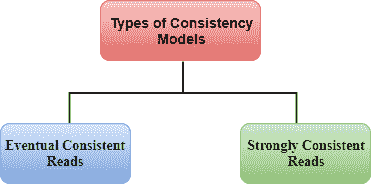
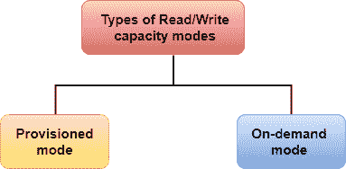
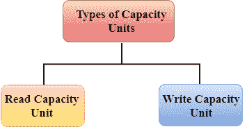

# 什么是电动数据库？

> 哎哎哎::1230【https://www . javatppoint . com/AWS-dynamodb】

*   Amazon DynamoDB 是一种快速灵活的 NoSQL 数据库服务，适用于任何规模的需要一致的一位数毫秒延迟的所有应用程序。
*   它是一个完全受管理的数据库，支持文档和键值数据模型。
*   其灵活的数据模型和性能使其非常适合移动、网络、游戏、广告技术、IOT 和许多其他应用。
*   它存储在固态硬盘存储中。
*   它分布在三个地理数据中心。

由于它在三个地理数据中心可用，它由两种不同类型的一致性模型组成:

*   **最终一致读数**
*   **强一致读数**

**最终一致读数**

它保持所有数据拷贝的一致性，这通常在一秒钟内完成。如果从 **DynamoDB 表**中读取数据，则响应不会反映最近完成的写操作，如果短时间后重复读取数据，则响应将是最近的更新。这是读取性能的最佳模型。

**强一致读数**

强一致读取返回的结果反映了在读取之前收到成功响应的所有写入。

#### 注意:如果您的应用程序想要立即从 DynamoDB 表中获取数据，那么选择强一致读取模型。如果您可以等待一秒钟，那么选择最终一致模型。

## AWS 动态数据库吞吐量

动态数据库吞吐量取决于对表执行读/写操作的读/写容量模式。

**有两种读/写容量模式:**

*   设置模式
*   按需模式

### 设置模式

*   它定义了应用程序可以从指定表中使用的最大容量。
*   在调配模式下，您需要指定应用程序每秒需要的读写次数。
*   如果超过了预配模式吞吐量的限制，就会导致请求限制。
*   调配模式对于具有可预测和一致流量的应用程序来说很好。

**预配模式由两个容量单位组成:**

*   读取容量单位
*   写容量单位

**读取容量单位**

*   读取容量单位的总数取决于项目大小和读取一致性模型。
*   读取容量单位代表两种类型的一致性模型:
    *   **强一致模型:**读取容量单位表示每秒钟对大小高达 4KB 的项目进行一次强一致读取。
    *   **最终一致模型:**读取容量单位表示一个大小高达 4KB 的项目每秒两次最终一致的读取。
*   当项目大小大于 4KB 时，DynamoDB 将需要额外的读取容量单位。例如，如果项目的大小为 8KB，则强一致读取需要 2 个读取容量单位，而最终一致读取需要 1 个读取容量单位。

**写入容量单位**

*   写入容量单位的总数取决于项目大小。
*   大小不超过 1KB 的项目只需要 1 个写入容量单位。
*   当大小大于 1KB 时，DynamoDB 将需要额外的写入容量单位。例如，如果项目大小为 2KB，则每秒执行 1 次写入需要两个写入容量单位。
*   例如，如果您创建一个具有 20 个写入容量单位的表，那么您每秒可以对大小不超过 1KB 的项目执行 20 次写入。

## 按需模式

*   DynamoDB 按需模式有一个灵活的新计费选项，能够在没有任何容量规划的情况下每秒服务数千个请求。
*   按需模式为读写请求提供按请求付费的定价，因此您只需为您使用的内容付费，从而轻松平衡成本和性能。
*   在按需模式下，随着流量水平的增加或减少，DynamoDb 会立即适应客户的工作负载。
*   按需模式支持除自动缩放之外的所有 DynamoDB 功能，如加密、时间点恢复等
*   如果您不执行任何读/写操作，那么您只需要为数据存储付费。
*   按需模式对于那些流量不可预测且数据库预测非常复杂的应用程序非常有用。

* * *