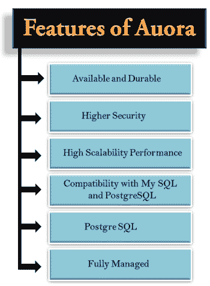

# 什么是极光？

> 原文：<https://www.javatpoint.com/aws-aurora>

*   它是在 RDS 中开发的数据库引擎。
*   它实际上是一个由亚马逊开发的辐条数据库引擎。
*   它是在 re: invent 2014 中宣布的。
*   它只能在 AWS 基础设施上运行。它不像可以安装在本地设备上的 MySQL 数据库。
*   它是一个与 MySQL 兼容的关系数据库引擎，结合了高端商业数据库的速度和可用性以及开源数据库的简单性和成本效益。
*   它的性能是 MySQL 的五倍，价格是商业数据库的十分之一，同时提供了相似的性能和可用性。

## 极光标度

*   如果我们从 10 GB 开始，超过了 10 GB，那么它会自动扩展到 10 GB 存储。10 GB 可以增加到 64 TB。
*   计算资源可扩展至 32 个 CPU 和 244 GB 内存。
*   它在每个可用性区域维护 2 份数据拷贝，至少有三个可用性区域。因此，我们可以说它维护了您数据的 6 个副本。
*   它旨在透明地处理多达两个数据副本的丢失，而不影响数据库的写可用性，以及多达三个副本的丢失，而不影响读可用性。这是非常多余的。
*   这也是一种自我修复的方法，即连续扫描数据块和磁盘，以便在检测到错误时自动修复错误。

## 复制品

**副本有两种类型:**

*   **极光复制品**
*   **MySQL 读取副本**

### 极光复制品

*   极光副本是极光数据库集群中的独立点，用于扩展读取操作和提高可用性。
*   它可以跨可用性区域分发多达 15 个极光副本。
*   数据库集群卷由多个数据副本组成，数据库集群卷中的数据表示为数据库集群中的单个极光副本。所有极光副本都返回相同的查询结果。
*   极光副本在读取扩展方面表现良好，但在写入操作方面表现不佳，因为它们完全专用于数据库集群中的读取操作。写操作主要由主实例管理。
*   极光副本被设置为故障切换目标以提高可用性，即如果极光实例出现故障，则极光副本将被提升为主实例。
*   如果极光数据库集群不包括极光副本，则需要重新创建数据库实例以从故障事件中恢复。极光副本比重新创建数据库实例更快。

### MySQL 读取副本

*   它可以跨可用性区域创建多达 5 个读取副本。
*   它增强了数据库实例的可用性，该功能可以扩展单个数据库实例的容量，以应对读取量大的数据库工作负载。
*   您可以为源数据库实例创建多个副本，并且可以从数据的多个副本为大量应用程序读取流量提供服务，从而提高读取吞吐量。

## 亚马逊极光的特点

**以下是亚马逊极光的特色:**

*   可用且耐用
*   更高的安全性
*   高可扩展性和高性能
*   与 MySQL 和 PostgreSQL 的兼容性
*   完全管理

*   **可用且耐用**
    它提供了容错和自容存储的特性。它提供了超过 99.99%的可用性，复制了 6 份数据拷贝，即三个可用性区域各 2 份拷贝，并将数据持续备份到 S3。它在不到 30 秒的时间内从物理存储故障中恢复。借助全球数据库，单个极光数据库可以分布在多个 AWS 区域，以提供更快的读取和灾难恢复。
*   **更高的安全性**
    亚马逊极光为您的数据库提供了多级安全性。它使用亚马逊 VPC 提供网络隔离，使用您通过 AWS 密钥管理服务创建和控制的密钥进行加密。
*   **高可扩展性和高性能**
    亚马逊极光以商业数据库十分之一的价格提供比 MySQL 高五倍的性能，同时提供相似的性能和可用性。您可以根据自己的需求增加或减少资源。每个数据库实例的存储量最多可增加 64 TB。例如，如果我们从 10 GB 开始，超过 10 GB，则存储大小会自动扩展到 10 GB。
*   **与 MySQL 和 PostgreSQL 的兼容性**
    亚马逊极光与 MySQL 和 PostgreSQL 完全兼容。这意味着您可以使用 MySQL 或 PostgreSQL 导入/导出工具轻松地从 MySQL 或 PostgreSQL 迁移到 Aurora。您在现有数据库中使用的代码、应用程序、驱动程序和工具也可以在亚马逊极光中使用。
*   **完全管理**
    亚马逊关系数据库服务完全管理亚马逊极光。您不必担心各种数据库管理任务，如硬件配置、软件修补、设置、配置或备份。亚马逊极光会持续将数据备份到亚马逊 S3，并提供时间点恢复。您还可以通过使用亚马逊**云观察**来监控您的数据库性能，这是一个用于快速检测性能问题的工具。

* * *