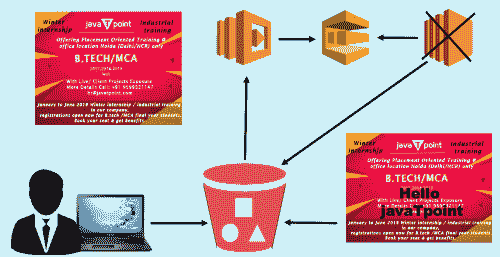
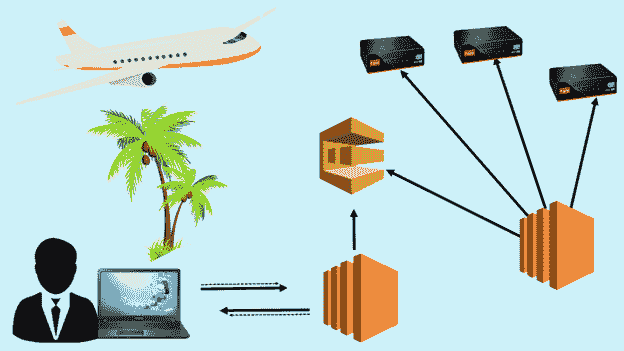
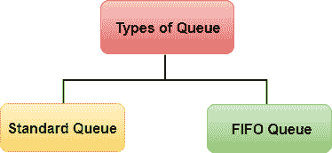
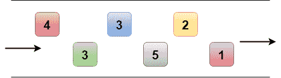
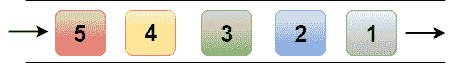

# 什么是 SQS？

> 原文：<https://www.javatpoint.com/aws-sqs>

*   SQS 代表**简单排队服务**。
*   SQS 是自动气象站提供的第一项服务。
*   亚马逊 SQS 是一个网络服务，让你访问一个消息队列，可以用来存储消息，同时等待计算机处理它们。
*   Amazon SQS 是一个分布式队列系统，它使 web 服务应用程序能够快速可靠地对应用程序中的一个组件生成的消息进行排队，以供另一个组件使用，其中队列是等待处理的消息的临时存储库。
*   在 SQS 的帮助下，您可以在任何音量的软件组件之间发送、存储和接收消息，而不会丢失消息。
*   使用亚马逊 sqs，您可以分离应用程序的组件，以便它们可以独立运行，从而简化组件之间的消息管理。
*   分布式应用程序的任何组件都可以将消息存储在队列中。
*   消息可以包含高达 256 KB 的任何格式的文本，如 json、xml 等。
*   应用程序的任何组件稍后都可以使用亚马逊 SQS 应用编程接口以编程方式检索消息。
*   队列充当组件生成和保存数据之间的缓冲区，组件接收数据进行处理。这意味着，如果生产者生产工作的速度快于消费者处理工作的速度，或者生产者或消费者只是间歇性地连接到网络，队列就会解决出现的问题。
*   如果有两个 EC2 实例正在拉 SQS 队列。如果消息数量超过某个限制，您可以配置自动缩放组。假设消息数量超过 10，那么您可以添加额外的 EC2 实例来更快地处理作业。这样，SQS 提供了弹性。

**我们通过一个例子来了解一下。**

让我们来看看一个生成 Meme 的网站。假设用户想上传一张照片，想转换成 Meme。用户在网站上传照片，网站可能会在 s3 中存储照片。它一完成上传，就会触发一个 Lambda 函数。Lambda 将关于这个特定图像的数据分析给 SQS，这些数据可以是“模因顶部应该说什么”、“模因底部应该说什么”、S3 桶的位置等。这些数据作为一条信息存在于 SQS 内部。EC2 实例查看消息并执行其工作。EC2 实例创建一个模因，并将其存储在 S3 桶中。一旦 EC2 实例完成了它的工作，它就返回到 SQS。最好的情况是，如果您丢失了 EC2 实例，那么您也不会丢失该作业，因为该作业位于 S3 桶中。

**我们再来看看 SQS 的另一个例子，即旅游网站。**

假设用户想要寻找一个套餐假期，并且想要寻找最好的航班。AUser 在浏览器中键入一个查询，然后它命中 EC2 实例。EC2 实例看起来像“用户在寻找什么？”，然后将消息放入队列中发送到 SQS。EC2 实例拉队列。EC2 实例不断地拉队列，寻找要做的工作。一旦它得到了工作，它就会处理它。它询问航空公司的服务，以获得所有最好的航班。它将结果发送到网络服务器，网络服务器将结果发送回用户。用户然后根据他或她的预算选择最佳航班。

如果我们没有 SQS，那会发生什么？

网络服务器将信息传递给应用服务器，然后应用服务器查询航空公司服务。如果应用程序服务器崩溃，那么用户将丢失其查询。SQS 的一大优点是数据在 SQS 排队，即使应用服务器崩溃，队列中的消息也会在超时间隔窗口中被标记为不可见。超时后，消息重新出现在队列中；那么一个新的 EC2 实例可以使用这个消息来执行它的工作。因此，我们可以说 SQS 消除了应用服务器依赖。

## 伫列类型

**队列有两种类型:**

*   **标准队列(默认)**
*   **先进先出队列(先进先出)**

*   **标准队列**

*   SQS 提供标准队列作为默认队列类型。
*   它允许您每秒进行无限数量的事务。
*   它保证消息至少传递一次。但是，有时，一条消息的多个副本可能会被无序传递。
*   它提供了尽力而为的排序，确保消息通常以发送时的相同顺序传递，但它不提供保证。

*   先进先出队列

*   先进先出队列补充了标准队列。
*   它保证排序，即它们被发送的顺序也以相同的顺序被接收。
*   队列最重要的特性是先进先出队列和一次处理，即消息只传递一次，并保持可用，直到使用者处理并删除它。
*   先进先出队列不允许将重复项引入队列。
*   它还支持允许在单个队列中有多个有序消息组的消息组。
*   先进先出队列被限制为每秒 300 个事务，但具有标准队列的所有功能。

## SQS 能见度超时

*   可见性超时是指读取器拾取消息后，消息在 SQS 队列中不可见的时间。
*   如果所提供的作业在可见性超时到期之前得到处理，则该消息将从队列中删除。如果在此时间内没有处理作业，消息将再次可见，另一个读取器将处理它。这可能会导致同一条消息被传递两次。
*   默认可见性超时为 30 秒。
*   如果任务时间超过 30 秒，可见性超时可以增加。
*   最大可见性超时为 12 小时。

**需要记住的要点:**

*   SQS 是拉动式的，而不是推动式的。
*   邮件大小为 256 KB。
*   邮件会在队列中保留 1 分钟到 14 天。
*   默认保留期为 4 天。
*   它保证您的消息至少会被处理一次。

* * *