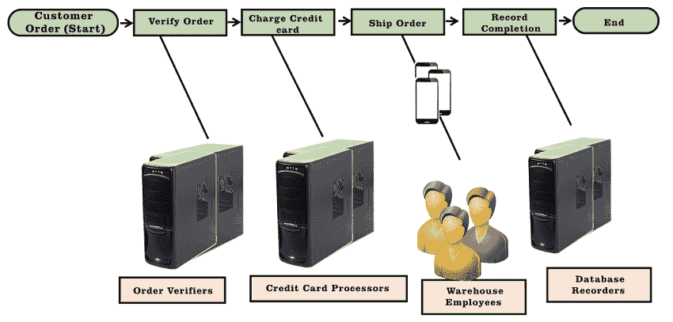
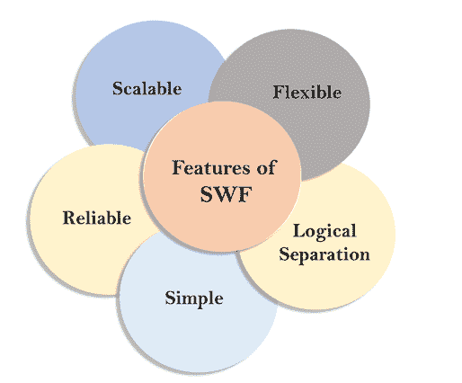

# 什么是 SWF？

> 原文：<https://www.javatpoint.com/aws-swf>

*   SWF 代表**简单工作流服务**。
*   这是一个用于构建可伸缩和弹性应用程序的 web 服务。
*   它提供了简单的应用编程接口调用，可以从任何语言编写的代码中执行，并且可以在您的 EC2 实例或您位于世界任何地方的任何访问互联网的机器上运行。例如，您正在构建一个由各种模块组成的应用程序，并在各种模块之间进行协调；我们在 aws 中依赖 SWF。SWF 作为一个协调器，它控制着应用程序的所有模块。
*   它允许您构建应用程序，并使跨分布式组件协调工作变得容易。
*   SWF 在项目的所有组件之间提供了一个逻辑分离。
*   SWF 涉及根据应用程序的逻辑流协调各种任务，例如管理任务间的依赖关系、调度和并发性。您不必手动管理任务；SWF 会为你做一切。

**我们通过一个例子来了解一下。**



假设客户下了订单。

**第一步:**你要验证一个订单。你有你的 EC2 实例，他们去检查订单是否有库存。一旦订单被验证，即你有一个股票，然后移动到步骤 2。

**步骤 2:** 现在，它在**收费信用卡**上工作。它检查信用卡的收费是否成功。

**第三步:**如果信用卡充值成功，我们会发货下单。运送订单需要人工交互。人类从仓库带来订单，如果产品已经装箱，就意味着它已经准备好装运了。

**第 4 步:**记录完成是一个数据库，表示产品已经装箱并运送到目的地地址。它还提供了跟踪号。典型工作流程到此结束。

## 主权财富基金工作人员和决策者

*   工人是与亚马逊 SWF 交互以获取任务、处理接收到的任务并返回结果的程序。
*   决策器是一个根据应用程序逻辑提供任务协调的程序，如排序、并发、调度等。
*   工人和决策者都运行在云基础设施上，如亚马逊 EC2，或防火墙后的机器。
*   决策者对任务的进度采取一致的观点，并发起新的任务，而亚马逊 SWF 存储任务并将其分配给工人来处理它们。
*   亚马逊 SWF 确保任务只被分配一次，永远不会重复。
*   工作人员和决策者不必跟踪执行状态，因为亚马逊 SWF 可以持久地保持该状态。
*   工人和决策者都独立运行，规模迅速扩大。

## 主权财富基金领域

*   域是将同一帐户中的一组类型、执行和任务列表与其他列表隔离开来的容器。
*   工作流、活动类型和工作流执行都在一个域范围内。
*   您可以使用 AWS 管理控制台或亚马逊 SWF 应用编程接口中的注册域操作来注册域。

参数以 JSON ( **Javascript 对象符号**)格式指定。格式如下所示:

```

RegisterDomain
{
    "name" : "867530901";
    "Description": "music";
     "workflowExecutionRetentionPeriodInDays": "60";
}

```

**在哪里，**

**工作流执行保留期天数**定义保留期的天数。

#### 注意:最大工作流可以是 1 年，其值以秒为单位。

## SQS 和瑞士法郎之间的差额

*   亚马逊 SWF 提供了一个面向任务的 API，而亚马逊 SQS 提供了一个面向消息的 API。/li >
*   亚马逊 SWF 确保任务只被分配一次，永远不会重复。使用亚马逊 SQS，消息可以被复制，它可能还需要确保一条消息只被处理一次。/li >
*   SWF 跟踪应用程序中的所有任务和事件，而 SQS 在应用程序使用多个队列时实现自己的应用程序级跟踪。

## 主权财富基金的特点



*   **可伸缩**
    亚马逊 SWF 会随着应用程序的使用情况自动伸缩资源。当您添加更多云工作流或增加工作流的复杂性时，不需要手动管理工作流服务。
*   **可靠**
    亚马逊 SWF 运行在亚马逊高度可用的数据中心，因此只要应用程序需要，就会提供状态跟踪。亚马逊 SWF 存储任务，将它们发送到各自的应用程序组件，跟踪它们的进度。
*   **简单**
    亚马逊 SWF 用全新的云工作流互联网服务彻底取代了旧工作流解决方案和流程自动化软件的复杂性。它消除了开发人员管理自动化过程的需要，因此您可以专注于应用程序的独特功能。
*   **逻辑分离**
    亚马逊 SWF 提供了后台作业的逐步逻辑的控制流和包含业务逻辑的实际工作单元之间的逻辑分离。由于逻辑分离，您可以从业务逻辑中分别管理、维护和扩展应用程序的“状态机器”。根据业务需求的变化，您可以轻松管理业务逻辑，而不必担心状态机制、任务调度和流程控制。
*   **灵活**
    亚马逊 SWF 允许你修改应用组件，即你可以用任何编程语言修改应用逻辑，并在云中或内部运行。

* * *