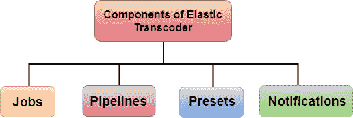
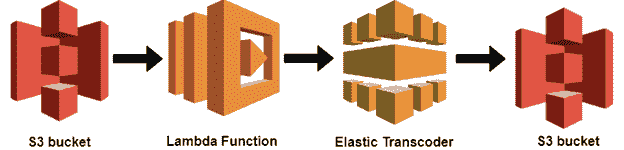

# 什么是弹性转码器？

> 原文：<https://www.javatpoint.com/aws-elastic-transcoder>

*   弹性转码器是一种 aws 服务，用于将存储在 S3 桶中的媒体文件转换成不同设备支持的不同格式的媒体文件。
*   弹性转码器是云端的媒体转码器。
*   它用于将媒体文件从原始源格式转换为不同的格式，这些格式将在智能手机、平板电脑、个人电脑等上播放。
*   它为流行的输出格式提供转码预设，这意味着您不需要猜测哪些设置在特定设备上最有效。
*   如果您使用弹性转码器，那么您需要根据您转码的分钟数和转码的分辨率付费。

## 弹性代码转换器的组件

**弹性转码器由四部分组成:**

*   **作业**
*   **管道**
*   **预设**
*   **通知**

*   **Jobs**
    这个工作的主要任务就是完成转码的工作。每个作业最多可以转换 30 种格式的文件。例如，如果您想要将一个媒体文件转换为八种不同的格式，那么单个作业会创建八种格式的文件。创建作业时，需要指定要转码的文件的名称。
*   **管道**
    管道是由转码作业组成的队列。创建作业时，需要指定要添加作业的管道。如果您希望作业创建多种格式，弹性代码转换器会按照您在作业中指定的格式顺序为每种格式创建文件。
    您可以创建两个管道中的任意一个，即标准优先级作业和高优先级作业。工作主要属于标准优先工作。有时您想立即对文件进行转码；使用高优先级管道。
*   **预置**
    预置是包含将媒体文件从一种格式转码为另一种格式的设置的模板。弹性转码器由一些常见格式的默认预设组成。您也可以创建自己的预设，这些预设不包含在默认预设中。您需要指定创建作业时要使用的预设。
*   **通知**
    通知是一个可选字段，您可以使用弹性转码器进行配置。通知服务是一项让您随时了解作业状态的服务:当弹性代码转换器开始处理您的作业时，当弹性代码转换器完成其作业时，无论弹性代码转换器是否遇到错误情况。您可以在创建管道时配置通知。

## 云如何使用弹性代码转换器

假设我在 S3 水桶上传了 mp4 文件。一旦上传完成，它就会触发一个 Lambda 函数。Lambda 函数将调用弹性代码转换器。弹性转码器将 mp4 文件转换成不同的格式，以便在 iphone、笔记本电脑等中打开文件。一旦完成转码，它会将转码后的文件存储在 S3 存储桶中。

* * *