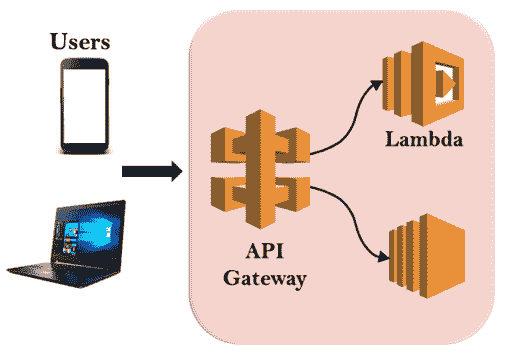
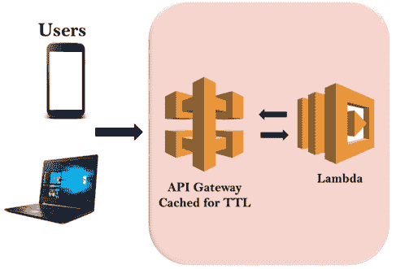
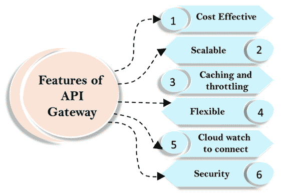

# 应用编程接口网关

> 原文：<https://www.javatpoint.com/aws-api-gateway>

*   应用编程接口网关是一个网关，由一组创建无服务器学习管理系统的 Lambda 函数组成。
*   API Gateway 是一个完全托管的服务，它使开发人员可以轻松地发布、维护、监控和保护任何规模的 API。
*   只需在 AWS 管理控制台中单击几下，您就可以创建一个应用编程接口，作为应用程序从后端服务访问数据、业务逻辑或功能的“前门”，例如运行在亚马逊弹性计算云(亚马逊 EC2)上的应用程序、运行在 AWS Lambda 上的代码或任何网络应用程序。
*   如果您的浏览器正在对应用编程接口网关进行应用编程接口调用，那么应用编程接口网关正在将这些调用向下路由到 Lambda。

## 应用编程接口网关的架构

假设我们让通过手机或笔记本电脑操作的用户对应用编程接口网关进行应用编程接口调用。应用编程接口网关触发一个 Lambda 函数或 EC2 中的一个函数。

## 什么是 API 缓存？

*   在亚马逊应用编程接口网关中，您可以启用应用编程接口缓存来缓存端点的响应。
*   应用编程接口缓存可以减少对端点的调用次数，还可以改善对应用编程接口的请求的延迟。
*   启用应用编程接口缓存后，应用编程接口网关会在指定的生存时间内(以秒为单位)缓存来自您的端点的响应。应用编程接口网关通过从缓存中查找响应来响应请求，而不是向您的端点发出请求。

## 应用编程接口缓存的体系结构

假设我们让用户对应用编程接口网关进行应用编程接口调用。API 网关触发一个 Lambda 函数，然后 Lambda 函数将响应发送回 API 网关。现在，另一个用户来了，对应用编程接口网关进行同样的应用编程接口调用，然后我们打开缓存和生存时间。假设 TTL 是 60 秒。因此，响应在应用编程接口网关中停留 60 秒。现在，为了满足另一个用户的请求，您不需要调用 Lambda 函数，因为该请求的响应已经被缓存。这样，我们可以从最终用户那里获得更快的响应。

## 应用编程接口网关的特点

*   **经济高效**
    由于 API Gateway 为 API 请求提供了分层定价模型，因此成本非常低，效率也非常高。API 请求的价格低至每百万个请求 1.51 美元，您还可以通过减少请求数量来降低成本。
*   **可扩展**
    您不必担心让 EC2 服务或自动扩展组响应 API 请求。应用编程接口网关自动扩展。
*   **缓存和节流**
    缓存是 API Gateway 最重要的功能。缓存用于缓存端点的响应，这改善了应用编程接口请求的延迟。这也是决定服务价格的主要因素。
    您还可以防止您的应用编程接口网关的安全风险。如果您想防止欺诈应用编程接口调用淹没应用编程接口网关，您可以配置节流服务，该服务可以节流请求以防止攻击。
*   **灵活**
    要实现 API 网关，您不必启动 EC2 实例或设置网关软件。API 网关可以在几分钟内通过 AWS 管理控制台实现。
*   **CloudWatch 连接**
    一个亚马逊 API 网关与作为监控服务的 CloudWatch 服务集成在一起。该工具用于监控传入的应用编程接口调用、延迟和错误的指标。
*   **安全**
    你可以授权访问你的 API。API Gateway 用于通过执行各种授权选项(如 Lambda 函数和身份访问管理服务(IAM))来验证传入的请求。IAM 与网关集成在一起，网关提供诸如 AWS 凭证之类的工具，即访问和密钥来访问应用编程接口。Lambda 函数用于验证令牌，如果令牌验证成功，那么将授予对 API 的访问权限。

* * *