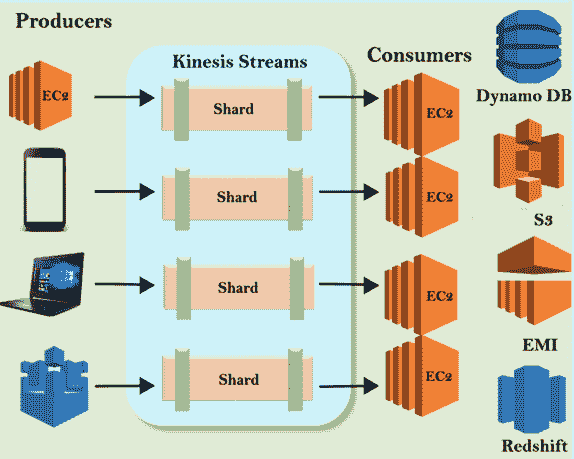

# 由外界刺激引起的不随意运动

> 原文：<https://www.javatpoint.com/aws-kinesis>

在了解驱动程序之前，您应该了解流数据。

## 什么是流数据？

流数据是从成千上万个数据源连续生成的数据，这些数据源可以同时发送小规模的数据记录。

### 以下是流数据的示例:

*   **从网上商店购买**
    人们在 Amazon.com 购买商品，并生成流数据，流数据可以是交易、产品等。
*   **股价**
    股价也是流媒体数据的一个例子。
*   **游戏数据**
    假设用户正在玩愤怒的小鸟游戏，应用程序正在生成流数据返回中央服务器。该流数据可以是“用户正在做什么”、“分数是多少”。
*   **社交网络数据**
    社交网络数据也是流媒体数据的另一个例子。假设你访问了脸书，更新了你的状态，并在你朋友的墙上贴了一个帖子。然后，所有这些数据将被流式传输。
*   **地理空间数据**
    当你使用优步，并且你的设备连接到互联网上的时候。优步应用程序一直在说，优步司机在哪里，你在哪里，它正在查询地图，以给你提供到达目的地的最佳路线。这也是流数据的一个很好的例子。
*   **物联网传感器数据**
    它感知全球各地的监测温度。

## 什么是驱动力？

驱动程序是 AWS 上的一个平台，可以发送你的流式数据。它使分析负载流数据变得容易，还为您提供了根据业务需求构建定制应用程序的能力。

## 驱动力的核心服务

*   **驱动流**
*   **驱动消防软管**
*   **驱动力分析**

### 驱动力溪流

*   驱动力流由碎片组成。
*   碎片每秒提供 5 个读取事务，最高总数据读取速率为 2MB 秒，最高总数据写入速率为 1MB 秒，最高每秒 1，000 条记录。
*   数据流的数据容量是为数据流指定的碎片数量的函数。驱动流的总容量是所有碎片容量的总和。

**驱动流的架构**

假设我们有 EC2，手机，笔记本电脑，IOT，它们正在产生数据。他们被称为生产者，因为他们生产数据。数据被移动到驱动流并存储在碎片中。默认情况下，数据存储在碎片中 24 小时。您可以将保留时间增加到 7 天。一旦数据存储在碎片中，就有了 EC2 实例，也就是所谓的消费者。他们从碎片中提取数据，并将其转化为有用的数据。一旦消费者完成了计算，那么有用的数据就被移动到任意一个 AWS 服务，即 DynamoDB、S3、EMR、红移。

### 驱动力消防站

*   驱动程序消防软管是一项服务，用于向亚马逊 S3、亚马逊红移、亚马逊 Elasticsearch 等目的地传送流数据。
*   有了驱动力消防站，你就不用管理资源了。

**驱动力消防水带建筑**

**

假设你有 EC2，手机，笔记本电脑，IOT，这是生产数据。他们也被称为生产者。生产者将数据发送到驱动消防软管。Kinesis Firehose 不必管理碎片等资源，不必担心流，不必担心手动编辑碎片以跟上数据等。它？这是完全自动化的。你甚至不用担心消费者。可以通过使用 Lambda 函数来分析数据。一旦数据被分析，数据就被直接发送到 S3。数据分析是可选的。关于 Kinesis Firehouse 有一点很重要，那就是没有自动保留窗口，但是 kinlis 流有一个自动保留窗口，默认时间是 24 小时，可以延长到 7 天。驱动力消防软管不是这样工作的。它基本上要么分析数据，要么将数据直接发送到 S3 或其他地方。

另一个位置可以是红移。首先，你必须给 S3 写信，然后把它复制到红移。

如果位置是 Elasticsearch 集群，则数据直接发送到 Elasticsearch 集群。

### 运动学分析

运动学分析是运动学的一项服务，其中使用标准 SQL 处理和分析流数据。

**驱动分析的架构**

我们有驱动力消防水管和驱动力流。驱动分析允许您运行驱动防火墙中存在的数据的 SQL 查询。您可以使用 SQL 查询将数据存储在 S3、红移或 Elasticsearch 集群中。本质上，使用 SQL 类型查询语言在驱动程序内部分析数据。

## 带驱动流和驱动消防软管的差异

*   驱动流是手动管理的，而驱动消防软管是全自动管理的。
*   驱动流将数据发送到许多服务，而驱动消防软管仅将数据发送到 S3 或红移。
*   驱动流由自动保留窗口组成，默认时间为 24 小时，可以延长至 7 天，而驱动消防软管没有自动保留窗口。
*   驱动流将数据发送给消费者进行分析和处理，而驱动 firehose 则不必担心消费者，因为驱动 firehose 本身通过使用 lambda 函数来分析数据。

* * ***