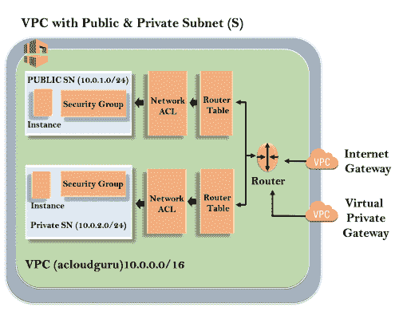
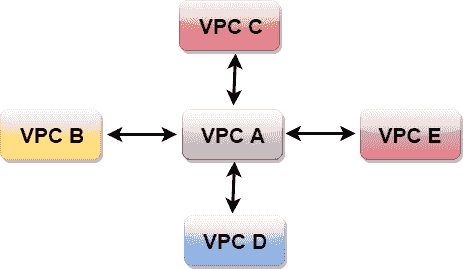
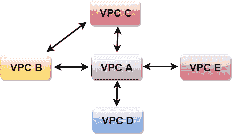

# VPC 是什么

> 哎哎哎:# t0]https://www . javatppoint . com/AWS-VPC

*   VPC 代表虚拟私有云。
*   亚马逊虚拟私有云(亚马逊 VPC)提供了一个 AWS 云的逻辑隔离区域，您可以在其中启动您定义的虚拟网络中的 AWS 资源。
*   您可以完全控制虚拟网络环境，包括选择您的 IP 地址范围、创建子网以及配置路由表和网络网关。
*   您可以轻松定制亚马逊虚拟私有云的网络配置。例如，您可以为可以访问互联网的 web 服务器创建面向公共的子网，也可以将数据库或应用程序服务器等后端系统放置到面向私有的子网中。
*   您可以提供多层安全性，包括安全组和网络访问控制列表，以帮助控制对每个子网中 Amazon EC2 实例的访问。

## VPC 建筑

外部线条代表该地区，该地区是美国东部 1。在该地区内部，我们有 VPC，在 VPC 之外，我们有互联网网关和虚拟专用网关。互联网网关和虚拟专用网关是连接 VPC 的方式。这两个连接都到达 VPC 的路由器，然后路由器将流量定向到路由表。路由表然后将流量导向网络 ACL。网络 ACL 是防火墙或很像安全组。网络 ACL 是允许和拒绝角色的状态列表。您还可以阻止网络 ACL 上的 IP 地址。现在，转到针对 EC2 实例访问另一行的安全组。它有两个子网，即公共子网和专用子网。在公共子网中，EC2 实例可以访问互联网，但是在私有子网中，EC2 实例不能单独访问互联网。我们可以连接实例。要连接实例，请转到公共子网，然后将其 SSH 到私有子网。这就是所谓的跳框。这样，我们可以将公共子网中的实例连接到私有子网中的实例。

**部分范围预留给专用子网:**

*   10.0.0.0 - 10.255.255.255 (10/8 前缀)
*   172 . 16 . 0 . 0-172 . 31 . 255 . 255(172.16/12 前缀)
*   192 . 168 . 0 . 0-192 . 168 . 255 . 255(192 . 108/16 前缀)

## 我们能用 VPC 做什么？

*   在您选择的子网中启动实例。我们可以选择自己的子网寻址。
*   我们可以在每个子网中分配自定义的 IP 地址范围。
*   我们可以在子网之间配置路由表。
*   我们可以创建一个互联网网关，并将其连接到我们的 VPC。
*   它为您的 AWS 资源提供了更好的安全控制。
*   我们可以将安全组分配给单个实例。
*   我们还有子网网络访问控制列表(ACLS)。

## VPC 对等

*   VPC 对等是一种网络连接，允许您使用私有 IP 地址通过直接网络路由将一个 VPC 与另一个 VPC 连接起来。
*   实例的行为就像它们在同一个专用网络上一样。
*   您可以将 VPC 的帐户与其他 AWS 帐户以及同一帐户中的其他 VPC 进行对等。
*   对等是星形配置，即 1 个 VPC 对等其他 4 个虚拟专用网络。
*   它没有**传递对等！！**。

#### 注意:不可传递对等意味着您想要连接的网络是直接链接的。

*   你可以在不同地区之间进行对等。假设你在一个地区有一个 VPC，在另一个地区有另一个 VPC，那么你可以在不同地区之间对等虚拟专用网络。

**我们通过一个例子来理解非传递对等的例子。**

上图显示，VPC B 已经向 VPC A 进行了对等，因此 VPC B 中的实例可以与 VPC A 进行对话。但是，VPC B 无法通过 VPC A 与 VPC C 进行对话。这被称为不可传递对等，即 VPC C 和虚拟专用网 B 都没有直接链接，因此它们无法相互对话。

因此，为了在 VPC B 和 VPC C 之间进行通信，我们需要对它们进行对等操作，如下图所示。

* * *