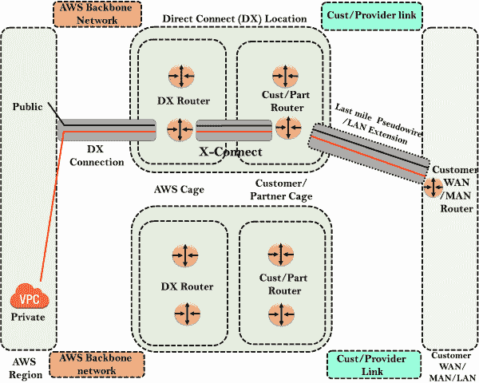
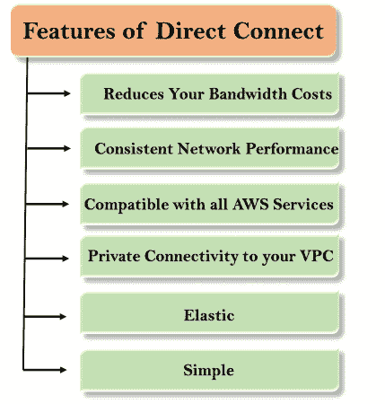

# 直接接合

> 原文：<https://www.javatpoint.com/aws-direct-connect>

*   AWS 直连是一种云服务解决方案，可以轻松建立从您的场所到 AWS 的专用网络解决方案。
*   使用 AWS 直连，您可以在 AWS 和您的数据中心、办公室或托管环境之间建立私有连接，这可以降低您的网络成本，提高带宽吞吐量，并提供比基于互联网的连接更一致的网络体验。
*   直接连接是专用线路上的直接连接。

## 为什么使用直连？

**使用直连是因为以下原因:**

*   它将您的数据中心直接连接到 AWS。
*   它适用于高吞吐量工作负载，即网络流量非常大的情况。
*   它为您提供了稳定可靠的安全连接。

## 直连架构

*   **AWS区域**

在直连架构中，我们有 **AWS 区域**，在 AWS 区域内，我们有 AWS 公共服务，如 S3，还有 VPC，可能是一个私人的 VPC。

*   **直连(DX)位置**

它由遍布世界各地的直连位置组成。在直连位置内部，我们有两个框架，即 AWS 框架和客户/合作伙伴框架。AWS 框架由直连路由器组成，客户/合作伙伴框架由客户/零件路由器组成。

您的数据中心有一条专用链路，标记为**最后一英里伪线/局域网扩展**。AWS 也有自己的**骨干网**。通过 AWS 主干网，他们通过 DX 连接连接到 DX 路由器。连接是连接 DX 路由器和客户/零件路由器。它还包括一条将客户/零件路由器连接到客户广域网/城域网路由器的专用线路。当我们运行一个连接时，客户/零件路由器通过 X-Connect 连接到 DX 路由器。DX-路由器通过 DX 连接连接到 AWS 公共服务。同样，客户数据中心可以连接到 VPC 服务。

## 直接连接的特点

*   **降低您的带宽成本**
    如果您有繁重的工作负载要在 AWS 中运行，那么 AWS 可以通过两种方式降低网络成本:
    *   直连可以直接将数据传入和传出AWS。
    *   直连使用专用链路，其数据传输速率低于互联网数据传输速率。
*   **一致的网络性能**
    随着互联网不断改变数据从 A 点到 b 点的路由方式，网络延迟可能会因互联网而异。直连允许您选择使用专用连接的数据，从而提供一致的网络性能。
*   **兼容所有 AWS 服务**
    直连是一种网络服务，可与所有可通过互联网访问的 AWS 服务(如亚马逊存储服务、弹性计算云和亚马逊虚拟私有云)一起工作。
*   **与您的亚马逊 VPC**
    的私有连接可以用来建立一个从您的内部直接到 AWS VPC 的私有虚拟接口。它可以在您的网络和 VPC 之间提供私有的高带宽网络连接。借助多个虚拟接口，您可以建立到多个虚拟专用网络的专用连接。
*   **弹性**
    亚马逊直连可以轻松扩展连接，满足您的需求。直接连接可提供高达 10 Gbps 的连接。直连可以提供多种连接来满足您的需求。可以使用直接连接来代替建立虚拟专用网连接，因为直接连接避免了对虚拟专用网硬件的需要。
*   **简单**
    您可以使用 AWS 管理控制台轻松注册亚马逊直连。AWS 管理控制台提供了一个简单的视图来有效地管理所有的连接和虚拟接口。您甚至可以在配置一个或多个虚拟接口后下载路由器模板。

* * *