# 什么是 VPC 流量日志？

> 原文：<https://www.javatpoint.com/aws-vpc-flowlogs>

*   VPC 流量日志是 aws 的一项功能，它捕获去往或来自 VPC 网络接口的 IP 流量信息。
*   亚马逊流量日志数据可以通过使用亚马逊云观察日志或亚马逊 S3 桶来存储。
*   创建流日志后，您可以从亚马逊云观察日志中查看和检索数据。
*   简而言之，我们可以说 VPC 流量日志是存储 VPC 流量的一种方式。
*   流量日志有多种用途:
    *   解决“为什么特定流量没有到达实例”的问题。
    *   VPC 流量日志也可以作为一个安全工具来监控到达您的实例的流量。

## VPC 流量测井的局限性:

*   您不能启用与您的 VPC 对等的 VPC 流量日志，除非它与 VPC 在同一帐户中对等。
*   创建流日志时，不能标记流日志。
*   一旦创建了流日志，就不能更改其配置。例如，如果您将一个 IAM 角色与流程日志相关联，则不能更改 IAM 角色。在这种情况下，您需要删除流日志，并使用所需的配置创建新的流日志。

## VPC 流量记录水平

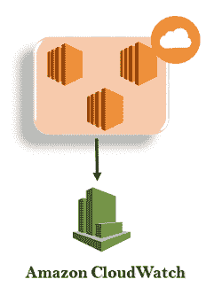

**VPC 流量日志可以在三个级别创建:**

*   虚拟机
*   子网络
*   网络接口级别

## 如何创建 VPC 流量日志

*   登录到 AWS 管理控制台。
*   转到 VPC 服务，我们可以从下面的屏幕中看到已经创建了名为 javatpointvpc 的 VPC。

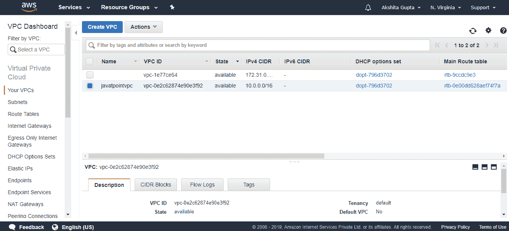

*   单击自定义 VPC，然后单击操作下拉菜单。点击创建流量日志。

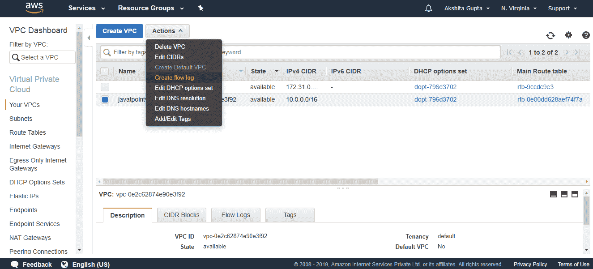

*   填写以下详细信息以创建流日志。

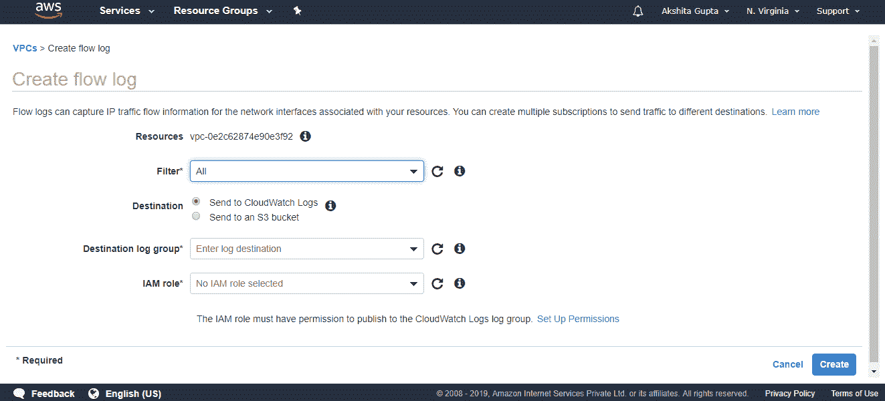

哪里，

**过滤器:**它决定要记录的流量类型。有三种类型的过滤器:全部、接受和拒绝。“All”用于记录已接受和已拒绝的流量。“接受”用于仅记录已接受的流量，“拒绝”仅记录已拒绝的流量。

**目的地:**目的地决定了你要将流量发送到哪里。有两种目的地可供选择:发送到云监视日志和发送到 S3 存储桶。我选择“发送到云观察日志”作为目的地。

**目的日志组:**决定目的地的名称。到目前为止，我们还没有创建云观察日志。首先，我们创建 CloudWatch 日志，然后将日志的名称添加到该日志组中。

*   点击云观察。

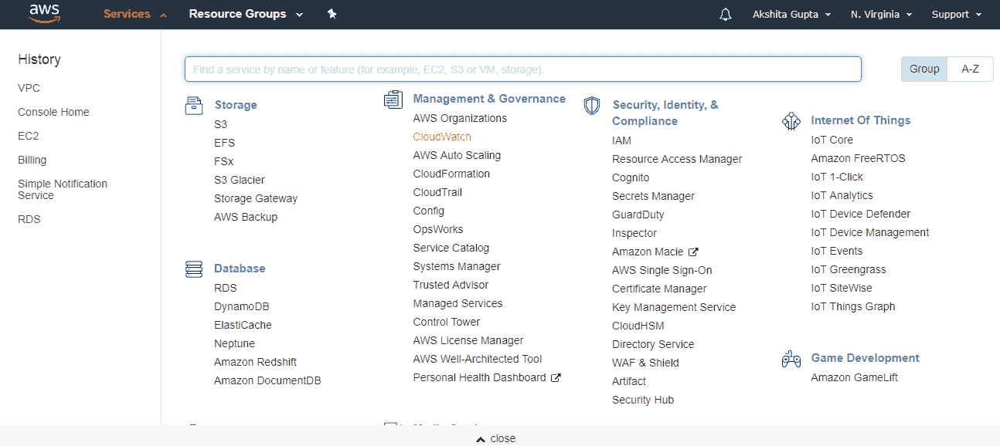

*   点击控制台左侧出现的**日志**。

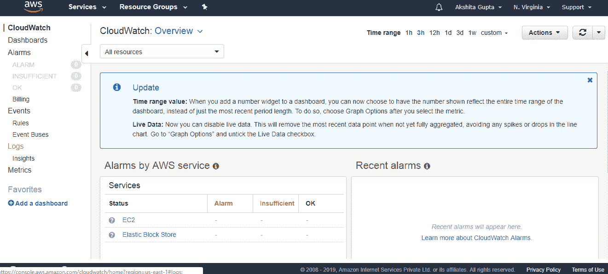

*   点击**开始吧**按钮。

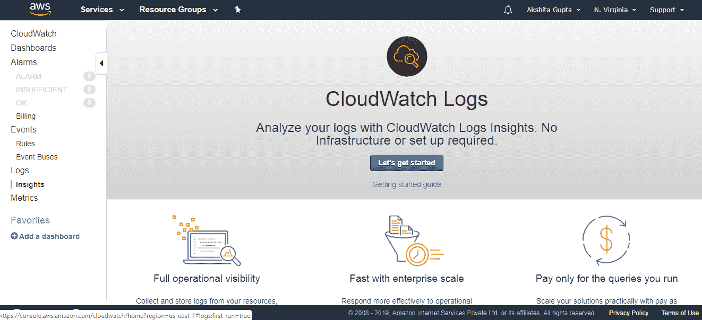

*   点击**创建日志组**按钮。

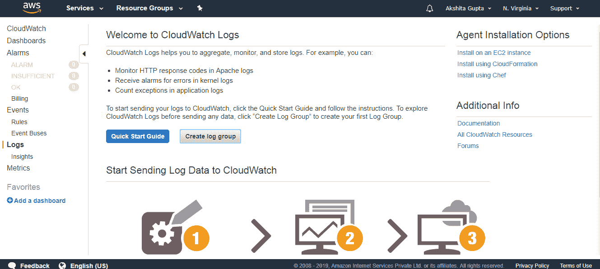

*   输入日志组名称。

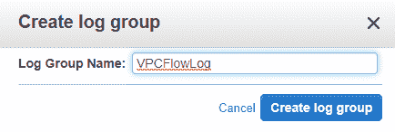

*   最后，创建 CloudWatch 日志。在 FlowLog 控制台中输入日志名称。

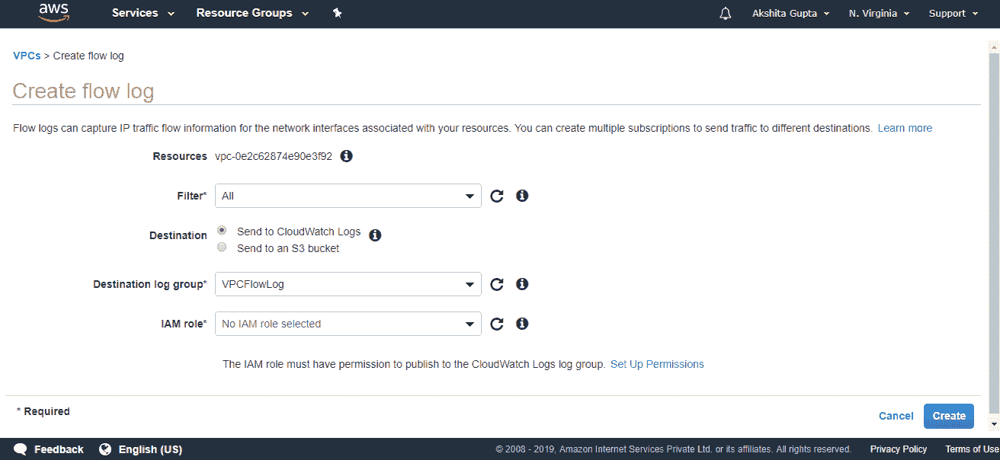

从上面的屏幕中，我们观察到“没有选择 IAM 角色”。要选择 IAM 角色，我们需要首先创建一个 IAM 角色。点击**设置权限**。

*   要创建一个 IAM 角色，输入角色名称，然后点击**允许**按钮。

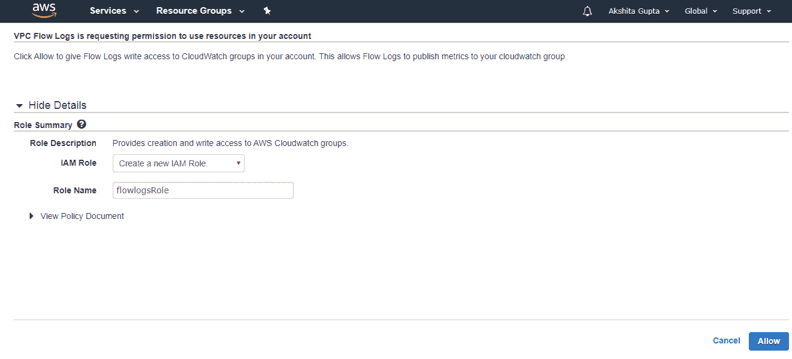

*   创建 IAM 角色后，在流量日志控制台中输入 IAM 角色。

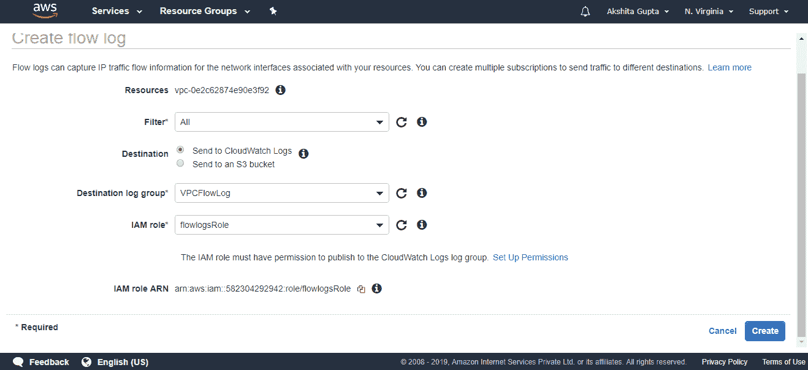

*   下面的屏幕显示流量日志已经创建。

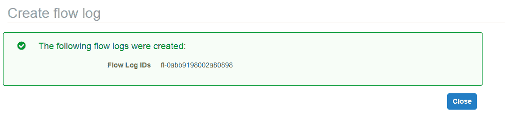

* * *